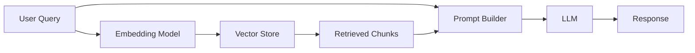

# 05 — Production LLM Patterns

**Links**: [[_MOC]] | [[02 Model Serving]] | [[04 Model Optimization]] | [[06 Guardrails & Safety]] | [[07 Evaluation]]

Deploying LLMs to production involves challenges beyond model choice — latency, cost, reliability, safety, and quality control.

## RAG in Production

Retrieval-Augmented Generation grounds LLM outputs in external knowledge:



| Component | Production Considerations |
|-----------|-------------------------|
| **Chunking** | Size tradeoff (256-1024 tokens), overlap, section-aware vs naive split |
| **Embedding model** | Latency (model size), dimension (storage cost), multilingual needs |
| **Vector store** | HNSW vs IVF index, hybrid search (dense + sparse), filtering |
| **Retrieval** | Top-k tuning, reranking stage, query rewriting, HyDE |
| **Caching** | Exact match cache (Redis), semantic cache (embedding similarity) |

### RAG Evaluation Metrics

| Metric | What It Measures |
|--------|-----------------|
| **Context precision** | How many retrieved chunks are actually relevant |
| **Context recall** | How many relevant chunks were retrieved (vs missed) |
| **Faithfulness** | Does the response contradict the retrieved context |
| **Answer relevance** | Does the answer address the question |

## Prompt Management

Managing prompts in production requires versioning, testing, and monitoring:

- **Prompt versioning**: Track changes to system prompts, few-shot examples, templates
- **Prompt templates**: Parameterized templates (e.g., LangChain, Jinja2)
- **A/B testing**: Run different prompts against the same query, compare quality
- **Prompt monitoring**: Detect prompt injection, jailbreak attempts, drift

| Tool | Strengths |
|------|-----------|
| **LangSmith** | Trace, debug, evaluate prompts; full LangChain integration |
| **PromptHub** | Version control, collaboration, template library |
| **Weights & Biases Prompts** | Experiment tracking, prompt management |

## Structured Output

LLMs generate unstructured text. For production systems, structured output is critical:

| Method | Description | Reliability |
|--------|-------------|-------------|
| **JSON mode** | Constrain output to valid JSON | High (with grammar guidance) |
| **Function calling** | Model chooses and populates a function schema | High (GPT-4, Claude 3) |
| **Grammar-guided decoding** | Constrain with formal grammars (LMQL, guidance, outlines) | Very high |
| **Schema-based validation** | Validate + retry (JSON Schema, Pydantic) | Reliable with retry |

```python
# Outlines: grammar-constrained generation
import outlines

schema = """{
    "name": "string",
    "age": "integer",
    "diagnosis": {"type": "string", "enum": ["cold", "flu", "covid"]}
}"""

generator = outlines.generate.json(model, schema)
result = generator("Patient presents with fever and cough")
# Guaranteed valid JSON matching the schema
```

## Context Window Management

- **Context budget**: Track total tokens (system + history + retrieved + query)
- **Sliding window**: Drop oldest messages as context fills
- **Summarization**: Summarize older context into a compressed form
- **Hybrid**: Keep recent messages verbatim, summarize older ones

## Caching Strategies

| Cache Type | Key | Value | Hit Rate |
|-----------|-----|-------|----------|
| **Exact match** | Request text hash | LLM response | Low (exact duplicates rare) |
| **Semantic cache** | Request embedding | LLM response | Medium (similar queries) |
| **Prefix cache** | Request prefix | KV cache state | High (shared system prompt) |
| **Chain cache** | Intermediate results | Computed values | Medium (repeated sub-queries) |

**Links**: [[AI-ML/RAG/_MOC]] | [[02 Model Serving]] | [[06 Guardrails & Safety]] | [[04 Model Optimization]]

## External Resources

- [LangSmith](https://smith.langchain.com/)
- [LLM Caching with GPTCache](https://github.com/zilliztech/GPTCache)
- [Redis — Semantic Cache](https://redis.io/solutions/vector-search/)
- [Outlines — Structured Generation](https://github.com/outlines-dev/outlines)
- [RAGAS — RAG Evaluation](https://docs.ragas.io/)
- [LangChain Prompt Management](https://python.langchain.com/docs/modules/model_io/prompts/)
- [Context Window Strategies (Anthropic)](https://docs.anthropic.com/en/docs/build-with-claude/prompt-engineering/context-windows)
- [RAG Survey Paper](https://arxiv.org/abs/2312.10997)
- [OpenAI Prompt Engineering Guide](https://platform.openai.com/docs/guides/prompt-engineering)
