# 06 — Guardrails & Safety

**Links**: [[_MOC]] | [[05 Production LLM]] | [[07 Evaluation]] | [[Security/_MOC]]

Production LLM systems need guardrails to prevent harmful outputs, data leaks, and policy violations at every stage of the request-response cycle.

## Guardrail Architecture

```mermaid
graph LR
    subgraph Input["Input Guardrails"]
        I1[PII Detection]
        I2[Prompt Injection Scan]
        I3[Topic Filtering]
        I4[Rate Limiting]
    end
    subgraph Execution["LLM Call"]
        E1[Context Filtering]
        E2[Safety Instruction]
    end
    subgraph Output["Output Guardrails"]
        O1[Content Moderation]
        O2[Factuality Check]
        O3[PII Redaction]
        O4[Style/Format Validation]
    end
    User --> Input
    Input --> Execution
    Execution --> Output
    Output --> Response
```



## Input Guardrails

| Check | What It Detects | Mitigation |
|-------|----------------|------------|
| **Prompt injection** | Jailbreak attempts, role-play attacks, delimiter injection | Regex patterns, ML classifier, input sanitization |
| **PII in prompts** | Emails, phone numbers, SSNs, API keys in user input | Mask or reject before LLM sees it |
| **Topic boundaries** | Off-topic or out-of-scope queries | Keyword filter, classifier model, redirect |
| **Language / locale** | Unexpected language | Language detection, route to appropriate model |
| **Rate limiting** | Abuse, scraping, DoS | Token bucket, request queue, per-user limits |

## Content Moderation

| Category | Example | Detection Method |
|----------|---------|-----------------|
| **Hate speech** | Racial slurs, incitement | Classifier (Perspective API, custom model) |
| **Harassment** | Threats, bullying | Keyword + classifier |
| **Sexual content** | Explicit descriptions | Classifier, embedding similarity |
| **Violence** | Gore, self-harm | Classifier, crisis resources intervention |
| **Illegal activity** | Instructions for crime | Keyword + LLM-as-judge |

## PII Redaction

Types of PII to detect and redact:

- **Direct identifiers**: Name, email, phone, SSN, passport, driver's license
- **Quasi-identifiers**: DOB, ZIP code, gender, ethnicity
- **Credentials**: API keys, passwords, tokens, secrets

```python
# Presidio: PII detection + redaction
from presidio_analyzer import AnalyzerEngine
from presidio_anonymizer import AnonymizerEngine

analyzer = AnalyzerEngine()
anonymizer = AnonymizerEngine()

text = "Contact John at john@email.com or 555-1234"
results = analyzer.analyze(text=text, language="en")
anonymized = anonymizer.anonymize(text=text, analyzer_results=results)
# "Contact <PERSON> at <EMAIL_ADDRESS> or <PHONE_NUMBER>"
```

## Guardrails Frameworks

| Framework | Strengths |
|-----------|-----------|
| **NeMo Guardrails** | Colang scripting language, dialogue management, input/output rails, retrieval rails |
| **Guardrails AI** | Pythonic API, validators for common patterns, hub of pre-built guards |
| **Lakera Guard** | API-based, prompt injection detection, real-time |
| **Rebuff** | Open-source, prompt injection detection, canary tokens |

```python
# NeMo Guardrails: define guardrail policies in Colang
# config.yml
rails:
  input:
    flows:
      - detect jailbreak
      - check topic
  output:
    flows:
      - moderate content
      - check factuality
  retrieval:
    flows:
      - validate sources

# Colang policy
define flow detect jailbreak
  if $user_message matches "(ignore|forget) (previous|all) instructions"
    bot say "I can't process that request."
    stop
```

## Red-Teaming & Adversarial Testing

Systematic testing to find vulnerabilities before deployment:

| Technique | Description |
|-----------|-------------|
| **Manual red-teaming** | Human testers probe for harmful outputs |
| **Automated red-teaming** | LLM generates adversarial prompts (e.g., Garak, PromptBench) |
| **Constitutional AI** | Model judges its own outputs against a constitution |
| **Adversarial attacks** | Gradient-based, token-flipping, embedding-space attacks |

**Links**: [[Security/_MOC]] | [[05 Production LLM]] | [[07 Evaluation]] | [[AI-ML/NLP/LLM Safety and Guardrails]]

## External Resources

- [NeMo Guardrails GitHub](https://github.com/NVIDIA/NeMo-Guardrails)
- [Guardrails AI](https://www.guardrailsai.com/)
- [Lakera Guard](https://www.lakera.ai/)
- [Rebuff — Prompt Injection Detector](https://github.com/protectai/rebuff)
- [OWASP LLM Top 10](https://owasp.org/www-project-top-10-for-large-language-model-applications/)
- [Microsoft Presidio (PII)](https://github.com/microsoft/presidio)
- [Garak — LLM Vulnerability Scanner](https://github.com/NVIDIA/garak)
- [The Prompt Report](https://arxiv.org/abs/2406.06608)
- [Anthropic Red-Teaming Guide](https://www.anthropic.com/red-teaming)
