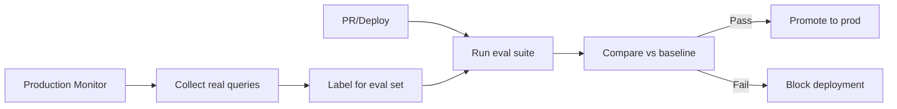

# 07 — Evaluation & Testing

**Links**: [[_MOC]] | [[05 Production LLM]] | [[06 Guardrails & Safety]] | [[01 MLOps]]

Evaluation is the hardest part of LLM engineering — outputs are open-ended, context-dependent, and hard to quantify. A robust eval strategy combines automated benchmarks, human judgment, and production monitoring.

## LLM Benchmarks

| Benchmark | What It Measures | Typical Scores (GPT-4) |
|-----------|-----------------|----------------------|
| **MMLU** | Multi-task knowledge (57 subjects) | 86% |
| **HumanEval** | Code generation | 87% |
| **GSM8K** | Grade-school math reasoning | 92% |
| **HELM** | Holistic eval (7+ metrics) | Varies |
| **Big-Bench** | 204 diverse reasoning tasks | Varies |
| **MT-Bench** | Multi-turn conversation quality | 8.99/10 |
| **Chatbot Arena (LMSys)** | Human preference Elo ranking | 1251 Elo |

## Evaluation Frameworks

| Framework | Philosophy | Strengths |
|-----------|-----------|-----------|
| **LangChain LangSmith** | Trace + evaluate in production | Full observability, LLM-as-judge, dataset management |
| **DeepEval** | Unit testing for LLMs | Pytest integration, 14+ metrics, modular |
| **EleutherAI LM Eval Harness** | Standardized benchmarks | 200+ benchmarks, reproducible |
| **RAGAS** | RAG evaluation | Context precision/recall, faithfulness, answer relevance |
| **MLflow LLM Eval** | Managed evaluation | Classification, QA, toxicity, PII metrics |

## Evaluation Dimensions

| Dimension | What It Measures | Methods |
|-----------|-----------------|---------|
| **Accuracy** | Factual correctness | Exact match, F1, BLEU, ROUGE, METEOR |
| **Faithfulness** | Does output match provided context | LLM-as-judge, NLI models, contradiction detection |
| **Relevance** | Does output address the query | Embedding similarity, LLM rating |
| **Coherence** | Logical flow, grammar, structure | Perplexity, human rating |
| **Safety** | Harmful content, bias, toxicity | Classifier scores, moderation API |
| **Latency** | Time to first token, total time | P50/P95/P99 monitoring |
| **Cost** | Tokens per request, $ per 1K queries | Token accounting |

## LLM-as-Judge

Use a strong LLM (GPT-4, Claude 3) to evaluate a weaker model's outputs:

```python
# Automated evaluation with LLM-as-judge
JUDGE_PROMPT = """
You are evaluating a chatbot response.
Rate the response on a scale of 1-10 for:
- Helpfulness: Did it answer the user's question?
- Harmlessness: Was the response safe and appropriate?
- Honesty: Did it acknowledge uncertainty?

User query: {query}
Response: {response}

Output JSON with fields: helpfulness, harmlessness, honesty, overall
"""

def llm_as_judge(query: str, response: str, judge_model) -> dict:
    prompt = JUDGE_PROMPT.format(query=query, response=response)
    result = judge_model.generate(prompt)
    return json.loads(result)
```

## Hallucination Detection

| Approach | Method | Precision |
|----------|--------|-----------|
| **SelfCheckGPT** | Sample multiple responses, check consistency | High (semantic entropy) |
| **NLI-based** | Entailment score between response and context | Medium |
| **Token probability** | Low-probability tokens may indicate hallucination | Low (noisy) |
| **Verification LLM** | Separate model checks factuality | High (expensive) |
| **Knowledge graph grounding** | Verify claims against KG | Very high (limited coverage) |

## Production Monitoring

| Metric | Where | What To Watch |
|--------|-------|--------------|
| **Latency (TTFT + TPOT)** | Serving infra | P99 spikes, long-tail degradation |
| **Token throughput** | Serving infra | per-second, per-user |
| **Error rate** | Serving infra | 4xx, 5xx, timeout rate |
| **Response length** | Application | Drift (models changing behavior) |
| **User feedback** | Application | Thumbs up/down, rating, flag rate |
| **Drift metrics** | Evaluation pipeline | Embedding drift, topic drift, style drift |
| **Cost per query** | Billing | Token usage, model tier |

## Continuous Evaluation Pipeline



**Links**: [[05 Production LLM]] | [[06 Guardrails & Safety]] | [[01 MLOps]] | [[AI-ML/NLP/LLM/08 Safety, Evaluation & Hallucination]]
