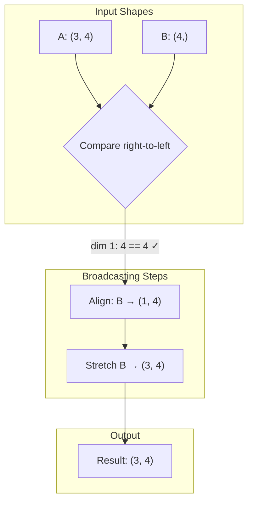

# NumPy Broadcasting

**Links**: [[01 Arrays]] | [[04 Universal Functions]] | [[07 Performance]] | [[_MOC]]

## The Problem

Without broadcasting, adding a scalar to an array requires making a copy with the same shape:

```python
arr = np.ones((3, 3))
# Want to add 5 to every element

# Without broadcasting:
arr + np.full((3, 3), 5)     # Wasteful — creates a 9-element array just for 5

# With broadcasting:
arr + 5                       # NumPy "stretches" 5 to match (3, 3)
```

## The Rules

NumPy compares dimensions **from right to left**. Two dimensions are compatible when:

1. They are equal, **or**
2. One is 1

```python
# Rule applied right-to-left:
# Shape A:        (3, 3, 4)
# Shape B:           (1, 4)
# Result:         (3, 3, 4)   ✓

# Shape A:        (3, 3)
# Shape B:        (3, 1)
# Result:         (3, 3)      ✓

# Shape A:        (3,)
# Shape B:        (1, 3)
# Result:         (1, 3)      → stretched to (3, 3)

# Shape A:        (3, 3)
# Shape B:           (3)
# Result:         (3, 3)      ✓ (B treated as (1, 3))

# Shape A:        (3, 4)
# Shape B:        (3,)
# Result:         ERROR       ✗ (4 ≠ 3, neither is 1)
```

## Visual Examples

```python
# Scalar + array: (1,) + (3,) → (3,)
arr = np.array([1, 2, 3])
arr + 100                      # [101, 102, 103]
# Broadcasting:
#   arr:    [1, 2, 3]
#   100 → [100, 100, 100]
#   sum:   [101, 102, 103]

# Column + row: (3,1) + (4,) → (3,4)
col = np.array([[1], [2], [3]])      # shape: (3, 1)
row = np.array([10, 20, 30, 40])     # shape: (4,)
result = col + row
# result shape: (3, 4)
# [[11, 21, 31, 41],
#  [12, 22, 32, 42],
#  [13, 23, 33, 43]]
```

## Common Patterns

```python
# Standardize (z-score) each column
data = np.random.randn(100, 5)
mean = data.mean(axis=0)         # shape: (5,)
std = data.std(axis=0)           # shape: (5,)
standardized = (data - mean) / std   # Broadcasts (100,5) - (5,) → (100,5)

# Center each row
row_means = data.mean(axis=1, keepdims=True)  # shape: (100, 1)
centered = data - row_means                   # Broadcasts (100,5) - (100,1) → (100,5)

# Outer product via broadcasting
a = np.array([1, 2, 3])   # shape: (3,)
b = np.array([4, 5])      # shape: (2,)
outer = a[:, np.newaxis] * b  # (3,1) * (2,) → (3,2)
# newaxis inserts dimension: a[:, None] → shape (3, 1)
```

## Broadcasting Visualization


