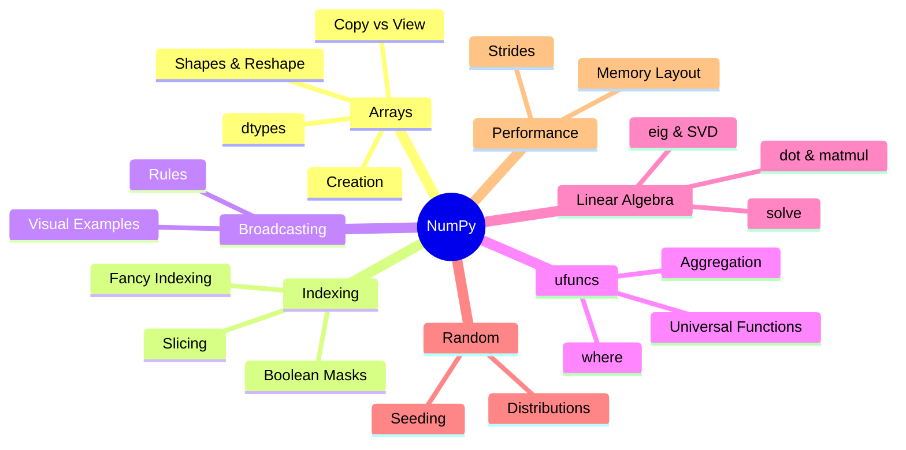

# NumPy — Map of Content

NumPy is the foundational library for numerical computing in Python. Its `ndarray` provides fast, vectorized operations on multi-dimensional arrays — the backbone of pandas, scikit-learn, PyTorch, and virtually every data science library. This folder covers array creation, indexing, broadcasting, linear algebra, random number generation, and performance optimization.

**Parent**: [[../_MOC|Data Science]]

## Notes

| # | File | Covers |
|---|------|--------|
| 01 | [[01 Arrays]] | Creation, shapes, reshape, dtypes, copy vs view |
| 02 | [[02 Indexing]] | Slicing, fancy indexing, boolean masking |
| 03 | [[03 Broadcasting]] | The broadcasting rules with visual examples |
| 04 | [[04 Universal Functions]] | ufuncs, aggregation, where, vectorization |
| 05 | [[05 Linear Algebra]] | dot, matmul, eig, SVD, solve, linalg |
| 06 | [[06 Random]] | Distributions, seeding, random sampling |
| 07 | [[07 Performance]] | Strides, memory layout, C vs Fortran order |

