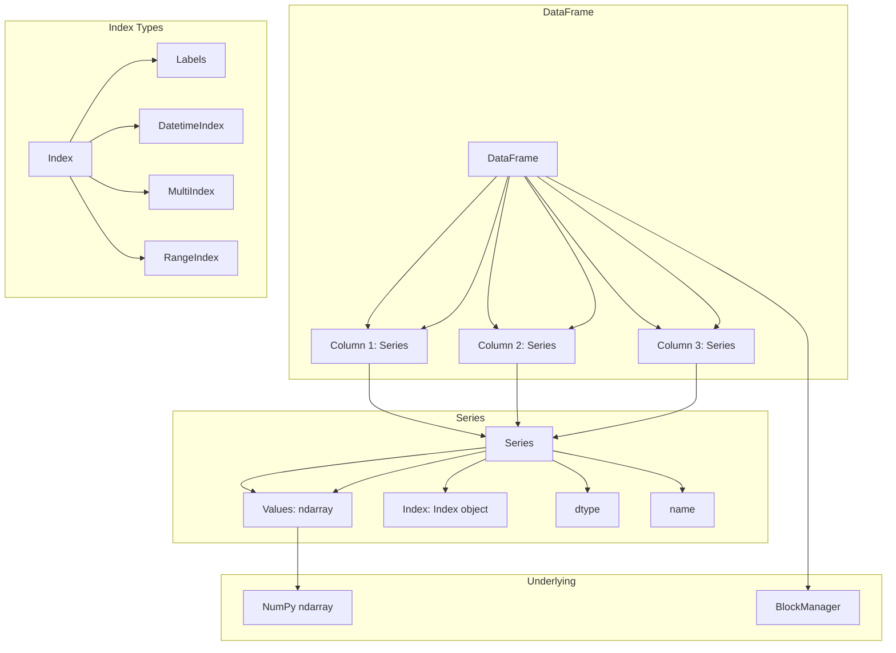

# Pandas Basics

**Links**: [[_MOC]] | [[02 I-O]] | [[03 Cleaning]] | [[04 Selection Indexing]] | [[07 Transform String]] | [[10 Advanced]]

## Core Data Structures

| Structure | Description | Axis |
|-----------|-------------|------|
| Series | 1D labeled array | Index |
| DataFrame | 2D labeled table | Index + Columns |
| Index | Label collection | — |

## Creating DataFrames

```python
import pandas as pd
import numpy as np

# From dictionary
df = pd.DataFrame({
    'name': ['Alice', 'Bob', 'Charlie'],
    'age': [30, 25, 35],
    'city': ['Portland', 'Seattle', 'San Francisco'],
    'salary': [75000, 65000, 95000],
    'hired': pd.to_datetime(['2020-01-15', '2021-03-20', '2019-06-01']),
})

# From list of dicts
df = pd.DataFrame([
    {'name': 'Alice', 'age': 30},
    {'name': 'Bob', 'age': 25},
])

# From CSV
df = pd.read_csv('data.csv', parse_dates=['date'], index_col='id')

# From SQL
df = pd.read_sql('SELECT * FROM users', connection)

# From Parquet
df = pd.read_parquet('data.parquet')
```

## Data Inspection

```python
df.head(10)                      # First 10 rows
df.tail(5)                       # Last 5 rows
df.sample(3)                     # Random 3 rows
df.info()                        # Column types, non-null count, memory
df.describe()                    # Summary statistics (numeric)
df.describe(include='object')    # Summary for categorical cols
df.shape                         # (rows, columns)
df.columns                       # Column names
df.dtypes                        # Column types
df.index                         # Index values
df.memory_usage(deep=True)       # Memory usage per column
```

## Column Types (dtypes)

| Type | Description | When to Use |
|------|-------------|-------------|
| `int64` | Integer | Whole numbers |
| `float64` | Float | Decimal numbers |
| `object` | Mixed/string | Text data (not optimized) |
| `bool` | Boolean | True/False |
| `datetime64[ns]` | Datetime | Dates and timestamps |
| `timedelta[ns]` | Time delta | Time differences |
| `category` | Categorical | Low-cardinality strings (<50% unique) |
| `Int32` (nullable) | Nullable integer | Integer with NA support |

## DataFrame Architecture


