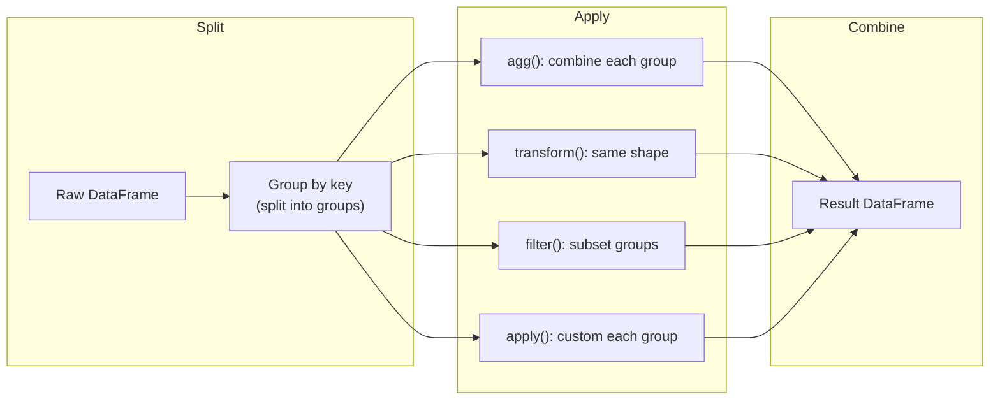

# Pandas GroupBy and Aggregation

**Links**: [[04 Selection Indexing]] | [[06 Merge Join Concat]] | [[07 Transform String]] | [[_MOC]]

## Basic GroupBy

```python
df.groupby('city')['salary'].mean()
df.groupby('city')['salary'].agg(['mean', 'median', 'std'])

# Named aggregation (clean, column names)
df.groupby('city').agg(
    avg_salary=('salary', 'mean'),
    count=('name', 'count'),
    total=('salary', 'sum'),
).reset_index()
```

## Multiple Aggregations Per Column

```python
df.groupby('region').agg({
    'amount': ['sum', 'mean', 'std', 'count'],
    'date': ['min', 'max'],
    'customer_id': 'nunique',
})
```

## Transform — Same Shape as Original

```python
# Percent of group total
df['pct_of_group'] = (
    df.groupby('region')['amount']
    .transform(lambda x: x / x.sum() * 100)
)

# Z-score within each group
df['z_score'] = (
    df.groupby('category')['value']
    .transform(lambda x: (x - x.mean()) / x.std())
)
```

## Filter Groups

```python
df.groupby('customer').filter(lambda g: g['amount'].sum() > 1000)
df.groupby('region').filter(lambda g: len(g) >= 10)
```

## Apply — Custom Aggregation

```python
def top_two(series):
    return series.nlargest(2).sum()

df.groupby('region')['amount'].apply(top_two)

# Multiple custom at once
df.groupby('region').agg(
    total_revenue=('amount', 'sum'),
    avg_revenue=('amount', 'mean'),
    top_two_sum=('amount', top_two),
    n_customers=('customer_id', 'nunique'),
    first_date=('date', 'min'),
    last_date=('date', 'max'),
)
```

## Pivot Tables

```python
pd.pivot_table(
    df,
    values='amount',
    index='region',
    columns='category',
    aggfunc='sum',
    fill_value=0,
    margins=True,
    margins_name='Total',
)

# Quick pivot (no aggregation — unique index/column pairs)
df_long.pivot(
    index='id',
    columns='quarter',
    values='revenue',
)
```

## Cross-Tabulation

```python
pd.crosstab(
    index=df['region'],
    columns=df['category'],
    values=df['amount'],
    aggfunc='sum',
    normalize='index',
    margins=True,
)
```

## Stack / Unstack / Melt

```python
# Setup wide data
df_wide = pd.DataFrame({
    'id': [1, 2, 3],
    'Q1': [100, 200, 150],
    'Q2': [110, 210, 160],
    'Q3': [120, 220, 170],
    'Q4': [130, 230, 180],
}).set_index('id')

# Stack: wide → long
df_long = df_wide.stack().reset_index(name='revenue')
df_long.columns = ['id', 'quarter', 'revenue']

# Unstack: long → wide
df_wide_back = df_long.set_index(['id', 'quarter']).unstack()

# Melt: explicit unpivot
df_melted = pd.melt(
    df_wide.reset_index(),
    id_vars=['id'],
    value_vars=['Q1', 'Q2', 'Q3', 'Q4'],
    var_name='quarter',
    value_name='revenue',
)
```

## Visual GroupBy Flow


