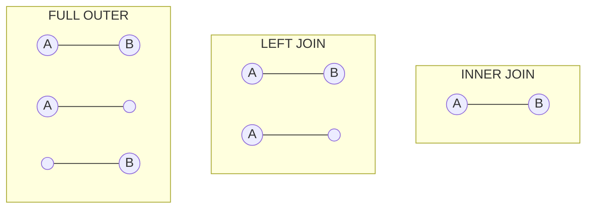
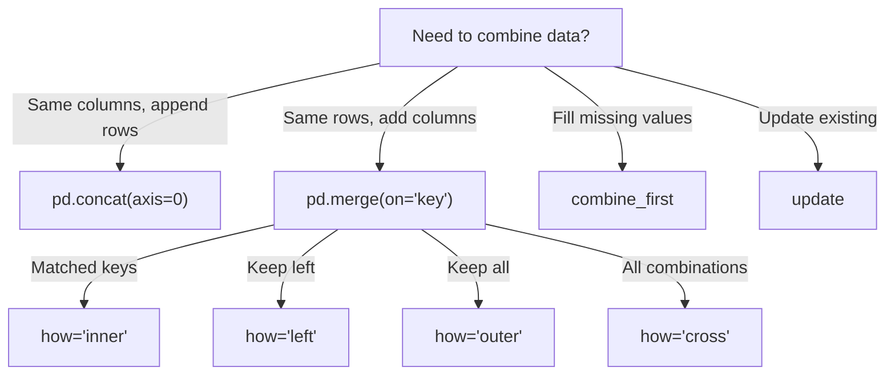

# Pandas Merge, Join, and Concat

**Links**: [[05 GroupBy Aggregation]] | [[04 Selection Indexing]] | [[_MOC]]

## SQL-Style Merges

```python
merged = pd.merge(
    df_orders,
    df_customers,
    on='customer_id',
    how='left',               # left, right, inner, outer, cross
    suffixes=('_order', '_customer'),
)
```

### Join Types Visualized



## Merge Validation

```python
# Validate merge relationships
pd.merge(df_orders, df_customers, on='customer_id',
    validate='m:1')               # Many-to-one

pd.merge(df_parent, df_child, on='parent_id',
    validate='1:m')               # One-to-many

pd.merge(df_a, df_b, on='id',
    validate='1:1')               # One-to-one

# Indicator column
merged = pd.merge(df_orders, df_customers, on='customer_id',
    how='outer', indicator=True)
merged['_merge'].value_counts()   # left_only, right_only, both
```

## Advanced Merge Patterns

```python
# Multiple column merge
pd.merge(df_a, df_b,
    left_on=['first', 'last'],
    right_on=['first_name', 'last_name'],
    how='left',
    suffixes=('_left', '_right'),
)

# Merge on index
pd.merge(df_a, df_b,
    left_index=True,
    right_on='customer_id',
)

# Cross join (cartesian product)
df_cross = pd.merge(
    df_products.assign(key=1),
    df_dates.assign(key=1),
    on='key',
).drop('key', axis=1)
```

## Concat

```python
# Row-wise (vertical)
pd.concat([df1, df2], axis=0)
pd.concat([df1, df2], ignore_index=True)
pd.concat([df1, df2], keys=['Q1', 'Q2'])

# Column-wise (horizontal)
pd.concat([df1, df2], axis=1)
```

## Combine & Update

```python
# Fill missing from another dataframe
df_a.combine_first(df_b)    # df_a values where non-null, else df_b

# Update in place
df_a.update(df_b)           # Modifies df_a where df_b has non-null
```

## Merge Decision Flow


