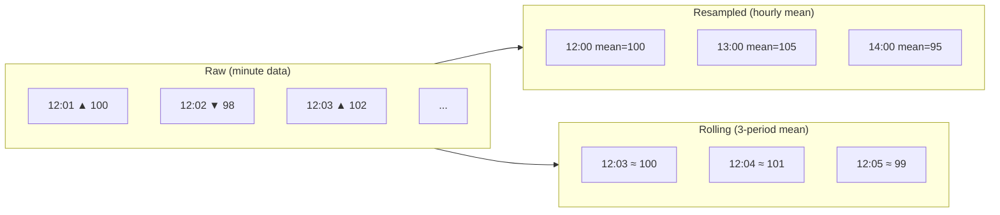

# Pandas Time Series

**Links**: [[01 Basics]] | [[03 Cleaning]] | [[05 GroupBy Aggregation]] | [[_MOC]]

## Creating Date Ranges

```python
dates = pd.date_range(
    start='2024-01-01',
    end='2024-12-31',
    freq='D',
)
dates_hourly = pd.date_range('2024-01-01', periods=24, freq='h')
dates_business = pd.date_range('2024-01-01', periods=20, freq='B')

# Period ranges
period = pd.Period('2024-Q1', freq='Q')
periods = pd.period_range('2024-01', periods=12, freq='M')
```

## Setting Datetime Index

```python
df.set_index('date', inplace=True)
df.index = pd.to_datetime(df.index)

# Or while reading
df = pd.read_csv('data.csv', parse_dates=['date'], index_col='date')
```

## Resampling

```python
df.resample('D').mean()          # Daily
df.resample('W').sum()           # Weekly
df.resample('ME').sum()          # Month end
df.resample('Q').mean()          # Quarterly
df.resample('Y').max()           # Yearly
df.resample('h').ffill()         # Hourly (forward fill gaps)

# Custom aggregation on resample
df.resample('M').agg({
    'sales': 'sum',
    'customers': 'nunique',
    'price': 'mean',
})
```

## Rolling Windows

```python
df['rolling_avg'] = df['value'].rolling(window=7).mean()
df['expanding'] = df['value'].expanding().mean()

# Rolling with custom function
df['rolling_custom'] = (
    df['value']
    .rolling(window=5, min_periods=2)
    .apply(lambda x: x.max() - x.min(), raw=False)
)

# Multiple metrics
def rolling_stats(series):
    return pd.Series({
        'mean': series.mean(),
        'std': series.std(),
        'skew': series.skew(),
    })

df_rolling = (
    df['value']
    .rolling(10)
    .apply(rolling_stats, raw=False)
)

# Rolling on grouped data
df['group_rolling_avg'] = (
    df.groupby('category')['value']
    .transform(lambda x: x.rolling(3, min_periods=1).mean())
)
```

## Exponentially Weighted Moving (EWM)

```python
df['ewm_halflife'] = df['value'].ewm(halflife=5).mean()
df['ewm_span'] = df['value'].ewm(span=12, adjust=False).mean()
df['ewm_com'] = df['value'].ewm(com=0.5).std()
```

## Shifting and Differencing

```python
df['prev_day'] = df['value'].shift(1)
df['next_day'] = df['value'].shift(-1)
df['pct_change'] = df['value'].pct_change()
df['diff'] = df['value'].diff()
df['log_return'] = np.log(df['value'] / df['value'].shift(1))
```

## Timedelta

```python
df['duration'] = df['end_date'] - df['start_date']
df['duration_days'] = df['duration'].dt.days
df['duration_hours'] = df['duration'].dt.total_seconds() / 3600

# Date arithmetic
df['date'] + pd.Timedelta(days=7)
df['date'] + pd.offsets.MonthEnd()
df['date'] + pd.offsets.BusinessDay(5)
```

## Date Component Features

```python
df['date'].dt.year
df['date'].dt.month
df['date'].dt.day
df['date'].dt.dayofweek        # Mon=0, Sun=6
df['date'].dt.dayofyear
df['date'].dt.quarter
df['date'].dt.is_month_start
df['date'].dt.is_month_end
df['date'].dt.is_quarter_end
df['date'].dt.is_year_end
df['date'].dt.days_in_month

# Floor/ceil
df['date'].dt.floor('D')
df['date'].dt.ceil('h')
```

## Timezone Handling

```python
df['date_utc'] = df['date'].dt.tz_localize('UTC')
df['date_est'] = df['date_utc'].dt.tz_convert('US/Eastern')

# Custom business days with holidays
from pandas.tseries.offsets import CustomBusinessDay
from pandas.tseries.holiday import USFederalHolidayCalendar
bday_us = CustomBusinessDay(calendar=USFederalHolidayCalendar())
df['next_business'] = df['date'] + bday_us
```

## Resample Visualization


