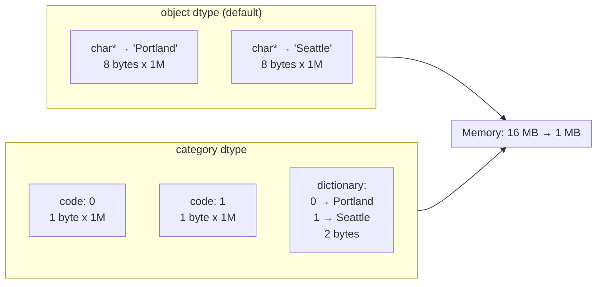

# Pandas Advanced: Performance and Optimization

**Links**: [[01 Basics]] | [[02 I-O]] | [[04 Selection Indexing]] | [[_MOC]]

## Memory Optimization

```python
# Check memory usage
df.info(memory_usage='deep')
df.memory_usage(deep=True)

# Downcast numeric types
def downcast(df):
    for col in df.select_dtypes(include=['int']).columns:
        df[col] = pd.to_numeric(df[col], downcast='integer')
    for col in df.select_dtypes(include=['float']).columns:
        df[col] = pd.to_numeric(df[col], downcast='float')
    return df

# Use nullable integer types
df['nullable_int'] = pd.array([1, 2, None], dtype='Int32')

# Categorical for low-cardinality strings
for col in df.select_dtypes(include='object').columns:
    if df[col].nunique() / len(df) < 0.5:
        df[col] = df[col].astype('category')

# Sparse data
df['sparse_col'] = pd.arrays.SparseArray(
    df['sparse_col'], fill_value=0
)

# Safe downcast helper
int_types = {
    'int8': (-128, 127),
    'int16': (-32768, 32767),
    'int32': (-2147483648, 2147483647),
    'int64': (-9223372036854775808, 9223372036854775807),
}

def safe_downcast_int(series):
    mn, mx = series.min(), series.max()
    for dtype, (lo, hi) in int_types.items():
        if mn >= lo and mx <= hi:
            return series.astype(dtype)
    return series
```

## Chunked Processing

```python
# Process large CSV in chunks
chunks = []
for chunk in pd.read_csv('huge.csv', chunksize=50000, low_memory=False):
    chunk = downcast(chunk)
    # ... process ...
    chunks.append(chunk)
result = pd.concat(chunks, ignore_index=True)

# Or use chunked processing with aggregation
results = []
for chunk in pd.read_csv('large.csv', chunksize=10000):
    results.append(
        chunk.groupby('city')['value'].sum()
    )
final = pd.concat(results).groupby(level=0).sum()
```

## Vectorization — Avoid Apply

```python
# Fast (vectorized)
df['total'] = df['quantity'] * df['price']

# Slow (apply row by row)
df['total'] = df.apply(
    lambda r: r['quantity'] * r['price'], axis=1
)

# Vectorized string ops (fast)
df['clean'] = df['text'].str.strip().str.lower()

# Slow apply
df['clean'] = df['text'].apply(
    lambda x: x.strip().lower() if isinstance(x, str) else x
)
```

## MultiIndex Deep Operations

```python
# Aggregate across levels
df_mi.groupby(level='region').sum()
df_mi.groupby(level=[0]).mean()

# Stack/unstack levels
df_mi.unstack(level='direction')
df_mi.stack()

# Sort by index levels
df_mi.sort_index(level=['region', 'direction'])

# Partial groupby
df_mi.groupby(level='region').transform(lambda x: x / x.sum())
```

## Pandas vs Polars

| Feature | Pandas | Polars |
|---------|--------|--------|
| Execution | Eager only | Eager + Lazy |
| Backend | NumPy | Apache Arrow |
| Memory | ~2x data size | ~1x data size |
| Multi-core | Single core | Automatic parallel |
| Index | Central concept | No index |
| API style | Method chaining | Expression-based |
| GroupBy | `.groupby('c').agg({'v':'sum'})` | `.group_by('c').agg(pl.col('v').sum())` |
| Missing data | NaN, None, NaT | null (unified) |
| Speed | Baseline | 5-30x faster |

```python
# Polars equivalent
import polars as pl

df_pl = pl.read_csv('data.csv')
q = (
    df_pl.lazy()
    .filter(pl.col('amount') > 0)
    .group_by('region')
    .agg([
        pl.col('amount').sum().alias('total'),
        pl.col('amount').mean().alias('avg'),
    ])
    .sort('total', descending=True)
)
result = q.collect()
```

## Memory Usage Diagram


