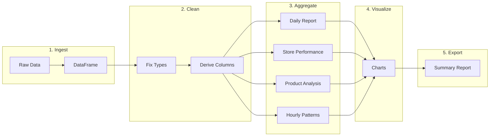

# Pandas End-to-End Data Pipeline

**Links**: [[02 I-O]] | [[03 Cleaning]] | [[05 GroupBy Aggregation]] | [[09 Visualization]] | [[_MOC]]

This example walks through a complete data analysis pipeline using a sales dataset: ingest → clean → feature engineer → aggregate → visualize.

## 1. Setup and Ingest

```python
import pandas as pd
import numpy as np
import matplotlib.pyplot as plt

# Generate sample sales data
np.random.seed(42)
dates = pd.date_range('2023-01-01', '2023-12-31', freq='h')
n = len(dates)

df = pd.DataFrame({
    'timestamp': dates,
    'store_id': np.random.choice(['S001', 'S002', 'S003', 'S004'], n),
    'product_id': np.random.choice(['P-A', 'P-B', 'P-C', 'P-D', 'P-E'], n),
    'quantity': np.random.poisson(3, n),
    'unit_price': np.random.uniform(5, 50, n).round(2),
    'customer_id': np.random.randint(1000, 5000, n),
    'promo_applied': np.random.choice([True, False], n, p=[0.3, 0.7]),
})
```

## 2. Clean

```python
# Remove invalid records
df = df[df['quantity'] > 0]

# Add derived columns
df['revenue'] = df['quantity'] * df['unit_price']
df['date'] = df['timestamp'].dt.date
df['hour'] = df['timestamp'].dt.hour
df['day_of_week'] = df['timestamp'].dt.dayofweek
df['month'] = df['timestamp'].dt.month
df['is_weekend'] = df['day_of_week'] >= 5

# Flag high-value transactions
df['high_value'] = df['revenue'] > df['revenue'].quantile(0.95)
```

## 3. Daily Aggregation

```python
daily = df.groupby('date').agg(
    total_revenue=('revenue', 'sum'),
    avg_transaction=('revenue', 'mean'),
    transaction_count=('revenue', 'count'),
    unique_customers=('customer_id', 'nunique'),
    quantity_sold=('quantity', 'sum'),
    promo_count=('promo_applied', 'sum'),
).reset_index()

daily['date'] = pd.to_datetime(daily['date'])
daily.set_index('date', inplace=True)
daily.head()
```

## 4. Store Performance

```python
store_stats = df.groupby('store_id').agg(
    total_revenue=('revenue', 'sum'),
    avg_revenue=('revenue', 'mean'),
    transactions=('revenue', 'count'),
    unique_products=('product_id', 'nunique'),
    avg_quantity=('quantity', 'mean'),
    promo_rate=('promo_applied', 'mean'),
).round(2).sort_values('total_revenue', ascending=False)

store_stats
```

## 5. Product Analysis

```python
product_stats = df.groupby('product_id').agg(
    total_revenue=('revenue', 'sum'),
    total_quantity=('quantity', 'sum'),
    avg_price=('unit_price', 'mean'),
    transaction_count=('revenue', 'count'),
).round(2)

product_stats['revenue_share'] = (
    product_stats['total_revenue'] / product_stats['total_revenue'].sum() * 100
)
product_stats = product_stats.sort_values('total_revenue', ascending=False)
product_stats
```

## 6. Hourly Patterns

```python
hourly = df.groupby('hour').agg(
    revenue=('revenue', 'sum'),
    transactions=('revenue', 'count'),
    avg_basket=('revenue', 'mean'),
).reset_index()

# Best and worst hours
peak_hour = hourly.loc[hourly['revenue'].idxmax()]
print(f"Peak hour: {peak_hour['hour']}:00 with ${peak_hour['revenue']:,.0f}")

# Weekend vs weekday
day_type = df.groupby('is_weekend').agg(
    revenue_per_day=('revenue', 'mean'),
    transactions_per_day=('revenue', 'count'),
).round(2)
```

## 7. Visualization

```python
fig, axes = plt.subplots(2, 3, figsize=(16, 10))

# Daily revenue trend
axes[0, 0].plot(daily.index, daily['total_revenue'],
    linewidth=1, alpha=0.7)
axes[0, 0].set_title('Daily Revenue Trend')
axes[0, 0].tick_params(axis='x', rotation=45)

# Revenue by store
store_stats['total_revenue'].plot(
    kind='bar', ax=axes[0, 1], color='steelblue',
    edgecolor='black', title='Revenue by Store'
)
axes[0, 1].tick_params(axis='x', rotation=0)

# Product revenue share
axes[0, 2].pie(
    product_stats['revenue_share'],
    labels=product_stats.index,
    autopct='%1.1f%%',
    startangle=90,
)

# Hourly pattern
axes[1, 0].plot(hourly['hour'], hourly['revenue'],
    marker='o', linewidth=2)
axes[1, 0].set_title('Revenue by Hour')
axes[1, 0].set_xlabel('Hour')
axes[1, 0].set_ylabel('Revenue')
axes[1, 0].grid(True, alpha=0.3)

# Revenue distribution
axes[1, 1].hist(df['revenue'], bins=50,
    edgecolor='black', alpha=0.7)
axes[1, 1].set_title('Transaction Value Distribution')
axes[1, 1].set_xlabel('Revenue')
axes[1, 1].axvline(
    df['revenue'].mean(), color='red',
    linestyle='--', label='Mean'
)
axes[1, 1].legend()

# Promo impact
promo_stats = df.groupby('promo_applied')['revenue'].mean()
axes[1, 2].bar(['No Promo', 'Promo'], promo_stats.values,
    color=['#ff7f7f', '#7fbfff'], edgecolor='black')
axes[1, 2].set_title('Average Revenue: Promo vs No Promo')

plt.tight_layout()
plt.show()
```

## 8. Key Insights

```python
# Summary report
report = {
    'total_revenue': daily['total_revenue'].sum(),
    'total_transactions': len(df),
    'avg_daily_revenue': daily['total_revenue'].mean(),
    'peak_revenue_day': daily['total_revenue'].idxmax().date(),
    'best_store': store_stats.index[0],
    'best_product': product_stats.index[0],
    'avg_transaction': df['revenue'].mean(),
    'promo_impact': (
        f"{promo_stats[True] - promo_stats[False]:.2f} per transaction"
    ),
}

for key, value in report.items():
    print(f"{key:30s}: {value}")
```

## Pipeline Flow


