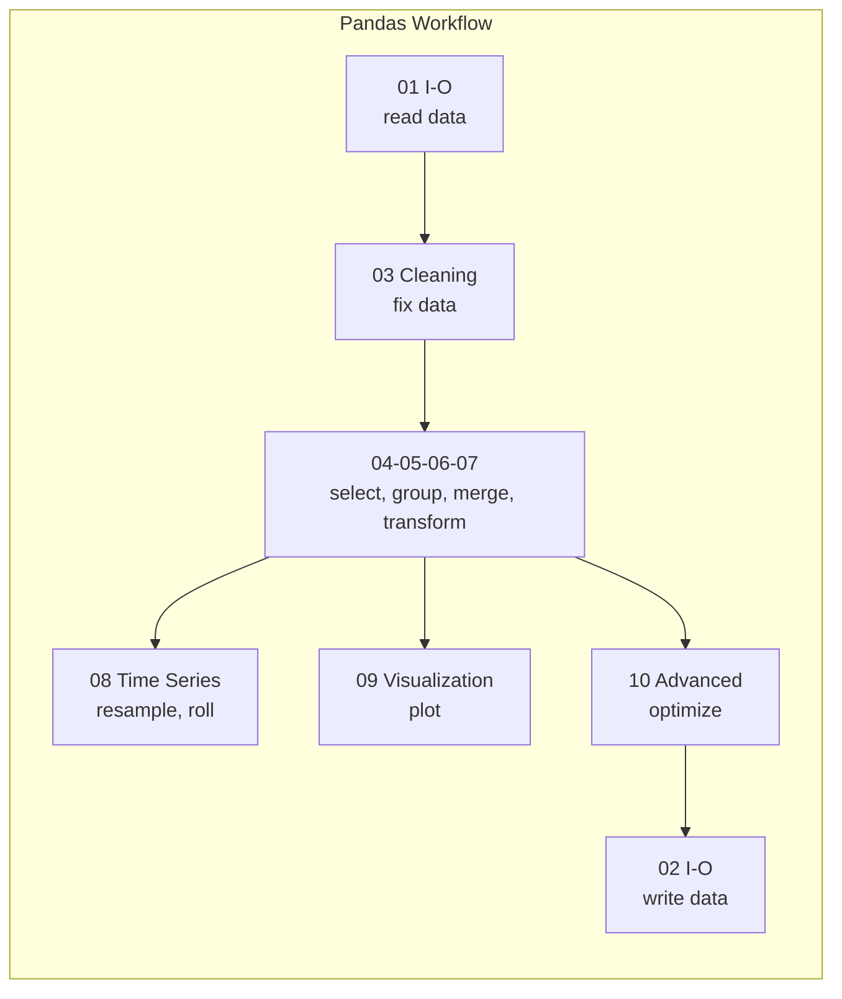

# Pandas — Map of Content

Pandas is the fundamental Python library for data manipulation and analysis, built on top of NumPy. Its core data structures — `Series` (1D) and `DataFrame` (2D) — provide labeled, axis-aware containers that integrate deeply with databases, spreadsheets, and statistical models. This folder covers the full pandas workflow from data ingestion to production pipelines.

**Parent**: [[../_MOC|Data Science]]

## Notes

| # | File | Covers |
|---|------|--------|
| 01 | [[01 Basics]] | Series, DataFrame, creation, inspection, dtypes, memory usage |
| 02 | [[02 I-O]] | CSV, Excel, SQL, Parquet, Feather, JSON, clipboard |
| 03 | [[03 Cleaning]] | Missing data, duplicates, outliers, type conversion |
| 04 | [[04 Selection Indexing]] | loc/iloc, boolean indexing, MultiIndex, slicing |
| 05 | [[05 GroupBy Aggregation]] | groupby, agg, transform, filter, pivot_table, crosstab |
| 06 | [[06 Merge Join Concat]] | merge (all types), concat, combine_first, update |
| 07 | [[07 Transform String]] | apply, map, replace, .str accessor, categoricals |
| 08 | [[08 Time Series]] | date_range, resample, rolling, ewm, shifting |
| 09 | [[09 Visualization]] | .plot API, matplotlib/seaborn integration, custom styles |
| 10 | [[10 Advanced]] | Memory optimization, chunking, MultiIndex deep, Polars comparison |
| 11 | [[11 End-to-End Pipeline]] | Full pipeline from ingest to clean to transform to viz |

## Quick Reference

| Operation | Code | Notes |
|-----------|------|-------|
| Read CSV | `pd.read_csv('file.csv')` | `parse_dates`, `dtype`, `chunksize` |
| Filter | `df[df['col'] > 0]` | Or `.query('col > 0')` |
| Group sum | `df.groupby('g')['v'].sum()` | `.agg()` for multiple |
| Merge | `pd.merge(a, b, on='k', how='left')` | `validate`, `indicator` |
| Pivot | `df.pivot(index, columns, values)` | `pivot_table` with aggregation |
| Resample | `df.resample('M').mean()` | Requires datetime index |
| Rolling | `df['v'].rolling(7).mean()` | `.apply(custom_fn)` |
| One-hot | `pd.get_dummies(df['col'])` | `drop_first=True` |
| Sort | `df.sort_values('col')` | `ascending=False` |
| Value counts | `df['col'].value_counts(normalize=True)` | `dropna=False` |
