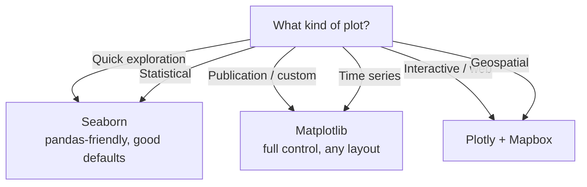

# Visualization — Map of Content

Data visualization turns numbers into insights. This folder covers the three major Python visualization libraries: Matplotlib (foundational, customizable), Seaborn (statistical, high-level), and Plotly (interactive, web-ready). Each library serves different needs — use the decision guide below to choose.

**Parent**: [[../_MOC|Data Science]]

## Notes

| Library | File | Best For |
|---------|------|----------|
| Matplotlib | [[Matplotlib]] | Full control, publication-quality, custom layouts |
| Seaborn | [[Seaborn]] | Statistical plots, attractive defaults, data exploration |
| Plotly | [[Plotly]] | Interactive charts, dashboards, web apps |

## Decision Guide

## Quick Comparison

| Feature | Matplotlib | Seaborn | Plotly |
|---------|-----------|---------|--------|
| API level | Low | High | Medium |
| Default style | Functional | Beautiful | Interactive |
| Interactivity | No | No | Yes (hover, zoom) |
| Statistical plots | Manual | Built-in | Limited |
| Speed | Fast | Fast | Moderate |
| Web export | Static images | Static images | Full HTML/JS |
| 3D plots | Yes | No | Yes |
| Map support | Limited | No | Yes (Mapbox) |
| pandas integration | `.plot()` | `.plot()` + `sns.*` | `plotly.express` |
