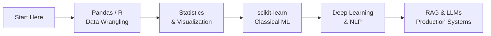

# Data Science — Map of Content

**Parent**: [[_MOC|Master Index]]

```mermaid
graph TD
  DS["Data Science"] --> LANG["Languages & Tools"]
  DS --> WRANGLING["Data Wrangling"]
  DS --> VIZ["Visualization"]
  DS --> STATS["Statistics & Probability"]
  DS --> ML["Machine Learning"]
  DS --> ENG["Data Engineering"]
  DS --> PROD["Production & MLOps"]

  LANG --> R["R for Data Science"]
  LANG --> PY["Pandas for Data Analysis"]
  LANG --> SKL["scikit-learn Deep Dive"]
  LANG --> SQL["SQL Query Optimization"]

  WRANGLING --> TIDY["dplyr / tidyr"]
  WRANGLING --> PAN["Pandas"]
  WRANGLING --> CLEAN["Data Cleaning"]

  VIZ --> GG["ggplot2"]
  VIZ --> MAT["matplotlib / seaborn"]
  VIZ --> BI["BI Tools"]

  STATS --> HYP["Hypothesis Testing"]
  STATS --> DIST["Distributions"]
  STATS --> BAYES["Bayesian Methods"]
  STATS --> INF["Information Theory"]

  ML --> SUP["Supervised Learning"]
  ML --> UNSUP["Unsupervised Learning"]
  ML --> ENSEMBLE["Ensemble Methods"]
  ML --> DL["Deep Learning"]

  ENG --> ETL["ETL / Data Pipelines"]
  ENG --> DW["Data Warehousing"]
  ENG --> FEAT["Feature Stores"]

  PROD --> MLOPS["MLOps"]
  PROD --> MON["Model Monitoring"]
  PROD --> EXP["Experiment Tracking"]
```

## Topics

| Category | Notes |
|----------|-------|
| **Languages & Tools** | [[R for Data Science]], [[Pandas for Data Analysis]], [[scikit-learn Deep Dive]], [[SQL Query Optimization]] |
| **Statistics & Probability** | [[Information Theory]], [[Data Normalization Rules]], [[Database Indexing Deep Dive]] |
| **Machine Learning** | [[AI-ML/Deep-Learning/Machine-Learning/_MOC\|ML MOC]], [[Gradient Boosting]], [[Ensemble Methods]], [[Clustering Algorithms]] |
| **Data Engineering** | [[Data Engineering]], [[ETL and Data Pipeline Patterns]], [[Data Warehouse Modeling]], [[Feature Stores for Machine Learning]] |
| **Visualization** | — (see R and Python notes) |
| **Production** | [[MLOps]], [[Model Monitoring in Production]], [[AI-ML/Deep-Learning/LLMOps and AI Observability\|LLMOps]] |

## Learning Path

## Cross-Domain Links

- [[Pandas for Data Analysis]] → [[Data Engineering]], [[SQL Query Optimization]]
- [[scikit-learn Deep Dive]] → [[AI-ML/Deep-Learning/Machine-Learning/_MOC|Machine Learning]]
- [[Data Engineering]] → [[RAG Architecture]], [[Stream Processing]], [[Cloud Computing]]
- [[R for Data Science]] → [[Julia]], [[Machine Translation]]
- [[Feature Stores for Machine Learning]] → [[AI-ML/RAG/_MOC|RAG]], [[MLOps]]
