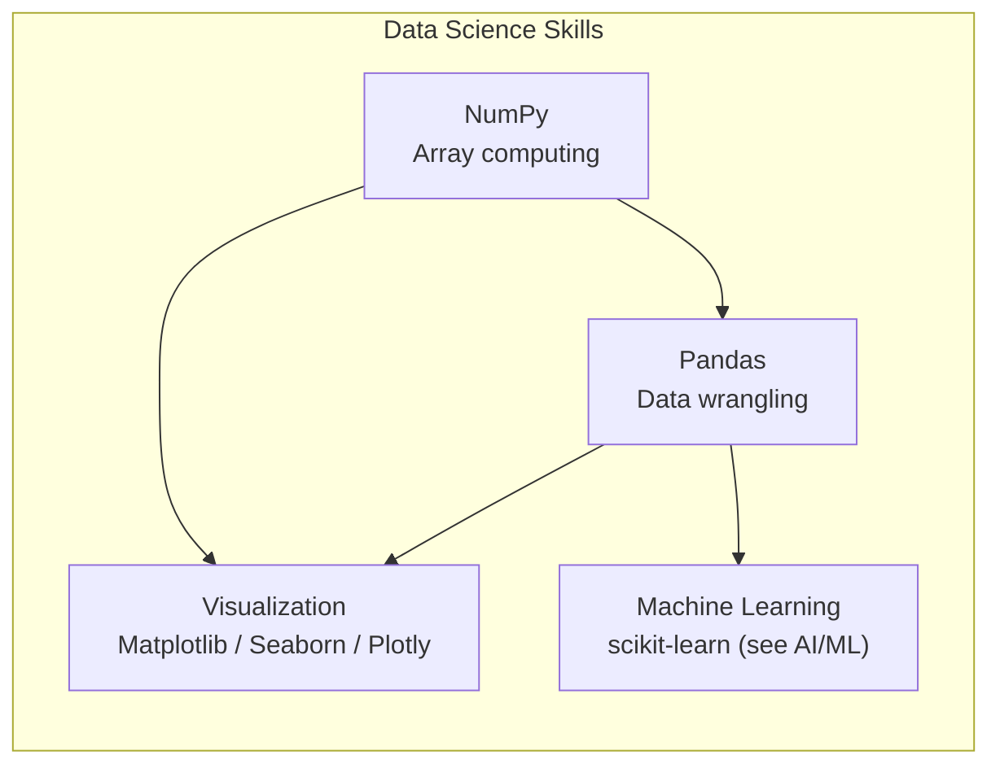
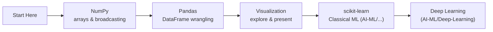

# Data Science — Map of Content

Data science extracts insights from data through statistical analysis, visualization, and machine learning. This folder now contains dedicated sub-folders for the core Python data science stack: **Pandas** for data wrangling, **NumPy** for numerical computing, and **Visualization** (Matplotlib, Seaborn, Plotly) for exploratory and presentation graphics. Each sub-folder is organized as a progressive learning path.

**Parent**: [[_MOC|Master Index]]

## Sub-Areas

| Area | Files | Covers |
|------|-------|--------|
| [[Pandas/_MOC\|Pandas]] | 11 | Basics, I-O, cleaning, indexing, groupby, merge, transform, time series, viz, advanced, end-to-end pipeline |
| [[NumPy/_MOC\|NumPy]] | 7 | Arrays, indexing, broadcasting, ufuncs, linear algebra, random, performance |
| [[Visualization/_MOC\|Visualization]] | 4 | Matplotlib, Seaborn, Plotly — comparison and decision guide |

## Learning Path

## Cross-Domain Links

- [[Pandas/_MOC|Pandas]] → [[../../Web-Dev/Programming/Python Deep Dive|Python]], [[System-Design/Databases/Database Indexing Deep Dive|Database Indexing]], [[System-Design/Databases/ETL and Data Pipeline Patterns|ETL]]
- [[NumPy/_MOC|NumPy]] → [[../../Web-Dev/Programming/Python Deep Dive|Python]], [[System-Design/Architecture/Computer Architecture and Organization|Computer Architecture]]
- [[Visualization/_MOC|Visualization]] → [[AI-ML/Deep-Learning/Machine-Learning/_MOC|Machine Learning]]
- [[Pandas/11 End-to-End Pipeline|Data Pipeline]] → [[System-Design/Databases/ETL and Data Pipeline Patterns|ETL Patterns]], [[System-Design/Databases/Data Engineering|Data Engineering]]
- [[Pandas/05 GroupBy Aggregation|GroupBy]] → [[System-Design/Databases/SQL JOIN Operations|SQL JOINs]]
