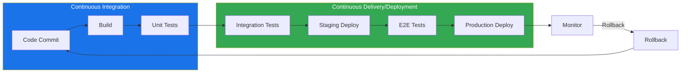

# 🔄 CI/CD — Map of Content

Continuous Integration and Continuous Deployment automate the path from code commit to production release. This folder covers the four major CI/CD platforms — GitHub Actions, GitLab CI, Jenkins, and general CI/CD pipeline design — with configuration examples, best practices, and migration strategies between platforms.

**Parent**: [[DevOps/_MOC|DevOps]]

## CI/CD Pipeline Flow

## Tools Comparison

| Tool | Hosting | Configuration | Language | Scalability | Cost Model | Best For |
|------|---------|--------------|----------|-------------|------------|----------|
| [[DevOps/CI-CD/GitHub Actions]] | Cloud (GitHub) | YAML workflows | Node.js, Docker, any | Good (20 concurrent) | Free tier + per-minute | Open-source, GitHub projects |
| [[DevOps/CI-CD/GitLab CI]] | Cloud/Self-hosted | YAML .gitlab-ci.yml | Any (via runners) | Excellent (auto-scaling) | Free tier + per-user | End-to-end DevOps platform |
| [[DevOps/CI-CD/Jenkins]] | Self-hosted | Jenkinsfile (Groovy) | Java ecosystem | Manual scaling | Free (open-source) | Complex enterprise pipelines |
| [[DevOps/CI-CD/CI CD Pipelines]] | Any | Varies | Any | Varies | Varies | Foundational understanding |

## Pipeline Stages Breakdown

| Stage | Activities | Tools | Gates |
|-------|-----------|-------|-------|
| Code Commit | Linting, formatting, secret scanning | ESLint, Prettier, GitLeaks | Pre-commit hooks, status checks |
| Build | Compilation, dependency resolution | Maven, Gradle, npm, pip | Build failure = stop |
| Test | Unit, integration, E2E, security scanning | Jest, PyTest, Selenium, OWASP ZAP | Code coverage ≥ 80%, zero critical vulns |
| Deploy | Canary, blue-green, rolling | ArgoCD, Spinnaker, Helm | Health checks, smoke tests |
| Monitor | Metrics, logs, traces, alerts | Prometheus, Grafana, ELK, Datadog | SLO/SLI burn-rate alerts |

## Best Practices

1. **Fail Fast**: Fail the pipeline as early as possible to reduce wasted compute.
2. **Idempotent Builds**: Every build of the same commit must produce identical artifacts.
3. **Immutable Artifacts**: Build once, promote through environments — never rebuild.
4. **Infrastructure as Code**: Define all environments (staging, prod) in version-controlled config.
5. **Security Scanning**: Embed SAST, DAST, dependency scanning, and container scanning in pipelines.
6. **Secret Management**: Never hardcode secrets — use vaults (HashiCorp Vault, AWS Secrets Manager, GitHub Secrets).
7. **Parallel Stages**: Run independent tests in parallel to minimize pipeline duration.
8. **Self-Service**: Let teams own their pipelines; provide templates and shared libraries.
9. **Artifact Retention**: Define retention policies for build artifacts and logs.
10. **Pipeline as Code**: Store pipeline definitions alongside source code in the same repo.

## Common CI/CD Patterns

### Trunk-Based Development
- Developers commit directly to `main` or short-lived feature branches (< 1 day).
- CI runs on every commit; CD deploys from `main` automatically.
- **Pros**: Minimal merge overhead, continuous integration.
- **Cons**: Requires feature flags to hide in-progress work.
- **Links**: [[Git/Git Workflows]], [[Feature Flags and Toggles]]

### Git Flow
- Long-lived branches: `develop`, `release/*`, `hotfix/*`, `main`.
- CI runs on feature branches; CD runs on `release` and `main`.
- **Pros**: Clear separation of concerns, structured releases.
- **Cons**: Complex branching; merge hell in large teams.
- **Links**: [[Git/Git Overview]], [[Release Management]]

### Release Branches
- Cut a `release/X.Y` branch from `main`; only bugfixes allowed.
- CI runs on all branches; CD deploys tagged releases.
- **Pros**: Stable main branch, controlled releases.
- **Cons**: Backport overhead for hotfixes.
- **Links**: [[Semantic Versioning]], [[Change Management]]

### Monorepo vs Multi-Repo
| Aspect | Monorepo | Multi-Repo |
|--------|----------|------------|
| Code sharing | Easy (same repo) | Via packages |
| CI complexity | Smart path-filtering needed | Per-repo pipelines |
| Atomic commits | Yes | No |
| Tooling | Nx, Bazel, Turborepo | Standard CI tools |

## Deployment Strategies

| Strategy | Downtime | Rollback Speed | Risk Profile |
|----------|----------|---------------|--------------|
| Rolling | None | Medium | Low |
| Blue-Green | None | Instant | Very Low |
| Canary | None | Incremental | Very Low (traffic shifting) |
| Recreate | Full | Slow | High |

## CI/CD Metrics (DORA)

| Metric | Target (Elite) | Target (High) |
|--------|---------------|---------------|
| Deployment Frequency | Multiple times/day | Once/week to once/month |
| Lead Time for Change | < 1 hour | < 1 week |
| Change Failure Rate | < 5% | < 15% |
| Time to Restore Service | < 1 hour | < 1 day |

## Cross-Domain Links

- [[DevOps/CI-CD/CI CD Pipelines]] → [[Testing/API Testing]], [[Testing/Unit Testing Guide]], [[Git/Git Workflows]], [[System-Design/Databases/Database Migration Tools]]
- [[DevOps/CI-CD/GitHub Actions]] → [[AI-ML/Deep-Learning/Machine-Learning/MLOps]], [[Testing/Load Testing]], [[Security/Secret Management]], [[DevOps/Infrastructure/Cloud Computing]]
- [[DevOps/CI-CD/GitLab CI]] → [[DevOps/Containers/Docker Containers]], [[DevOps/Infrastructure/Terraform]], [[DevOps/Infrastructure/Ansible]]
- [[DevOps/CI-CD/Jenkins]] → [[DevOps/Infrastructure/Packer]], [[DevOps/Infrastructure/Vagrant]], [[DevOps/Monitoring/Monitoring and Observability]]
- CI/CD Principles → [[DevOps/Infrastructure/Infrastructure as Code]], [[DevOps/Monitoring/Service Level Objectives]], [[DevOps/Monitoring/Site Reliability Engineering]]
- Deployment Strategies → [[System-Design/Architecture/Microservices Architecture]], [[DevOps/Containers/Kubernetes Deployments]], [[System-Design/Databases/Caching Strategies]]
- Pipeline Security → [[Security/API Security]], [[Security/Supply Chain Security]], [[Security/Identity and Access Management]]
- [[DevOps/CI-CD/_MOC|CI/CD MOC]] → [[DevOps/_MOC|DevOps Hub]], [[System-Design/_MOC|System Design Hub]]

## Key CI/CD Tools Deep Links

| Tool | Setup Complexity | Runner Types | Cache Support | Artifact Storage | Container Native |
|------|-----------------|-------------|---------------|-----------------|-----------------|
| GitHub Actions | Low | GitHub-hosted, self-hosted | Yes (actions/cache) | Yes (upload-artifact) | Yes (Docker Compose) |
| GitLab CI | Low-Medium | Shared, group, specific, auto-scaled | Yes (cache keyword) | Yes (artifacts keyword) | Yes (Docker-in-Docker) |
| Jenkins | High | Master-agent, Kubernetes, Docker | Manual (plugins) | Yes (Archive Artifact) | Via plugins |
| ArgoCD | Medium | Kubernetes-native | N/A | N/A | GitOps operator |

## CI/CD Security Gates

| Gate | Tooling | Enforcement |
|------|---------|-------------|
| SAST (Static Analysis) | SonarQube, Semgrep, CodeQL | Fail pipeline if critical issues found |
| DAST (Dynamic Analysis) | OWASP ZAP, Burp Suite | Fail on high-severity vulnerabilities |
| Dependency Scanning | Dependabot, Snyk, Trivy | Block on critical CVE |
| Container Scanning | Trivy, Clair, Grype | Block vulnerable base images |
| Secret Detection | GitLeaks, Talisman, TruffleHog | Fail on committed secrets |
| License Compliance | FOSSA, License Finder | Block incompatible licenses |
| SBOM Generation | Syft, CycloneDX | Generate + attest at build time |
