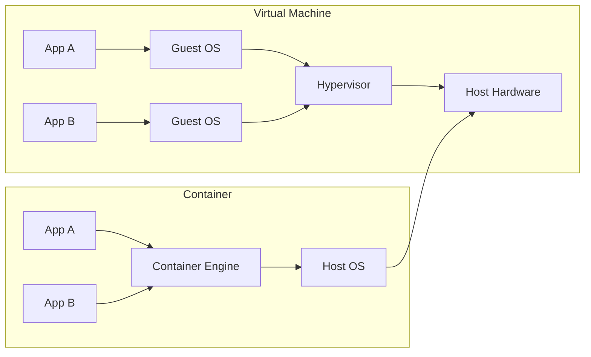

# Docker Containers

Docker packages applications and their dependencies into lightweight, portable containers that run consistently across environments. Containers share the host OS kernel and isolate processes at the OS level.

## Concepts

| Term | Meaning |
|------|---------|
| Image | Read-only template with instructions |
| Container | Runnable instance of an image |
| Dockerfile | Script to build an image |
| Volume | Persistent data storage |
| Network | Communication between containers |

## Dockerfile Example (Multi-Stage Build)

Using multi-stage builds keeps the final image small by separating build-time dependencies from runtime dependencies.

```dockerfile
# Stage 1: Build
FROM golang:1.22-alpine AS builder
WORKDIR /src
COPY go.mod go.sum ./
RUN go mod download
COPY . .
RUN CGO_ENABLED=0 go build -o /app/server .

# Stage 2: Runtime (distroless — no shell, no package manager)
FROM gcr.io/distroless/static-debian12:nonroot
WORKDIR /
COPY --from=builder /app/server .
EXPOSE 8080
USER nonroot:nonroot
ENTRYPOINT ["/server"]
```

The final image contains only the compiled binary and minimal runtime files, reducing both attack surface and disk footprint.

## Layer Caching

Each `RUN`, `COPY`, and `ADD` instruction creates a new image layer. Docker caches layers across builds and reuses them when nothing has changed.

```dockerfile
# Good — copy dependency files first (cached until go.mod changes)
COPY go.mod go.sum ./
RUN go mod download

# Bad — copying all source first invalidates the layer on every change
COPY . .
RUN go mod download   # This re-runs every time any file changes
```

**Caching order matters**: Put infrequently changing instructions early (install OS packages, set up dependencies) and frequently changing instructions late (copy app source, run tests).

## Dockerfile Best Practices

| Practice | Why |
|----------|-----|
| Use specific base image tags (`python:3.12-slim`, not `python:latest`) | Reproducible builds, no surprise breaking changes |
| Multi-stage builds | Separate build and runtime, smaller final images |
| Minimize layers | Combine `RUN apt-get update && apt-get install -y ... && rm -rf /var/lib/apt/lists/*` |
| Copy dependency manifests first | Maximise layer cache hits |
| Use `.dockerignore` | Exclude `node_modules`, `.git`, `__pycache__` from build context |
| Run as non-root user | `USER nonroot` limits container breakout risk |
| Pin versions in `RUN` commands | `pip install flask==3.1.0` avoids surprise upgrades |
| Scan images for CVEs | `docker scout`, `trivy`, `grype` |

## Container vs Virtual Machine



| Aspect            | Virtual Machine             | Container                   |
|-------------------|-----------------------------|-----------------------------|
| **Isolation**     | Full OS boundary (strong)   | OS-level (weaker)           |
| **Startup**       | Minutes (boot OS)           | Milliseconds (start process)|
| **Size**          | GB (kernel + libs)          | MB (app + minimal deps)     |
| **Kernel**        | Each VM has its own         | Shared with host            |
| **Resource cost** | Significant overhead        | Near-native performance     |
| **Security boundary**| Strong (hypervisor)      | Moderate (namespace cgroup) |
| **Use case**      | Heavy isolation, mixed OS   | Lightweight, fast iteration |

## Networking Modes

| Mode    | How it works | Pros | Cons |
|---------|-------------|------|------|
| **Bridge** (default) | Each container gets a private IP on a virtual bridge (`docker0`). Ports published via `-p` are NAT-ed. | Good isolation, works out of the box | Slight NAT overhead |
| **Host** | Container shares the host's network stack directly; no port mapping needed. | Zero overhead, best perf | Port conflicts, reduced isolation |
| **Overlay** | Virtual network spanning multiple Docker hosts via libnetwork / VXLAN. | Multi-host service discovery | Requires swarm/k8s setup |
| **Macvlan** | Assigns a real MAC address from the physical network. | Bypasses NAT, direct addressing | IP exhaustion, limited flexibility |
| **None** | No networking interface except loopback. | Maximum isolation | Manual setup |

## Volumes and Bind Mounts

- **Volumes** — Managed by Docker, stored in `/var/lib/docker/volumes/`. Use `docker volume create` or `-v mydata:/data`. Survive container removal, portable across hosts.
- **Bind mounts** — Map a host path directly: `-v /host/path:/container/path`. Useful for dev (hot-reload), but less portable.
- **tmpfs mounts** — In-memory storage. Fast, but data lost on container stop.

| Feature        | Volume | Bind Mount |
|----------------|--------|------------|
| Managed by Docker | Yes | No |
| Cross-host portable | Yes (volume drivers) | No |
| Hot-reload for dev | Indirect | Direct |
| Backup/restore | `docker run --rm -v mydata:/data -v /backup:/backup alpine tar czf /backup/data.tar.gz /data` | Manual |
| Security | Sandboxed | Full host path access |

## Orchestration

- **Docker Compose**: Local multi-container setup with YAML configuration (services, networks, volumes).
- **Kubernetes**: Production container orchestration at scale (scheduling, auto-healing, scaling, rolling updates).

**See also**: [[Dev Environment Setup]], [[Code Architecture Patterns]], [[Developer Workflow Automation]]

**Links**: [[Docker Compose]] | [[Docker Networking and Storage]] | [[Kubernetes Basics]] | [[Kubernetes Deployments]]
