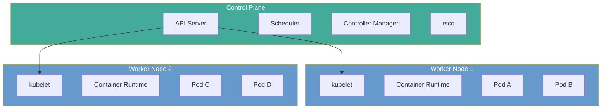

# Kubernetes Basics

**Links**: [[Docker Containers]] | [[Cloud Computing]] | [[Microservices Architecture]] | [[CI CD Pipelines]] | [[Infrastructure as Code]] | [[Monitoring and Observability]]

## What is Kubernetes?

Kubernetes automates deployment, scaling, and management of containerized applications.

## Architecture



- **Control Plane**: API Server (entry point), Scheduler (pod placement), Controller Manager (desired state convergence), etcd (cluster state store)
- **Worker Nodes**: kubelet (node agent), container runtime (Docker / containerd), kube-proxy (networking rules)

## Core Objects

| Object | API Group | Description |
|--------|-----------|-------------|
| **Pod** | `v1` | Smallest deployable unit — one or more containers with shared network |
| **Deployment** | `apps/v1` | Declarative pod management with rolling updates and rollbacks |
| **Service** | `v1` | Stable network endpoint for a set of pods (load-balanced) |
| **ConfigMap** | `v1` | Non-sensitive configuration injected as env vars or files |
| **Secret** | `v1` | Sensitive data (base64 encoded, mounted as env or volume) |
| **Ingress** | `networking.k8s.io/v1` | External HTTP/HTTPS routing rules to Services |
| **PersistentVolumeClaim** | `v1` | Request for persistent storage (abstracts PV provisioning) |
| **Namespace** | `v1` | Virtual cluster partition for resource isolation |

## Pod Lifecycle

```
Pending → ContainerCreating → Running → Succeeded
                                      → Failed (CrashLoopBackOff)
                                      → Unknown (node lost)
```

- **Pending**: Pod accepted but not yet scheduled (resource constraints)
- **ContainerCreating**: Images pulling, containers starting
- **Running**: At least one container is executing
- **Succeeded**: All containers exited with code 0 (batch jobs)
- **Failed**: Containers exited with non-zero exit code
- **CrashLoopBackOff**: Container keeps restarting and failing

## Deployment Example

```yaml
apiVersion: apps/v1
kind: Deployment
metadata:
  name: web-app
spec:
  replicas: 3
  selector:
    matchLabels:
      app: web
  template:
    metadata:
      labels:
        app: web
    spec:
      containers:
      - name: app
        image: myapp:latest
        ports:
        - containerPort: 8080
        resources:
          requests:
            memory: "256Mi"
            cpu: "250m"
          limits:
            memory: "512Mi"
            cpu: "500m"
```

## Service Types

| Type | Access Scope | Use Case |
|------|-------------|----------|
| **ClusterIP** | Inside cluster only (default) | Internal service-to-service communication |
| **NodePort** | External via `<NodeIP>:<port>` | Dev/test, direct node debugging |
| **LoadBalancer** | External via cloud LB | Production HTTP/API services |
| **ExternalName** | DNS alias (CNAME) | Service pointing to external resource |

## kubectl Commands

| Command | Description |
|---------|-------------|
| `kubectl get pods` | List all pods |
| `kubectl logs pod-name` | View pod logs |
| `kubectl exec -it pod-name -- bash` | Execute command inside a pod |
| `kubectl apply -f deployment.yaml` | Create or update resources from file |
| `kubectl delete pod pod-name` | Delete a pod (Deployment recreates it) |
| `kubectl port-forward pod 8080:80` | Forward local port to pod port |
| `kubectl describe pod pod-name` | Detailed status, events, and conditions |
| `kubectl get svc,deploy,pods -n myns` | List multiple resource types in a namespace |
| `kubectl top pod` | Show CPU/memory usage (requires metrics-server) |
| `kubectl rollout status deploy/web-app` | Check rolling update progress |

**Next**: [[Kubernetes Deployments]] — Rolling updates and scaling
