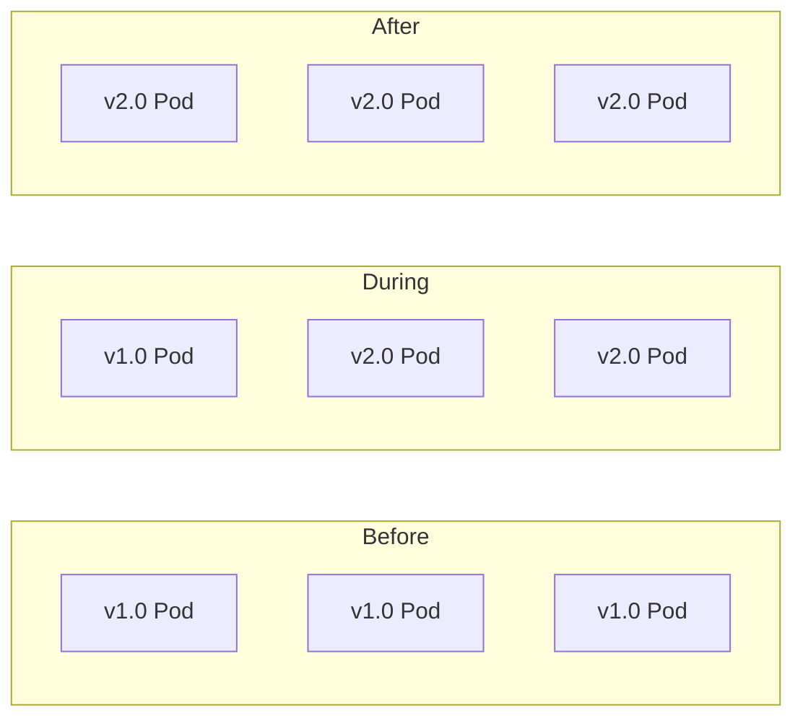

# Kubernetes Deployments

**Links**: [[Kubernetes Basics]] | [[Docker Containers]] | [[CI CD Pipelines]] | [[Infrastructure as Code]] | [[Monitoring and Observability]]

## Deployment Strategies

| Strategy | Description | Rollout | Downtime |
|----------|-------------|---------|----------|
| **RollingUpdate** | Gradual replacement of pods | Configurable surge/unavailable | None |
| **Recreate** | Kill all old pods, then create new | Immediate | Yes |
| **Blue/Green** | Two identical environments, switch traffic | Instant switch | None |
| **Canary** | Route % traffic to new version | Gradual traffic shift | None |

## Rolling Update Flow



```yaml
spec:
  strategy:
    type: RollingUpdate
    rollingUpdate:
      maxUnavailable: 1       # Max pods down during update
      maxSurge: 1              # Extra pods during update
```

```bash
kubectl set image deployment/web-app app=myapp:2.0.0
kubectl rollout status deployment/web-app
kubectl rollout undo deployment/web-app  # rollback
kubectl rollout history deployment/web-app
```

## Scaling

```bash
# Manual scaling
kubectl scale deployment/web-app --replicas=10

# Horizontal Pod Autoscaler
kubectl autoscale deployment/web-app --min=3 --max=20 --cpu-percent=70
```

## Health Checks

```yaml
livenessProbe:           # Restarts pod if fails
  httpGet:
    path: /healthz
    port: 8080
  initialDelaySeconds: 5
  periodSeconds: 10
readinessProbe:         # Routes traffic if passes
  httpGet:
    path: /readyz
    port: 8080
  initialDelaySeconds: 3
  periodSeconds: 5
## Resource Management

```yaml
resources:
  requests:              # Guaranteed minimum
    memory: "256Mi"
    cpu: "250m"
  limits:                # Hard cap (throttled / OOM)
    memory: "512Mi"
    cpu: "500m"
```

## ConfigMaps & Secrets

```yaml
envFrom:
  - configMapRef:
      name: app-config
  - secretRef:
      name: app-secrets
```

ConfigMaps store non-sensitive config; Secrets store sensitive data (base64 encoded). Both can be injected as env vars or volumes.

**Next**: [[Nginx Configuration]] — Reverse proxy
