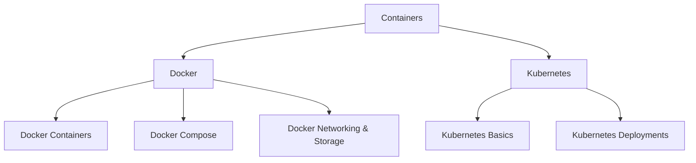

# 🐳 Containers — Map of Content

Containers package applications with their dependencies for consistent deployment across environments. This folder covers Docker (containers, compose, networking, storage) and Kubernetes (basics, deployments, services) — the standard stack for modern application orchestration. Start with [[DevOps/Containers/Docker Containers]] for the fundamentals.

**Parent**: [[DevOps/_MOC|DevOps]]

## Topics

| Tool | Description |
|------|-------------|
| [[DevOps/Containers/Docker Containers]] | Container fundamentals, images, layers |
| [[DevOps/Containers/Docker Compose]] | Multi-container local orchestration |
| [[DevOps/Containers/Docker Networking and Storage]] | Networks, volumes, mounts |
| [[DevOps/Containers/Kubernetes Basics]] | Pods, services, deployments, configmaps |
| [[DevOps/Containers/Kubernetes Deployments]] | Rolling updates, scaling, canary |

## Cross-Domain Links

- [[DevOps/Containers/Docker Containers]] → [[System-Design/Architecture/Microservices Architecture]], [[DevOps/Infrastructure/Cloud Computing]]
- [[DevOps/Containers/Kubernetes Basics]] → [[Security/Kubernetes Security]], [[DevOps/Infrastructure/Helm]]
- [[DevOps/Containers/Docker Compose]] → [[Testing/Integration Testing Patterns]], [[Dev-Environment Setup]]
