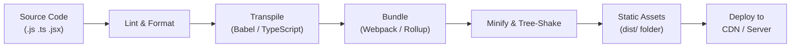

# Build Tools

**Links**: [[Developer Workflow Automation]] | [[Dev Environment Setup]] | [[CI CD Pipelines]] | [[Package Management]] | [[Web Development Fundamentals]]

## What are Build Tools?

Build tools automate transforming source code into production-ready assets: bundling modules, transpiling code, minifying files, and more.

## Build Pipeline



## Module Bundlers

| Tool | Language | Strengths |
|------|----------|-----------|
| **Webpack** | JS/TS | Mature ecosystem, code splitting, loaders |
| **Vite** | JS/TS | Fast dev server (ESM native), HMR |
| **esbuild** | JS/TS | Extremely fast (Go-based), simple config |
| **Rollup** | JS/TS | Tree-shaking, library bundling |
| **Parcel** | JS/TS | Zero config, fast |
| **Turbopack** | JS/TS | Rust-based, incremental (Next.js) |

## Bundler Comparison

| Feature | Webpack | Vite | esbuild | Rollup |
|---------|---------|------|---------|--------|
| Dev server | Webpack Dev Server | Native ESM | None | Rollup Plugin |
| HMR | ✓ | ✓ | ✗ | ✗ |
| Code splitting | ✓ | ✓ | ✓ | ✓ |
| CSS support | ✓ (loaders) | ✓ (native) | ✓ (plugin) | ✓ (plugin) |
| Configuration | Complex | Simple | Minimal | Moderate |
| Build speed | Slow | Fast | Fastest | Moderate |

## JavaScript Transpilers

```bash
# Babel: converts modern JS to compatible versions
npm install --save-dev @babel/core @babel/preset-env

# TypeScript: compiles TS to JS
npm install --save-dev typescript
```

## Vite Config Example

```javascript
import { defineConfig } from 'vite'

export default defineConfig({
  root: '.',
  build: {
    outDir: 'dist',
    minify: 'esbuild',
    rollupOptions: {
      input: 'src/main.js'
    }
  },
  server: {
    port: 3000,
    proxy: {
      '/api': 'http://localhost:8000'
    }
  }
})
```

## Package Scripts

```json
{
  "scripts": {
    "dev": "vite",
    "build": "vite build",
    "preview": "vite preview",
    "lint": "eslint . --ext .js,.ts",
    "test": "vitest run",
    "typecheck": "tsc --noEmit"
  }
}
```

## Other Build Systems

| Tool | Language | Purpose |
|------|----------|---------|
| **Make** | Any | Universal build orchestrator |
| **CMake** | C/C++ | Cross-platform build generation |
| **Bazel** | Multi-language | Monorepo-scale builds |
| **Gradle** | Java/Kotlin | JVM builds, Android |
| **Maven** | Java | Standard Java builds |
| **Cargo** | Rust | Rust build + package mgmt |
| **Go build** | Go | Single binary compilation |

**Next**: [[Cloud Computing]] — Cloud service models
