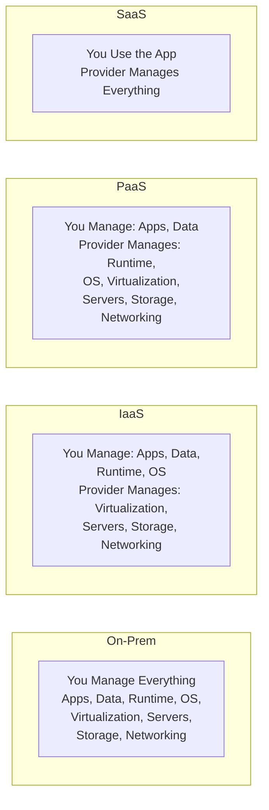

# Cloud Computing

**Links**: [[Docker Containers]] | [[Infrastructure as Code]] | [[CI CD Pipelines]] | [[Database Engines Compared]] | [[Microservices Architecture]]

## Service Models

| Model | What You Manage | Example Providers |
|-------|----------------|-------------------|
| **IaaS** | Apps, data, runtime, OS | AWS EC2, GCP Compute Engine, Azure VMs |
| **PaaS** | Apps and data only | Heroku, Vercel, Railway, Render |
| **SaaS** | Nothing (use the app) | Gmail, Slack, GitHub, Notion |
| **FaaS** | Functions only (serverless) | AWS Lambda, Cloud Functions, Azure Functions |

## Deployment Models

| Model | Description | Example |
|-------|-------------|---------|
| **Public Cloud** | Shared infrastructure over internet | AWS, Azure, GCP |
| **Private Cloud** | Dedicated infrastructure for one org | OpenStack, VMware |
| **Hybrid Cloud** | Mix of public and private with orchestration | AWS Outposts, Azure Arc |
| **Multi-Cloud** | Using multiple public cloud providers | AWS + GCP, Azure + AWS |

## Major Providers

| Provider | Compute | Database | Serverless | Container |
|----------|---------|----------|------------|-----------|
| AWS | EC2, ECS, EKS | RDS, DynamoDB | Lambda | ECS, EKS, Fargate |
| Azure | VMs, AKS | SQL DB, CosmosDB | Functions | AKS, Container Instances |
| GCP | Compute Engine, GKE | Cloud SQL, Spanner | Cloud Functions | GKE, Cloud Run |

## Cloud-Native Concepts

- **Elasticity**: Automatically scale resources up/down based on demand
- **Pay-as-you-go**: Only pay for what you use (per-second billing)
- **High Availability**: Redundant infrastructure across availability zones
- **Disaster Recovery**: Backup and failover across geographic regions
- **Immutable Infrastructure**: Replace instances, don't modify them

## Global Infrastructure

Cloud providers operate in geographic regions, each containing multiple availability zones (AZs). Deploying across AZs provides high availability and fault tolerance. Major providers also offer edge locations for low-latency content delivery.

## Pricing Models

| Model | Description | Best For |
|-------|-------------|----------|
| On-Demand | Pay per hour/second | Variable workloads, dev |
| Reserved | 1-3 year commitment, discount | Steady-state workloads |
| Spot/Preemptible | Unused capacity, steep discount | Batch, fault-tolerant |
| Savings Plans | Flexible commitment across services | Mixed workloads |

## Well-Architected Framework Pillars

| Pillar | Focus |
|--------|-------|
| Operational Excellence | Run and monitor systems |
| Security | Protect data and systems |
| Reliability | Recover from failures |
| Performance Efficiency | Use resources efficiently |
| Cost Optimization | Minimize waste |
| Sustainability | Minimize environmental impact |

Managed Kubernetes (EKS, AKS, GKE) and serverless platforms (Lambda, Cloud Run) further reduce operational overhead.

**Next**: [[Infrastructure as Code]] — Automate cloud provisioning
