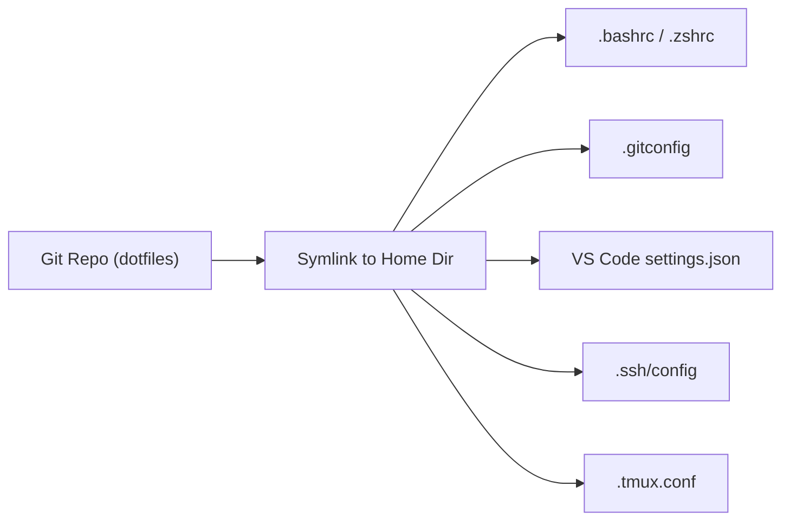

**Links**: [[Developer Workflow Automation]] | [[Shell Scripting]] | [[Package Managers]] | [[Build Tools]] | [[Vagrant]] | [[Ansible]]

# Dev Environment Setup

A well-configured development environment boosts productivity and reduces friction.

## Essential Tools

| Category | Tools |
|----------|-------|
| Editor | VS Code, Neovim, JetBrains, Zed |
| Terminal | Windows Terminal, iTerm2, Alacritty, Kitty |
| Shell | PowerShell 7, zsh, bash, fish |
| Version Control | Git + GitHub/GitLab/Bitbucket |
| Package Manager | pip, npm, cargo, brew, winget |
| Container | Docker Desktop, Podman, OrbStack |

## Dotfile Management



Keep dotfiles in a Git repository for easy setup across machines.

## VS Code Configuration

```json
{
  "editor.fontSize": 14,
  "editor.fontFamily": "JetBrains Mono, Fira Code, Cascadia Code",
  "editor.formatOnSave": true,
  "editor.minimap.enabled": false,
  "terminal.integrated.defaultProfile.windows": "PowerShell",
  "git.enableSmartCommit": true,
  "workbench.colorTheme": "One Dark Pro",
  "files.exclude": {
    "**/__pycache__": true,
    "**/.pytest_cache": true
  }
}
```

## Version Managers

| Language | Manager | Install Command |
|----------|---------|-----------------|
| Python | pyenv, uv | `pyenv install 3.12` |
| Node.js | nvm, fnm | `nvm install 20` |
| Rust | rustup | `rustup install stable` |
| Go | gvm | `gvm install go1.22` |
| Java | sdkman, jabba | `sdk install java 21` |
| Ruby | rbenv, rvm | `rbenv install 3.3` |

## Containerized Development

```yaml
# .devcontainer/devcontainer.json
{
  "name": "Python Dev",
  "image": "mcr.microsoft.com/devcontainers/python:3.12",
  "extensions": ["ms-python.python", "charliermarsh.ruff"],
  "postCreateCommand": "pip install -r requirements.txt",
  "forwardPorts": [8000],
  "customizations": {
    "vscode": {
      "settings": {
        "python.testing.pytestEnabled": true
      }
    }
  }
}
```

## Shell Enhancements

| Tool | Purpose |
|------|---------|
| **fzf** | Fuzzy finder (Ctrl+R history, Ctrl+T files) |
| **ripgrep (rg)** | Blazing fast file search |
| **bat** | Cat with syntax highlighting |
| **fd** | Modern find replacement |
| **lazygit** | Terminal Git UI |
| **htop** | Interactive process viewer |

## Workflow Tips

- Use `.env` files for local secrets (never commit)
- Set up shell aliases for common commands
- Install language servers (LSP) for IDE features in any editor
- Use `direnv` for automatic environment variables per directory

**See also**: [[Developer Workflow Automation]], [[Git Version Control]], [[Programming Resources]]
