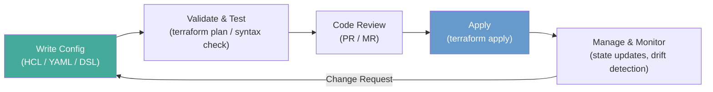

# Infrastructure as Code

**Links**: [[Cloud Computing]] | [[Docker Containers]] | [[CI CD Pipelines]] | [[Environment Variables]] | [[Dev Environment Setup]]

## What is IaC?

Infrastructure as Code (IaC) manages cloud resources through declarative or imperative configuration files rather than manual processes. It brings version control, review, and automation to infrastructure.

## Benefits of IaC

| Benefit | Description |
|---------|-------------|
| Consistency | Same config produces identical environments every time |
| Repeatability | Environments rebuilt from scratch in minutes |
| Version Control | Full history of changes via Git — diffs, blame, rollback |
| Audit Trail | Every change tracked with author, timestamp, and diff |
| Self-Documenting | Config files serve as living infrastructure docs |
| Speed | Provision infrastructure in minutes, not days |

## IaC Workflow



## Declarative vs Imperative

| Aspect | Declarative | Imperative |
|--------|-------------|------------|
| Focus | **What** (desired state) | **How** (step-by-step) |
| Drift Detection | Automatic (state comparison) | Manual (re-run script) |
| Idempotency | Built-in | Must be coded explicitly |
| Learning Curve | Higher (abstraction layer) | Lower (familiar scripting) |
| Tools | Terraform, Pulumi, CloudFormation | Ansible, Chef, Puppet |

**Terraform (Declarative)** — describe the final state:

```hcl
resource "aws_s3_bucket" "storage" {
  bucket = "my-app-storage-2024"
  tags = { Name = "Application Storage", Environment = "production" }
}
```

**Ansible (Imperative)** — describe the steps to reach the state:

```yaml
- name: Create S3 bucket
  amazon.aws.s3_bucket:
    name: my-app-storage-2024
    tags:
      Name: "Application Storage"
      Environment: "production"
```

## Provisioning vs Configuration Management vs Orchestration

| Layer | Tools | Purpose |
|-------|-------|---------|
| Provisioning | Terraform, Pulumi, CloudFormation | Create raw infrastructure — VMs, networks, databases |
| Configuration Mgmt | Ansible, Chef, Puppet | Install software, configure settings on existing resources |
| Orchestration | Kubernetes, Nomad, Docker Compose | Manage app lifecycle, scaling, networking |

These layers are complementary — Terraform provisions VMs, Ansible configures them, Kubernetes orchestrates containers.

## Terraform Workflow

```bash
terraform init          # Download providers and modules
terraform plan          # Preview changes against current state
terraform apply         # Execute planned changes
terraform destroy       # Tear down all managed resources
terraform fmt           # Format code to canonical style
terraform validate      # Check syntax and internals
```

## Terraform Example

```hcl
provider "aws" {
  region = "us-east-1"
}

resource "aws_db_instance" "database" {
  engine         = "postgres"
  instance_class = "db.t3.micro"
  db_name        = "myapp"
  username       = "admin"
  password       = var.db_password
  skip_final_snapshot = true
}
```

## Tools Comparison

| Tool | Language | State Mgmt | Drift Detection | Cloud-Agnostic | Approach |
|------|----------|------------|----------------|----------------|----------|
| Terraform | HCL | Remote state (S3, etc.) | Yes | Yes | Immutable |
| Pulumi | TypeScript, Python, Go | Self-managed | Yes | Yes | Immutable |
| CloudFormation | JSON / YAML | AWS-managed | Yes | No (AWS only) | Immutable |
| Ansible | YAML | None (stateless) | No (adhoc) | Yes | Mutable |
| Chef | Ruby DSL | Chef Server | Limited | Yes | Mutable |
| Puppet | Puppet DSL | Puppet Server | Yes | Yes | Mutable |

## Best Practices

- Store state remotely (S3, Terraform Cloud) — never locally
- Use workspaces or directories for environments (dev / staging / prod)
- Pin provider and module versions
- Keep secrets out of state files (use `sensitive` flag, vault backends)
- Review infrastructure changes in pull requests
- Run `terraform plan` in CI as a gating step
- Use modules to encapsulate reusable patterns

**Next**: [[Monitoring and Observability]] — Watch your systems
