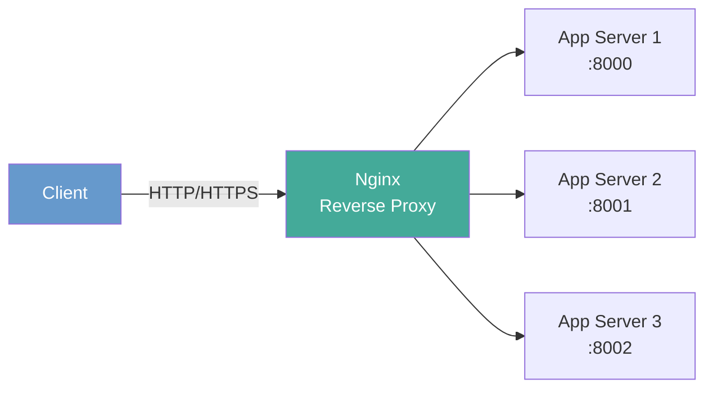

# Nginx Configuration

**Links**: [[Docker Containers]] | [[Kubernetes Basics]] | [[Web Security]] | [[Caching Strategies]] | [[Rate Limiting]] | [[HTTP Protocol]]

## What is Nginx?

High-performance web server, reverse proxy, load balancer, and HTTP cache. Handles 10,000+ concurrent connections with an event-driven, non-blocking architecture.

## Reverse Proxy



```nginx
server {
    listen 80;
    server_name example.com;
    location / {
        proxy_pass http://localhost:8000;
        proxy_set_header Host $host;
        proxy_set_header X-Real-IP $remote_addr;
        proxy_set_header X-Forwarded-For $proxy_add_x_forwarded_for;
        proxy_set_header X-Forwarded-Proto $scheme;
    }
}
```

## Location Block Directives

| Modifier | Meaning | Priority | Example |
|----------|---------|----------|---------|
| `=` | Exact match | Highest | `location = /login` |
| `^~` | Prefix match, stops regex search | High | `location ^~ /static/` |
| `~` | Case-sensitive regex | Medium | `location ~ \.php$` |
| `~*` | Case-insensitive regex | Medium | `location ~* \.(jpg\|png)$` |
| (none) | Prefix match | Lowest | `location /api` |

## Static File Serving

```nginx
server {
    root /var/www/html;
    index index.html;
    location / { try_files $uri $uri/ /index.html; }
    location ~* \.(css|js|jpg|png|woff2|svg)$ {
        expires 1y;
        add_header Cache-Control "public, immutable";
    }
}
```

## SSL/TLS Configuration

```nginx
server {
    listen 443 ssl http2;
    server_name example.com;
    ssl_certificate /etc/ssl/certs/example.com.pem;
    ssl_certificate_key /etc/ssl/private/example.com.key;
    ssl_protocols TLSv1.2 TLSv1.3;
    ssl_ciphers ECDHE-ECDSA-AES128-GCM-SHA256:ECDHE-RSA-AES128-GCM-SHA256;
    ssl_prefer_server_ciphers on;
    ssl_session_cache shared:SSL:10m;
    ssl_session_timeout 10m;
    location / { proxy_pass http://backend; }
}
```

## Load Balancing Methods

| Method | Directive | Behavior |
|--------|-----------|----------|
| Round Robin | (default) | Distributes evenly across servers |
| Least Connections | `least_conn` | Sends to server with fewest active connections |
| IP Hash | `ip_hash` | Consistent routing — same client, same server |
| Random | `random` | Picks random server, optionally weighted |

```nginx
upstream backend {
    least_conn;
    server 10.0.0.1:8000 weight=3;
    server 10.0.0.2:8000;
    server 10.0.0.3:8000 backup;
}
```

## Caching and Compression

```nginx
proxy_cache_path /var/cache/nginx levels=1:2 keys_zone=mycache:10m max_size=1g;
proxy_cache_key "$scheme$request_method$host$request_uri";

gzip on;
gzip_types text/plain text/css application/json application/javascript;
gzip_comp_level 6;
gzip_min_length 1000;
gzip_vary on;

server {
    location /api/ {
        proxy_cache mycache;
        proxy_cache_valid 200 5m;
        proxy_cache_use_stale error timeout;
        proxy_pass http://backend;
    }
}
```

## Rate Limiting

```nginx
limit_req_zone $binary_remote_addr zone=login:10m rate=5r/s;

server {
    location /login {
        limit_req zone=login burst=10 nodelay;
        proxy_pass http://backend;
    }
}
```

## Best Practices

- Use `worker_processes auto` and `worker_connections 1024+` for concurrency
- Hide version: `server_tokens off`
- Test config: `nginx -t && systemctl reload nginx`
- Use HTTP/2 for multiplexed connections
- Set timeouts: `proxy_read_timeout 60s`, `proxy_connect_timeout 10s`

**Next**: [[Kubernetes Basics]] — Container orchestration
