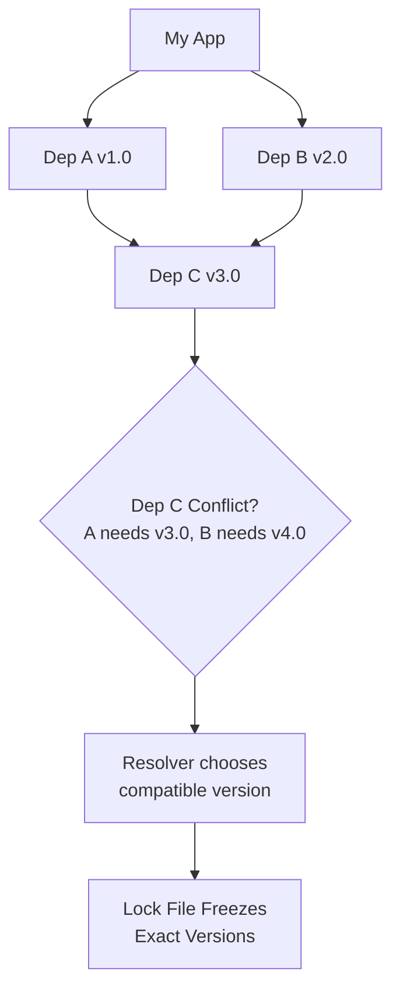

**Links**: [[Build Tools]] | [[Dev Environment Setup]] | [[Shell Scripting]] | [[Developer Workflow Automation]] | [[Vagrant]] | [[Ansible]]

# Package Managers

Package managers automate installing, updating, configuring, and removing software dependencies. Each ecosystem has its own.

## Language Package Managers

| Language | Manager | Registry | Lock File |
|----------|---------|----------|-----------|
| JavaScript | npm/yarn/pnpm | npmjs.com | package-lock.json |
| Python | pip/poetry | PyPI | requirements.txt / poetry.lock |
| Rust | cargo | crates.io | Cargo.lock |
| Go | go mod | proxy.golang.org | go.sum |
| Java | Maven/Gradle | Maven Central | pom.xml / build.gradle |
| Ruby | bundler | rubygems.org | Gemfile.lock |
| .NET | NuGet | nuget.org | packages.lock.json |
| Swift | SPM | swift.org | Package.resolved |

## Dependency Resolution



## Key Features Comparison

| Feature | npm | pip | cargo | go mod |
|---------|-----|-----|-------|--------|
| Lock file | ✓ | ✗ (pip) / ✓ (poetry) | ✓ | ✓ |
| Reproducible builds | ✓ | With lock | ✓ | ✓ |
| Private registries | ✓ | ✓ | ✓ | Via replace |
| Semantic versioning | ✓ | ✓ | ✓ | ✓ |
| Workspaces/Monorepo | ✓ | ✗ | ✓ | ✓ |
| Pre/post scripts | ✓ | ✗ | ✓ | ✗ |
| Audit | npm audit | pip-audit | cargo audit | n/a |
| Binary distribution | npx | pip install | cargo install | go install |

## SemVer (Semantic Versioning)

```
MAJOR.MINOR.PATCH

MAJOR: Breaking changes (1.x → 2.0)
MINOR: New features, backward compatible (1.1 → 1.2)
PATCH: Bug fixes, backward compatible (1.1.0 → 1.1.1)
```

**Prefixes**: `^` (compatible with minor), `~` (approximately, patch), no prefix (exact)

## Lock Files

Lock files pin exact versions of every transitive dependency. Benefits:
- **Reproducible builds**: Same versions across every machine
- **Security**: Protection against accidental upgrades (supply chain)
- **Performance**: Faster installs (skip resolution step)

```bash
# Always commit lock files to version control
git add package-lock.json Cargo.lock go.sum poetry.lock
```

## Security

- Run `npm audit`, `pip-audit`, `cargo audit` for vulnerability scanning
- Use Dependabot or Renovate for automated updates
- Pin exact versions in production deployments
- Enable two-factor auth on package registries
- Use private registries for proprietary packages

## Best Practices

- Commit lock files to version control
- Use virtual environments (venv, conda) for Python isolation
- Prefer `pnpm` over `npm` for disk efficiency (hard links)
- Use `npm ci` (not `npm install`) in CI for deterministic installs
- Use `dependabot` or `renovate` for automated updates

**Links**: [[Dev Environment Setup]] | [[CI CD Pipelines]] | [[Docker Containers]] | [[Python Virtual Environments]] | [[Build Tools]]
