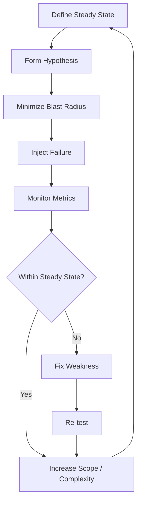

# Chaos Engineering

**Links**: [[Service Mesh]] | [[Monitoring and Observability]] | [[Microservices Architecture]] | [[CI CD Pipelines]] | [[Error Handling Patterns]]

## What is Chaos Engineering?

Chaos engineering is the practice of intentionally injecting failures into a system to uncover weaknesses before they cause real outages.

## Core Principles

1. **Define steady state**: What does "normal" look like? (e.g., 99.9% request success, p99 latency < 200ms)
2. **Hypothesize**: What do we expect to happen when we inject a failure?
3. **Run experiment**: Introduce the failure in a controlled manner
4. **Analyze**: Compare results against steady state
5. **Fix and expand**: Address weaknesses, increase experiment scope

## Experiment Flow



## Types of Experiments

| Experiment | Description | Tool |
|------------|-------------|------|
| **Kill a pod** | Randomly terminate a container | Chaos Mesh, Litmus |
| **Network latency** | Add delay to network requests | Toxiproxy, Chaos Mesh |
| **Packet loss** | Drop network packets | tc-netem, Chaos Mesh |
| **CPU stress** | Saturate CPU resources | stress-ng, Litmus |
| **Memory pressure** | Fill up memory | stress-ng, Litmus |
| **Disk I/O spike** | Increase disk latency | fio, Chaos Mesh |
| **DNS failure** | Make DNS resolution fail | Chaos Mesh, Gremlin |
| **Certificate expiry** | Use expired TLS certificates | Gremlin |
| **Database failure** | Kill database connection | Chaos Mesh, custom |
| **Region outage** | Simulate AZ/region failure | AWS Fault Injection |

## Tools

| Tool | Platform | Features |
|------|----------|----------|
| **Chaos Monkey** | Netflix/OSS | Random instance termination |
| **Gremlin** | SaaS | Safe failure injection, UI, RBAC |
| **Litmus** | Kubernetes | Cloud-native, workflow-based |
| **Chaos Mesh** | Kubernetes | Network, DNS, disk, stress, HTTP |
| **Toxiproxy** | TCP proxy | Network-level fault injection |
| **AWS FIS** | AWS | Managed fault injection service |

## Kubernetes Chaos (Chaos Mesh)

```yaml
apiVersion: chaos-mesh.org/v1alpha1
kind: PodChaos
metadata:
  name: pod-kill-example
spec:
  action: pod-kill
  mode: one
  selector:
    namespaces:
      - production
    labelSelectors:
      app: payment-service
  duration: "60s"
```

## Metrics to Monitor During Experiments

| Metric | What It Tells |
|--------|---------------|
| Error rate (5xx) | Is the system handling failures? |
| p50/p95/p99 latency | Is performance degrading gracefully? |
| Saturation (CPU/mem) | Are there resource bottlenecks? |
| Circuit breaker trips | Are protections working? |
| Retry count | Are clients retrying appropriately? |

## Maturity Model

| Level | Stage | Practices |
|-------|-------|-----------|
| 1 | Ad-hoc | Manual testing, no automation |
| 2 | Reactive | Post-incident chaos experiments |
| 3 | Proactive | Scheduled experiments in staging |
| 4 | Continuous | Automated experiments in CI/CD |
| 5 | Game Day | Regular chaos drills in production |

## Safety

- **Blast radius**: Always start small (one instance, not all)
- **Run in production**: Only in systems designed for it (redundancy, graceful degradation)
- **Automated rollback**: Kill switch if metrics degrade beyond threshold
- **Business hours**: Start during low-traffic periods
- **Observability**: Ensure monitoring is reliable before running experiments

**Next**: [[Time Series Databases]] — Store and query time-based data
