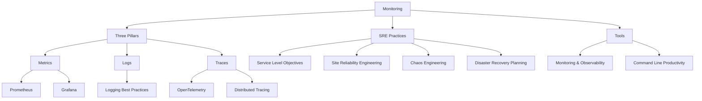

# 📊 Monitoring & Observability — Map of Content

**Parent**: [[DevOps/_MOC|DevOps]]

## Topics

| Category | Notes |
|----------|-------|
| **Metrics** | [[Prometheus and Monitoring Systems]], [[Grafana Deep Dive]] |
| **Logs** | [[Logging Best Practices]] |
| **Traces** | [[OpenTelemetry Deep Dive]], [[Distributed Tracing]] |
| **SRE** | [[Service Level Objectives]], [[Site Reliability Engineering]], [[Chaos Engineering]], [[Disaster Recovery Planning]] |
| **Overview** | [[Monitoring and Observability]], [[Command Line Productivity]] |

## Cross-Domain Links

- [[DevOps/Monitoring/Monitoring and Observability]] → [[AI-ML/Deep-Learning/Machine-Learning/Model Monitoring in Production]], [[System-Design/Architecture/Microservices Architecture]]
- [[DevOps/Monitoring/Prometheus and Monitoring Systems]] → [[AI-ML/Deep-Learning/Machine-Learning/Feature Stores for Machine Learning]]
- [[DevOps/Monitoring/OpenTelemetry Deep Dive]] → [[System-Design/Architecture/Distributed Tracing]], [[System-Design/Architecture/Microservices Architecture]]
- [[DevOps/Monitoring/Service Level Objectives]] → [[Testing/Performance Testing]], [[Testing/Load Testing]]
