# ⚙️ DevOps — Map of Content

```mermaid
graph TD
  DEVOPS["DevOps"] --> CICD["CI/CD"]
  DEVOPS --> CT["Containers"]
  DEVOPS --> INF["Infrastructure"]
  DEVOPS --> MON["Monitoring"]
  DEVOPS --> API["REST API Design"]

  CICD --> PIP["CI CD Pipelines"]
  CICD --> GHA["GitHub Actions"]
  CICD --> GLCI["GitLab CI"]
  CICD --> JNK["Jenkins"]

  CT --> DC["Docker Containers"]
  CT --> DCOMP["Docker Compose"]
  CT --> DNS["Docker Networking & Storage"]
  CT --> KB["Kubernetes Basics"]
  CT --> KD["Kubernetes Deployments"]

  INF --> IAC["Infrastructure as Code"]
  INF --> TF["Terraform"]
  INF --> ANS["Ansible"]
  INF --> PKR["Packer"]
  INF --> VG["Vagrant"]
  INF --> CC["Cloud Computing"]
  INF --> CCO["Cloud Cost Optimization"]
  INF --> EC["Edge Computing"]
  INF --> HELM["Helm"]
  INF --> NGX["Nginx Configuration"]
  INF --> EP["Envoy Proxy"]
  INF --> CON["Consul"]
  INF --> SS["Shell Scripting"]
  INF --> BT["Build Tools"]
  INF --> PM["Package Managers"]
  INF --> DES["Dev Environment Setup"]
  INF --> DWA["Developer Workflow Automation"]

  MON --> MO["Monitoring & Observability"]
  MON --> PROM["Prometheus & Monitoring Systems"]
  MON --> GRAF["Grafana Deep Dive"]
  MON --> OTEL["OpenTelemetry Deep Dive"]
  MON --> DT["Distributed Tracing"]
  MON --> LOG["Logging Best Practices"]
  MON --> SLO["Service Level Objectives"]
  MON --> SRE["Site Reliability Engineering"]
  MON --> CE["Chaos Engineering"]
  MON --> DRP["Disaster Recovery Planning"]
```

## Sub-Areas

| Area | Notes | Description |
|------|-------|-------------|
| [[DevOps/CI-CD/_MOC\|CI/CD]] | 4 | Pipeline automation |
| [[DevOps/Containers/_MOC\|Containers]] | 5 | Docker & Kubernetes |
| [[DevOps/Infrastructure/_MOC\|Infrastructure]] | 18 | IaC, cloud, config management |
| [[DevOps/Monitoring/_MOC\|Monitoring]] | 11 | Observability, SRE, alerting |

## Cross-Domain Links

- [[DevOps/CI-CD/CI CD Pipelines]] → [[Testing/API Testing]], [[Testing/Unit Testing Guide]], [[Git/Git Overview]]
- [[DevOps/Containers/Docker Containers]] → [[System-Design/Architecture/Microservices Architecture]], [[DevOps/Containers/Kubernetes Basics]]
- [[DevOps/Monitoring/Monitoring and Observability]] → [[AI-ML/Deep-Learning/Machine-Learning/Model Monitoring in Production]]
- [[DevOps/REST API Design]] → [[Web-Dev/API Gateway Patterns]], [[Security/API Security]], [[Web-Dev/gRPC]]
- [[DevOps/Infrastructure/Cloud Computing]] → [[System-Design/Architecture/Serverless Computing]], [[System-Design/Databases/Database Sharding]]
