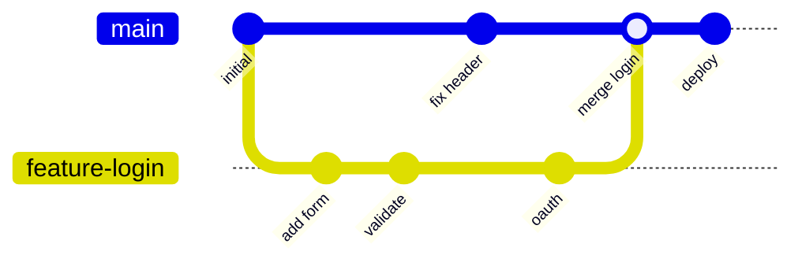

# Git Branch

**Links**: [[Overview]] | [[Commit]] | [[Checkout and Switch]] | [[Merge]] | [[Rebase]] | [[Workflows]] | [[Remote]]

Branching is Git's killer feature. Unlike many VCS tools, Git branches are lightweight — just pointers to commits — making branch-and-merge workflows fast and cheap.

## What is a Branch?

A branch is a **lightweight movable pointer** to a commit. Creating a branch is instantaneous — Git writes a 41-byte file (`refs/heads/<name>`) containing a 40-character SHA-1 hash.

```
main:  a1b2c3d ← HEAD           feature: a1b2c3d (after create)
main:  a1b2c3d                   feature: e4f5g6h ← HEAD (after commit)
```

## Branch Operations

| Action | Command |
|--------|---------|
| Create | `git branch feature-x` |
| Create & switch | `git switch -c feature-x` |
| List local | `git branch` |
| List remote | `git branch -r` |
| List all | `git branch -a` |
| Switch | `git switch feature-x` |
| Rename | `git branch -m old new` |
| Safe delete | `git branch -d feature-x` |
| Force delete | `git branch -D feature-x` |

```bash
git switch -c feature-x              # Create + switch (modern)
git checkout -b feature-x            # Create + switch (legacy)
git branch feature-x a1b2c3d         # From specific commit
git switch -                         # Switch to previous branch
```

## Branch Naming Conventions

| Pattern | Purpose | Example |
|---------|---------|---------|
| `main` / `master` | Default primary branch | `main` |
| `feature/<desc>` | New feature work | `feature/user-auth` |
| `bugfix/<desc>` | Bug fixes | `bugfix/login-crash` |
| `release/<ver>` | Release preparation | `release/v2.1.0` |
| `hotfix/<desc>` | Urgent production fixes | `hotfix/security-patch` |

Rules: lowercase with hyphens, use `/` for hierarchy, descriptive but concise, delete after merging.

## Remote-Tracking Branches

Remote-tracking branches (`remotes/origin/main`) reflect the state of remote branches from your last fetch:

```bash
git branch -r                     # List: origin/main, origin/feature
git remote show origin            # Detailed remote branch info
```

### Upstream Tracking

```bash
git push -u origin feature-x      # Push + set upstream
git branch -u origin/feature-x    # Set upstream explicitly
git branch -vv                    # Show tracked upstream
```

Once tracking is set, `git push`/`git pull` work without arguments, and `git status` shows `ahead N, behind M`.

## Branch/Merge Visualization



**Next**: [[Checkout and Switch]] — Navigate branches
