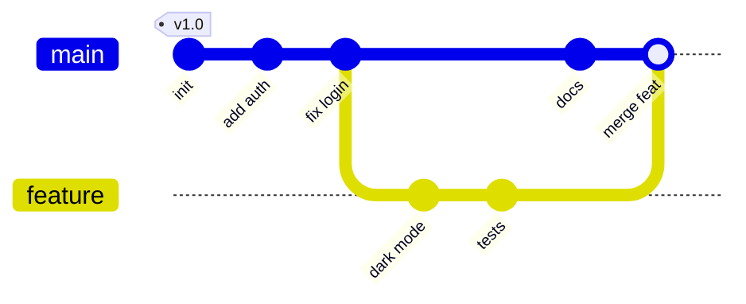

# Git Commit

**Links**: [[Add and Status]] | [[Diff]] | [[Log]] | [[Reset]] | [[Revert]] | [[Rebase]] | [[Branch]] | [[Tag]] | [[GPG]]

Commits are the backbone of Git history — each one is a complete project snapshot. Writing well-structured commits is the foundation of effective version control.

## What is a Commit?

A commit is a **snapshot** of your entire project at a point in time. Each commit contains:

- Unique SHA-1 hash (e.g., `a1b2c3d...`)
- Author name, email, and timestamp
- Parent commit pointer(s) — 0 (root), 1 (normal), or 2 (merge)
- A commit message (subject + body)
- A tree pointer to the root directory listing

## Commit Visualization



## Basic Committing

```bash
git add file.txt && git commit -m "Add user auth flow"
git commit -a -m "Fix typo in README"       # Stage tracked + commit
git commit                                  # Open editor for message
```

## Conventional Commits

A standardized format widely used in open source:

```
<type>(<scope>): <description>
```

| Type | Usage | Example |
|------|-------|---------|
| `feat` | New feature | `feat(auth): add OAuth2 login` |
| `fix` | Bug fix | `fix(api): handle null response` |
| `docs` | Documentation | `docs: update installation guide` |
| `refactor` | Code change (no fix/feat) | `refactor: extract helper` |
| `test` | Adding tests | `test: add unit tests for parser` |
| `chore` | Maintenance | `chore: bump dependencies` |

```bash
git commit -m "feat(api): add user endpoint"
git commit -m "fix(db): correct connection timeout"
```

Breaking changes use `!` or `BREAKING CHANGE` footer.

## Amending Commits

Fix the most recent commit without creating a new one:

```bash
# Change the commit message
git commit --amend -m "New message"

# Add forgotten files to last commit
git add forgotten.txt
git commit --amend --no-edit

# Amend author
git commit --amend --author="Jane <jane@example.com>"
```

> **Warning**: `--amend` rewrites history. Never amend pushed commits on shared branches.

## Atomic Commits Best Practices

Each commit should represent a single logical change:

| Principle | Why | Example |
|-----------|-----|---------|
| One concern per commit | Easy to review, revert, cherry-pick | Don't mix "fix typo" with "add feature" |
| Working state | Every commit should build | Test before committing |
| Descriptive message | Future-you will thank present-you | "Fix crash" → "Fix null pointer in login handler" |

```bash
# Bad — mixed concerns
git commit -a -m "lots of changes"

# Good — staged selectively
git add src/login.js && git commit -m "feat(login): add password reset"
git add src/styles.css && git commit -m "style: update button colors"
```

## Advanced Options

```bash
git commit --allow-empty -m "Trigger CI"         # Empty commit
git commit --verbose                              # Show diff in editor
git commit --signoff                              # Add Signed-off-by trailer
git commit --template .gitmessage                 # Use custom template
```

**Next**: [[Log]] — Explore commit history
