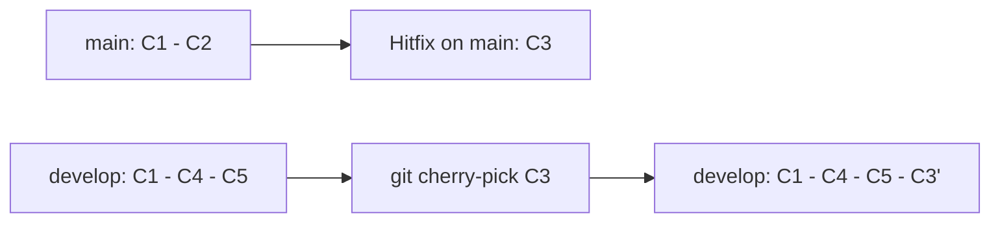

# Git Cherry-Pick

**Links**: [[Git Commit]] | [[Git Rebase]] | [[Git Interactive Rebase]] | [[Git Merge]] | [[Git Conflict Resolution]]

## What is Cherry-Pick?

`git cherry-pick` applies changes from a specific commit (or commits) onto your current branch, creating new commits with the same changes.

## Basic Usage

```bash
# Apply a single commit
git cherry-pick a1b2c3d

# Apply multiple commits
git cherry-pick a1b2c3d e4f5g6h

# Apply a range of commits (excludes the first)
git cherry-pick a1b2c3d..e4f5g6h

# Apply a range including the first
git cherry-pick a1b2c3d^..e4f5g6h
```

## Options

```bash
# Don't commit (just apply to working tree)
git cherry-pick -n a1b2c3d

# Edit commit message
git cherry-pick -e a1b2c3d

# Keep original author but commit as yourself
git cherry-pick -x a1b2c3d    # Adds "(cherry picked from commit ...)"

# Allow empty commits (normally skipped)
git cherry-pick --allow-empty a1b2c3d

# Keep original author and date
git cherry-pick --signoff a1b2c3d
```

## Cherry-Pick Conflicts

```bash
# If conflicts occur:
# 1. Resolve conflicts
# 2. Stage the file
git add resolved-file.txt
# 3. Continue
git cherry-pick --continue

# Abort entire cherry-pick
git cherry-pick --abort

# Skip this commit and move on
git cherry-pick --skip
```

## Conflict Tips

```bash
# When cherry-pick hits a conflict:
# Use theirs (the cherry-picked commit's version)
git restore --theirs conflicted.txt

# Use ours (current branch version)
git restore --ours conflicted.txt

# After resolving:
git add -A
git cherry-pick --continue
```

## Use Cases

| Scenario | Why |
|----------|-----|
| Hotfix to production | Pick fix commit from develop to main |
| Port a feature | Move commit from feature branch to release |
| Undo/redo in specific branch | Pick commits without rebasing |
| Selective integration | Pick only what you need |
| Backport security fix | Apply commit to older release branch |



**Next**: [[Git Reflog]] — Recover lost commits
