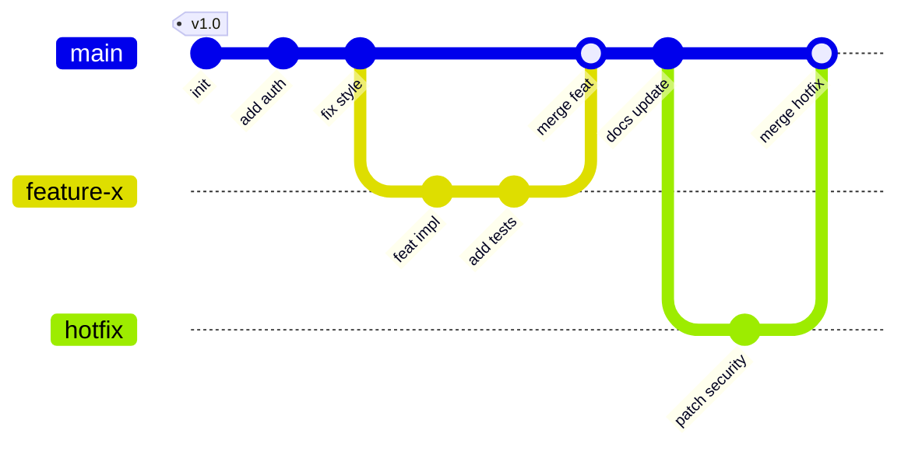

# Git Log

**Links**: [[Git Commit]] | [[Git Diff]] | [[Git Branch]] | [[Git Reflog]] | [[Git Blame]] | [[Git Bisect]]

## Basic Usage

```bash
git log                              # Full history
git log --oneline                    # One line per commit
git log --oneline --graph --all      # Branch graph visualization
```

### --oneline

```bash
git log --oneline -5                 # Last 5 commits
git log --oneline --no-merges        # Skip merge commits
```

### --graph

```bash
git log --oneline --graph --all      # ASCII branch graph
git log --graph --format="%h %s" --all
```

### --pretty / --format

```bash
git log --format="%h - %an, %ar : %s"
git log --format="%C(yellow)%h%Creset %s %Cgreen(%cr)%Creset"
```

| Placeholder | Meaning | Example |
|-------------|---------|---------|
| `%h` | Abbreviated hash | `a1b2c3d` |
| `%an` | Author name | `Jane Doe` |
| `%ae` | Author email | `jane@example.com` |
| `%ar` | Relative date | `2 weeks ago` |
| `%s` | Subject | `Add login form` |
| `%d` | Ref names | `(HEAD -> main, tag: v1)` |
| `%C(color)` | Color directive | `%C(yellow)` |

## Filtering

| Criteria | Command |
|----------|---------|
| By time | `git log --since="2024-01-01"` |
| By author | `git log --author="Jane"` |
| By message | `git log --grep="bugfix"` |
| By content change | `git log -S "function_name"` |
| Merges only | `git log --merges` |
| No merges | `git log --no-merges` |

```bash
git log --since="2 weeks ago" --until="yesterday"
git log --author="Jane\|John"                 # Multiple authors (regex)
git log -p -2                                 # Last 2 commits with diff
git log --stat --oneline                      # Files changed per commit
```

## Advanced Examples

```bash
# Commits in feature not in main
git log --oneline main..feature

# Commits affecting a directory
git log --all -- "src/"

# Show commits that touched a specific function
git log -L :myFunction:src/app.js

# Follow renamed file history
git log --follow file.txt

# Export hashes
git log --format="%H" --since="2024-01-01"
```

## Commit History Visualization



**Next**: [[Git Diff]] — View changes between commits
