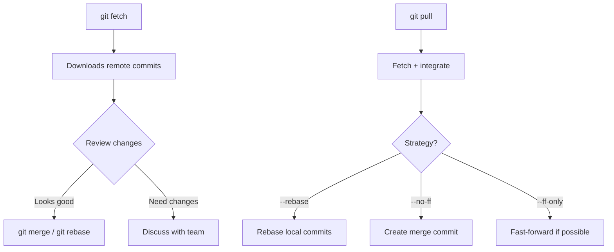

# Git Pull and Fetch

**Links**: [[Git Remote]] | [[Git Push]] | [[Git Branch]] | [[Git Merge]] | [[Git Rebase]] | [[Git Workflows]]

## git fetch vs git pull

| Command | Downloads | Merges | Use Case |
|---------|-----------|--------|----------|
| `git fetch` | Yes | No | Review changes first |
| `git pull` | Yes | Yes | Fast forward your branch |

## git fetch

Downloads remote commits without integrating them into your work.

```bash
# Fetch from origin
git fetch origin

# Fetch all remotes
git fetch --all

# Fetch and prune deleted remote branches
git fetch --prune

# See what was fetched
git log main..origin/main  # Commits ahead of your main
git diff main origin/main  # Differences

# Fetch a specific branch
git fetch origin feature
```

## Inspecting After Fetch

```bash
# Compare local vs remote
git log HEAD..origin/main --oneline
git diff HEAD origin/main --stat

# Merge or rebase after reviewing
git merge origin/main
git rebase origin/main
```

## git pull

Fetches and then integrates (merge or rebase).

```bash
# Pull with merge (default)
git pull origin main

# Pull with rebase (preferred)
git pull --rebase origin main

# Set rebase as default
git config --global pull.rebase true
```

## Pull Strategies

```bash
# Fast-forward only (reject if diverged)
git pull --ff-only

# Always create merge commit
git pull --no-ff

# Rebase local commits on top of remote
git pull --rebase
```

## Autostash

Stash local changes before pull, pop them after:

```bash
git pull --rebase --autostash

# Make it default
git config --global rebase.autoStash true
```

## When to Use Which

| Situation | Command |
|-----------|---------|
| Review before integrating | `git fetch` then `git log origin/main` |
| Fast-forward (no local commits) | `git pull --ff-only` |
| Rebase local work on remote | `git pull --rebase` |
| Dirty working tree | `git pull --rebase --autostash` |
| Want merge commit | `git pull --no-ff` |



**Next**: [[Git Tag]] — Tag important commits
