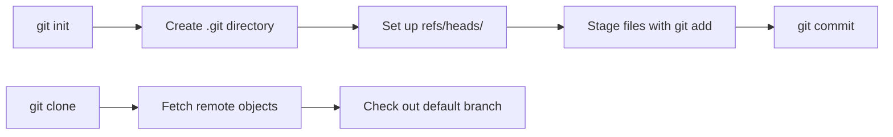

# Git Init and Clone

**Links**: [[Overview]] | [[Configuration]] | [[Add and Status]] | [[Commit]] | [[Remote]] | [[Branch]] | [[Worktrees]]

Every Git repository starts with init (create new) or clone (copy existing). These two commands are the entry points to any Git workflow.

## git init

Creates a new Git repository.

```bash
git init                          # Current directory
git init my-project               # Specific directory
git init --bare my-project.git    # Bare repo (server, no working tree)
git init --template ~/my-templates  # With custom templates
```

After `git init`, Git creates a `.git` directory:
```
.git/
├── HEAD
├── config
├── description
├── hooks/
├── info/
├── objects/
└── refs/
```

## git clone

Copies an existing repository.

```bash
git clone https://github.com/user/repo.git
git clone git@github.com:user/repo.git
git clone --branch develop https://github.com/user/repo.git
git clone --depth 1 https://github.com/user/repo.git    # Shallow
git clone --recursive https://github.com/user/repo.git   # With submodules
git clone --single-branch https://github.com/user/repo.git  # Only one branch
```

## Common Clone Options

| Option | Purpose |
|--------|---------|
| `--depth <n>` | Shallow clone (last n commits, faster) |
| `--branch <name>` | Clone a specific branch |
| `--recursive` | Initialize and clone submodules |
| `--single-branch` | Only fetch one branch |
| `--bare` | Bare clone for server mirrors |

## Bare vs Non-Bare

| Type | Working Tree | Use |
|------|-------------|-----|
| Non-bare | Yes | Development |
| Bare | No | Server/hub repos |

## Use Cases

```bash
# Mirror a repo (all branches, tags, refs)
git clone --mirror https://github.com/user/repo.git

# Shallow clone for CI
git clone --depth 1 --single-branch https://github.com/user/repo.git

# Re-initialize .git (fix corruption)
git init    # Safe to run again on existing repo
```



**Next**: [[Add and Status]] — Track changes in your working tree
