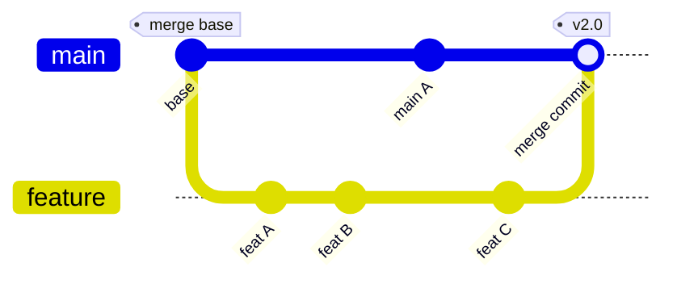

# Git Merge

**Links**: [[Branch]] | [[Checkout and Switch]] | [[Conflict Resolution]] | [[Rebase]] | [[Advanced Merging]] | [[Workflows]]

Merging combines divergent work into a unified history. Git supports several merge strategies, from simple fast-forwards to three-way recursive merges.

## What is Merging?

Merging combines changes from one branch into another. Git finds a common **merge base** (shared ancestor commit), then applies differences from both branches.

## Fast-Forward Merge

When the target hasn't diverged (it's an ancestor of the source), Git simply moves the pointer forward:

```
Before:  main → a1b2c3d
         feature → e4f5g6h (ahead)
After:   main → e4f5g6h (fast-forwarded)
```

```bash
git checkout main
git merge feature          # Fast-forward (default when possible)
```

## Three-Way Merge

When branches have diverged, Git creates a **merge commit** with two parents:

```
Merge base: a1b2c3d
            /        \
main:   f1g2h3i    j4k5l6m  :feature
            \        /
         merge commit (2 parents)
```

```bash
git checkout main
git merge feature          # Creates merge commit
```



## Merge Strategies

| Strategy | Use Case | Behavior |
|----------|----------|----------|
| `recursive` | Default (pre-2.33) | Three-way with rename detection |
| `ort` | Default (2.33+) | Faster, better conflict messages |
| `octopus` | 3+ branches | Multi-way (no conflict handling) |
| `ours` | Keep our version | Auto-resolve using current branch |
| `subtree` | Subproject merge | Merge with subtree adjustment |

## Merge Options

| Option | Effect | Use When |
|--------|--------|----------|
| `--no-ff` | Always creates merge commit | Preserve branch topology |
| `--squash` | Collapses source into 1 commit | Throwaway branches |
| `--ff-only` | Fail if fast-forward impossible | Safety checks |

```bash
git merge --no-ff feature                    # Force merge commit
git merge --squash feature && git commit     # Squash merge
git merge --ff-only feature                  # Fail if not fast-forward
git merge feature -m "Merge: release v2.1"   # Custom message
```

## Conflict Resolution Flow

When a merge conflict occurs, Git pauses and marks conflicting files:

```bash
git merge feature
# CONFLICT in src/index.js
# Fix conflicts then commit.

git status                    # Shows both-modified files
git diff                      # Shows conflict markers
```

Conflict markers in the file:

```
<<<<<<< HEAD
console.log("main version");
=======
console.log("feature version");
>>>>>>> feature
```

```bash
# After fixing:
git add src/index.js          # Mark resolved
git commit                    # Complete the merge

# Or abort entirely
git merge --abort
```

**Next**: [[Conflict Resolution]] — Handle merge conflicts
