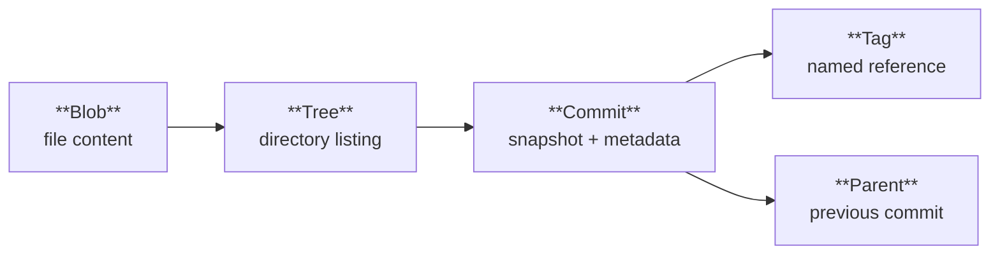
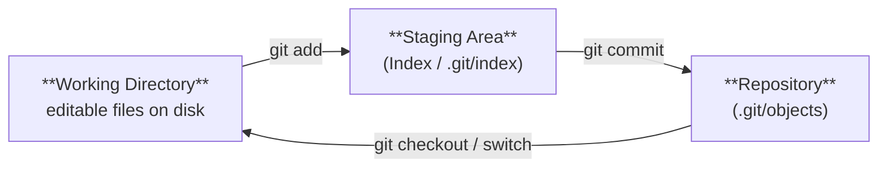

# Git Overview

**Links**: [[Installation]] | [[Configuration]] | [[Init and Clone]] | [[Add and Status]] | [[Commit]] | [[Branch]] | [[Remote]] | [[Workflows]] | [[Internals I]]

Git is the world's most widely used version control system, enabling thousands of developers to collaborate on projects of any scale with speed and reliability.

## What is Git?

Git is a **distributed version control system** (DVCS) created by Linus Torvalds in 2005 for Linux kernel development. Unlike centralized systems (SVN, CVS), every developer has a full copy of the entire repository history.

## Basic Workflow

A standard Git cycle follows three steps: edit, stage, commit.

```bash
# Edit files in your working directory
# Then stage specific changes
git add file.txt          # Stage a single file
git add .                 # Stage all changes

# Commit the staged snapshot
git commit -m "Descriptive summary of changes"

# Push to remote (when ready to share)
git push origin main
```

## Git Object Model

Git stores everything in a **directed acyclic graph (DAG)** of four immutable object types:



| Object | SHA-1 Hash Of | Stores |
|--------|---------------|--------|
| Blob | File content | Binary file data (no filename) |
| Tree | Sorted list of entries | Filenames, modes, pointers to blobs/trees |
| Commit | Tree hash + parent(s) + metadata | Author, message, timestamp, root tree |
| Tag | Commit hash (annotated) | Name, message, signature (optional) |

Every object is content-addressable — its hash is derived from its content, so changing even one byte produces a completely different hash.

## The Three-Tree Architecture

Git tracks your project through three trees:



| State | Tree | Description |
|-------|------|-------------|
| **Modified** | Working Directory | File changed but not yet staged |
| **Staged** | Staging Area (Index) | Marked for inclusion in next commit |
| **Committed** | Repository | Safely stored in object database |

## Why Git?

| Feature | Benefit |
|---------|---------|
| Distributed | Work offline, full backup on every clone |
| Branching | Lightweight branches, cheap context switching |
| Integrity | SHA-1 hashing detects any corruption |
| Speed | Most operations are local (no network round-trip) |
| Staging Area | Fine-grained control over what goes into each commit |

## Git vs Other VCS

| Feature | Git | SVN (Subversion) | Mercurial |
|---------|-----|------------------|-----------|
| Architecture | Distributed | Centralized | Distributed |
| Offline Work | Full support | Limited (read-only) | Full support |
| Branching | Lightweight (41-byte ref file) | Heavy (directory copy) | Lightweight |
| Staging Area | Yes (index) | No | No |
| Storage Model | Content-addressable (DAG) | Delta-based revisions | Revlog-based |
| Merge Strategies | Recursive, ort, octopus, ours | Simple three-way | Patch-based |
| Adoption | Dominant (GitHub, GitLab) | Legacy enterprise | Niche |

## Key Concepts

- **Repository (Repo)**: A Git database containing all files and history in `.git/`
- **Working Tree**: The directory on your filesystem where you edit files
- **Staging Area (Index)**: Intermediate area between working tree and repository
- **Commit**: A snapshot of the entire project at a point in time
- **Branch**: A movable pointer to a commit
- **HEAD**: Pointer to the current branch or commit (detached HEAD)
- **Remote**: A copy of the repository hosted elsewhere (GitHub, GitLab, etc.)

## Data Integrity

Git uses SHA-1 hashes (40-character hex strings) to identify every object. If a file changes, its hash changes. This makes it impossible to change history without detection. Git also stores a checksum of the entire repository in the reflog and packfiles, providing end-to-end integrity.

```bash
# Verify repository integrity
git fsck

# View object type
git cat-file -t a1b2c3d

# View object content
git cat-file -p a1b2c3d
```

**Next**: [[Installation]] — Install Git on your system
