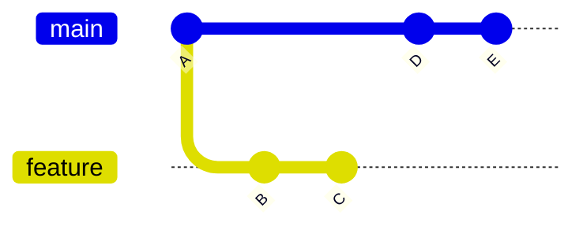

# Git Rebase

**Links**: [[Branch]] | [[Merge]] | [[Interactive Rebase]] | [[Conflict Resolution]] | [[Advanced Merging]] | [[Workflows]]

Rebasing rewrites commit history by applying commits on top of a new base. It creates a linear, clean history but requires care when collaborating with others.

## What is Rebasing?

Rebasing **reapplies commits** from one branch onto the tip of another, creating a **linear history**. Each original commit is replaced by a new commit with the same content but a different hash and parent.

```
Before:  main → a1b2c3d → f1g2h3i
         feature: j4k5l6m → m7n8o9p

After:   feature: a1b2c3d → f1g2h3i → j4k5l6m' → m7n8o9p'
                                                 ↑ new hashes!
```

## Rebase vs Merge

| Aspect | Merge | Rebase |
|--------|-------|--------|
| History | Preserves branch topology | Linear, cleaner log |
| Commit Hashes | Original preserved | All rebased commits get new hashes |
| Safety | Safe on shared branches | **DANGEROUS** on shared branches |
| Conflicts | Resolved once | Resolved per commit |
| Traceability | Easy to see merge point | Harder to find integration |

## Rebase Flow vs Merge Flow



Rebase replays B and C on top of E → `A → D → E → B' → C'`. Merge creates a merge commit → `A → D → E → M` (M has parents E and C).

## Basic Rebase

```bash
git rebase main                        # While on feature branch
git rebase --onto main feature topic   # Rebase topic onto main
git rebase --abort                     # Abort if wrong
git rebase --skip                      # Skip problematic commit
```

## Interactive Rebase

```bash
git rebase -i HEAD~3                   # Edit last 3 commits
git rebase -i main                     # All commits since branching
```

| Command | Short | Effect |
|---------|-------|--------|
| `pick` | `p` | Use commit as-is |
| `reword` | `r` | Change commit message |
| `edit` | `e` | Stop to amend |
| `squash` | `s` | Combine with previous (merge messages) |
| `fixup` | `f` | Combine with previous (discard message) |
| `drop` | `d` | Remove commit entirely |

```bash
# Squash last 3 commits into 1
git rebase -i HEAD~3
# Change: pick → squash for 2nd and 3rd commits
```

## The Golden Rule

**Never rebase commits that have been pushed to a shared repository.**

Rebasing rewrites history with new hashes. Anyone who pulled your old commits will have divergent history that Git cannot reconcile.

```bash
# SAFE: local branches not yet pushed
git rebase main

# Use --force-with-lease (not --force) for personal feature branches
git push --force-with-lease origin feature
```

## Rebase with Pull

```bash
git pull --rebase                      # Fetch + rebase instead of merge
git pull --rebase --autostash          # Auto-stash uncommitted changes
git config --global pull.rebase true   # Set as default
```

## Resume or Abort

```bash
git add <resolved-file> && git rebase --continue   # After fixing conflicts
git rebase --abort                                  # Change your mind
git rebase --skip                                   # Skip conflict commit
```

**Next**: [[Interactive Rebase]] — Squash, reword, reorder commits
