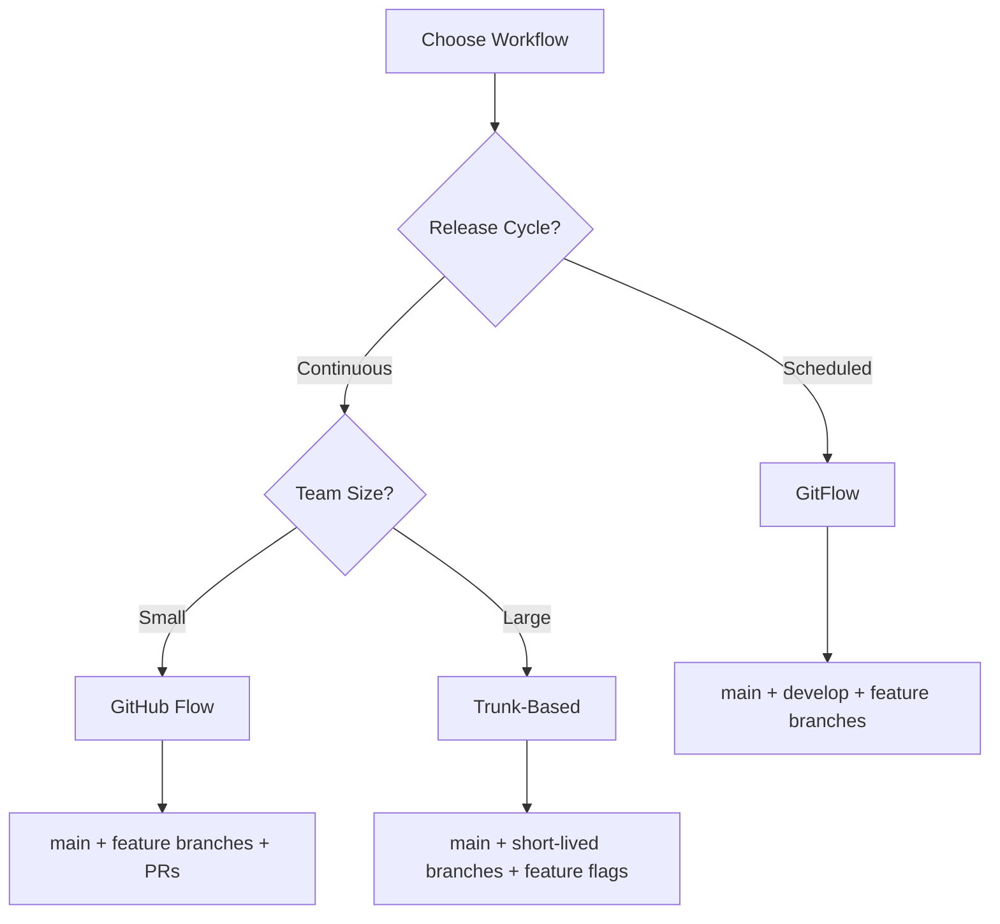

# Git Workflows

**Links**: [[Branch]] | [[Merge]] | [[Rebase]] | [[Remote]] | [[Pull and Fetch]] | [[Push]] | [[Hooks]]

A Git workflow defines how a team collaborates — from centralized models to feature branches, GitFlow, and trunk-based development. The right workflow depends on your team size and release cadence.

## What is a Workflow?

A Git workflow is a convention for how teams use branches, merges, and remotes to collaborate.

## GitFlow

```
main ──────●─────────●─────────●──
              \       / \       /
develop        ●───●   ●───●
                  \       /
feature           ●─────●
```

| Branch | Purpose |
|--------|---------|
| `main` | Production-ready code |
| `develop` | Integration branch |
| `feature/*` | New features (→ develop) |
| `release/*` | Release preparation (→ main + develop) |
| `hotfix/*` | Urgent production fixes (→ main + develop) |

**Best for**: Release-cycle projects with scheduled deployments.

## GitHub Flow

```
main ──●────────●────────●────
          \      / \      /
feature   ●──●   ●──●
```

- `main` is always deployable
- Create feature branches from `main`
- Open PRs for code review
- Merge to `main` and deploy immediately

**Best for**: Continuous deployment, simple projects.

## Trunk-Based Development

```
main ──●──●──●──●──●──●──●──●──
        \ /    \ /        \ /
short     ●      ●          ●
```

- Short-lived feature branches (hours, not days)
- Frequent merges to main
- Feature flags for incomplete features

**Best for**: CI/CD, large teams, high deployment frequency.

## Choosing a Workflow

| Factor | GitFlow | GitHub Flow | Trunk-Based |
|--------|---------|-------------|-------------|
| Release cycle | Scheduled | Continuous | Continuous |
| Team size | Any | Small-medium | Any |
| Deployment freq | Low | High | Very high |
| Complexity | High | Low | Medium |



**Next**: [[Pull Requests]] — PR workflow on GitHub
