# 📦 Git — Map of Content

Git is a distributed version control system created by Linus Torvalds in 2005. This folder covers both **reference notes** (45 topics from install to internals) and **hands-on lessons** for deep understanding.

## Hands-On Lessons

| Lesson | Topic | Time |
|--------|-------|------|
| [[Git/lessons/0001-git-objects-and-data-model\|01 — Git Objects & Data Model]] | Blobs, trees, commits, .git directory | 25 min |

## Reference Topics

```mermaid
graph TD
  GIT["Git"] --> START["Getting Started"]
  GIT --> BASIC["Basic Operations"]
  GIT --> BRANCH["Branching & Merging"]
  GIT --> SHARE["Sharing & Collaboration"]
  GIT --> ADV["Advanced"]
  GIT --> INTERN["Internals"]
  GIT --> PRAC["Best Practices"]

  START --> INST["Git Installation"]
  START --> CONF["Git Configuration"]
  START --> INIT["Git Init and Clone"]

  BASIC --> ADD["Git Add and Status"]
  BASIC --> COMMIT["Git Commit"]
  BASIC --> DIFF["Git Diff"]
  BASIC --> LOG["Git Log"]
  BASIC --> CLEAN["Git Clean"]

  BRANCH --> BR["Git Branch"]
  BRANCH --> CO["Git Checkout and Switch"]
  BRANCH --> MERGE["Git Merge"]
  BRANCH --> REBASE["Git Rebase"]
  BRANCH --> IR["Git Interactive Rebase"]
  BRANCH --> AM["Git Advanced Merging"]
  BRANCH --> CR["Git Conflict Resolution"]
  BRANCH --> CP["Git Cherry-Pick"]

  SHARE --> PUSH["Git Push"]
  SHARE --> PF["Git Pull and Fetch"]
  SHARE --> REMOTE["Git Remote"]
  SHARE --> PR["Git Pull Requests"]
  SHARE --> TAG["Git Tag"]
  SHARE --> SUB["Git Submodules"]
  SHARE --> BUND["Git Bundles"]
  SHARE --> ARCH["Git Archive"]

  ADV --> STASH["Git Stash"]
  ADV --> RESET["Git Reset"]
  ADV --> RESTORE["Git Restore"]
  ADV --> REVERT["Git Revert"]
  ADV --> BISECT["Git Bisect"]
  ADV --> BLAME["Git Blame"]
  ADV --> WORKTREE["Git Worktrees"]
  ADV --> HOOKS["Git Hooks"]
  ADV --> SH["Git Server Hooks"]
  ADV --> ATTR["Git Attributes"]
  ADV --> IGNORE["Git Ignore"]
  ADV --> LFS["Git LFS"]
  ADV --> GPG["Git GPG"]
  ADV --> ALIAS["Git Aliases"]

  INTERN --> GI["Git Internals I"]
  INTERN --> GII["Git Internals II"]
  INTERN --> GIII["Git Internals III"]

  PRAC --> WF["Git Workflows"]
  PRAC --> BP["Git Best Practices"]
```

| Category | Notes |
|----------|-------|
| **Getting Started** | [[Overview]], [[Installation]], [[Configuration]], [[Init and Clone]] |
| **Basic Operations** | [[Add and Status]], [[Commit]], [[Diff]], [[Log]], [[Clean]] |
| **Branching & Merging** | [[Branch]], [[Checkout and Switch]], [[Merge]], [[Rebase]], [[Interactive Rebase]], [[Advanced Merging]], [[Conflict Resolution]], [[Cherry-Pick]] |
| **Sharing** | [[Push]], [[Pull and Fetch]], [[Remote]], [[Pull Requests]], [[Tag]], [[Submodules]], [[Bundles]], [[Archive]] |
| **Advanced** | [[Stash]], [[Reset]], [[Restore]], [[Revert]], [[Reflog]], [[Bisect]], [[Blame]], [[Worktrees]], [[Hooks]], [[Server Hooks]], [[Attributes]], [[Ignore]], [[LFS]], [[GPG]], [[Aliases]] |
| **Internals** | [[Internals I]], [[Internals II]], [[Internals III]] |
| **Best Practices** | [[Workflows]], [[Best Practices]] |

## Mission
[[Git/MISSION]]
