# 📦 Git — Map of Content

Git is a distributed version control system created by Linus Torvalds in 2005. Unlike centralized systems, every clone is a full backup — enabling offline work, lightweight branching, and cryptographic integrity. This folder covers the complete Git landscape from first-time installation to plumbing-level internals, organized by skill progression.

## Topics

```mermaid
graph TD
  GIT["Git"] --> START["Getting Started"]
  GIT --> BASIC["Basic Operations"]
  GIT --> BRANCH["Branching & Merging"]
  GIT --> SHARE["Sharing & Collaboration"]
  GIT --> ADV["Advanced"]
  GIT --> INTERN["Internals"]
  GIT --> PRAC["Best Practices"]

  START --> INST["Git Installation"]
  START --> CONF["Git Configuration"]
  START --> INIT["Git Init and Clone"]

  BASIC --> ADD["Git Add and Status"]
  BASIC --> COMMIT["Git Commit"]
  BASIC --> DIFF["Git Diff"]
  BASIC --> LOG["Git Log"]
  BASIC --> CLEAN["Git Clean"]

  BRANCH --> BR["Git Branch"]
  BRANCH --> CO["Git Checkout and Switch"]
  BRANCH --> MERGE["Git Merge"]
  BRANCH --> REBASE["Git Rebase"]
  BRANCH --> IR["Git Interactive Rebase"]
  BRANCH --> AM["Git Advanced Merging"]
  BRANCH --> CR["Git Conflict Resolution"]
  BRANCH --> CP["Git Cherry-Pick"]

  SHARE --> PUSH["Git Push"]
  SHARE --> PF["Git Pull and Fetch"]
  SHARE --> REMOTE["Git Remote"]
  SHARE --> PR["Git Pull Requests"]
  SHARE --> TAG["Git Tag"]
  SHARE --> SUB["Git Submodules"]
  SHARE --> BUND["Git Bundles"]
  SHARE --> ARCH["Git Archive"]

  ADV --> STASH["Git Stash"]
  ADV --> RESET["Git Reset"]
  ADV --> RESTORE["Git Restore"]
  ADV --> REVERT["Git Revert"]
  ADV --> BISECT["Git Bisect"]
  ADV --> BLAME["Git Blame"]
  ADV --> WORKTREE["Git Worktrees"]
  ADV --> HOOKS["Git Hooks"]
  ADV --> SH["Git Server Hooks"]
  ADV --> ATTR["Git Attributes"]
  ADV --> IGNORE["Git Ignore"]
  ADV --> LFS["Git LFS"]
  ADV --> GPG["Git GPG"]
  ADV --> ALIAS["Git Aliases"]

  INTERN --> GI["Git Internals I"]
  INTERN --> GII["Git Internals II"]
  INTERN --> GIII["Git Internals III"]

  PRAC --> WF["Git Workflows"]
  PRAC --> BP["Git Best Practices"]
```

| Category | Notes |
|----------|-------|
| **Getting Started** | [[Git Overview]], [[Git Installation]], [[Git Configuration]], [[Git Init and Clone]] |
| **Basic Operations** | [[Git Add and Status]], [[Git Commit]], [[Git Diff]], [[Git Log]], [[Git Clean]] |
| **Branching & Merging** | [[Git Branch]], [[Git Checkout and Switch]], [[Git Merge]], [[Git Rebase]], [[Git Interactive Rebase]], [[Git Advanced Merging]], [[Git Conflict Resolution]], [[Git Cherry-Pick]] |
| **Sharing** | [[Git Push]], [[Git Pull and Fetch]], [[Git Remote]], [[Git Pull Requests]], [[Git Tag]], [[Git Submodules]], [[Git Bundles]], [[Git Archive]] |
| **Advanced** | [[Git Stash]], [[Git Reset]], [[Git Restore]], [[Git Revert]], [[Git Reflog]], [[Git Bisect]], [[Git Blame]], [[Git Worktrees]], [[Git Hooks]], [[Git Server Hooks]], [[Git Attributes]], [[Git Ignore]], [[Git LFS]], [[Git GPG]], [[Git Aliases]] |
| **Internals** | [[Git Internals I]], [[Git Internals II]], [[Git Internals III]] |
| **Best Practices** | [[Git Workflows]], [[Git Best Practices]] |

## Cross-Domain Links

- [[Git/Git Overview]] → [[DevOps/CI-CD/CI CD Pipelines]], [[Software-Engineering/Code Review Best Practices]]
- [[Git/Git Workflows]] → [[DevOps/CI-CD/CI CD Pipelines]], [[Software-Engineering/Agile Development]]
- [[Git/Git Hooks]] → [[DevOps/CI-CD/CI CD Pipelines]], [[Software-Engineering/Developer Experience]]
- [[Git/Git Bisect]] → [[Software-Engineering/Debugging Strategies]]
- [[Git/Git Submodules]] → [[Software-Engineering/Monorepo vs Polyrepo]]
