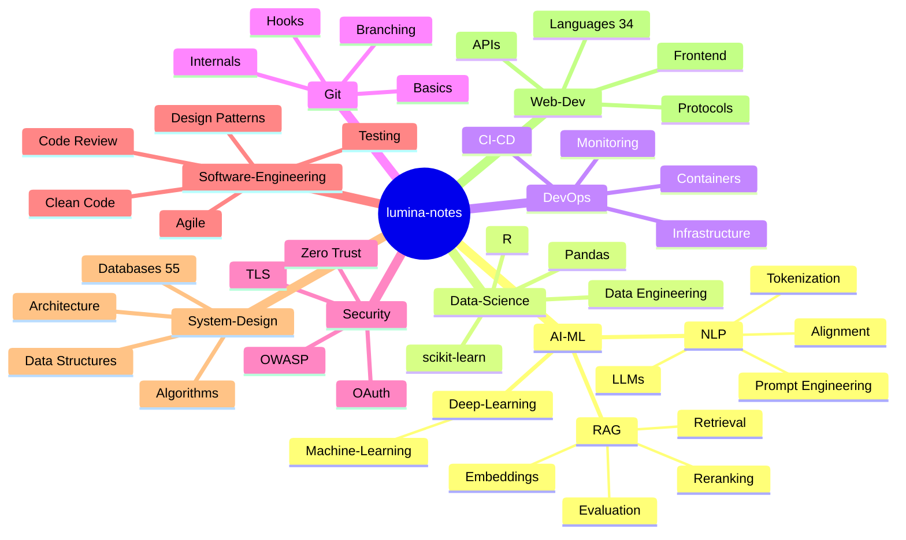

git add .
git commit -m "Add GitHub Actions release workflow"
git push origin mermaid-test
git tag v1.0.16
git push origin v1.0.16
<p align="center">



</p>

<div align="center">


</div>

<p align="center">
  A comprehensive engineering knowledge base -- 400+ interconnected notes across AI/ML, system design, databases, DevOps, security, and software engineering. Built for Lumina (Obsidian-compatible) with Mermaid diagrams, deep cross-linking, and hierarchical Maps of Content.
</p>

<p align="center">
  <a href="#structure">Structure</a> .
  <a href="#domains">Domains</a> .
  <a href="#features">Features</a> .
  <a href="#usage">Usage</a> .
  <a href="#stats">Stats</a> .
  <a href="#navigate">Navigate</a>
</p>

---

## Overview

lumina-notes is a structured second brain for engineers. Every folder contains a `_MOC.md` (Map of Content) index that links to all notes within it. Notes are deeply interconnected through `[[wiki-links]]`, forming a knowledge graph that mirrors real-world engineering relationships.

The vault prioritizes depth over breadth -- each note includes code examples, configuration snippets, architecture diagrams, and decision matrices. Mermaid diagrams are used throughout for visual explanation of complex systems.

---

## Structure

```
lumina-notes/
  _MOC.md                        Root master index
  AI-ML/                         Artificial Intelligence & Machine Learning
    Deep-Learning/               Transformers, attention, training, inference
      Machine-Learning/          Classical ML: ensembles, clustering, MLOps
    NLP/                         Tokenization, prompting, LLMs, alignment
    RAG/                         Retrieval-Augmented Generation full stack
  Data-Science/                  Data wrangling, analysis, engineering
  DevOps/                        CI/CD, containers, infrastructure, monitoring
  Git/                           45 notes from basics to internals
  Security/                      OAuth, TLS, OWASP, zero trust, cryptography
  Software-Engineering/          Design patterns, code review, testing, agile
  System-Design/                 Architecture, databases, algorithms, data structures
    Databases/                   55 notes on SQL, NoSQL, engines, indexing, sharding
  Testing/                       Unit, integration, performance, property-based
  Web-Dev/                       Frontend, protocols, APIs, programming languages
    Programming/                 34 language and framework deep dives
```

---

## Domains

| Domain | Notes | MOC Entry | Key Topics |
|--------|-------|-----------|------------|
| 🧠 AI/ML & NLP | 80+ | `AI-ML/_MOC.md` | LLMs, transformers, RAG, prompt engineering, alignment, RLHF |
| 🗄️ Databases | 55 | `System-Design/Databases/_MOC.md` | Indexing, sharding, transactions, replication, engines, modeling |
| 🏗️ System Design | 85+ | `System-Design/_MOC.md` | Architecture, microservices, CAP theorem, DDD, consensus |
| ⚙️ DevOps | 40+ | `DevOps/_MOC.md` | Docker, Kubernetes, CI/CD, monitoring, IaC |
| 🔧 Git | 45 | `Git/_MOC.md` | From init to internals, workflows, hooks |
| 🔒 Security | 15 | `Security/_MOC.md` | OAuth 2.0, TLS 1.3, OWASP Top 10, zero trust |
| 📐 Software Eng. | 30+ | `Software-Engineering/_MOC.md` | SOLID, design patterns, code review, testing, agile |
| 📊 Data Science | 5+ | `Data-Science/_MOC.md` | R, pandas, scikit-learn, data pipelines |
| 🌐 Web Dev | 30+ | `Web-Dev/_MOC.md` | React, HTTP, GraphQL, WebSocket, PWAs |
| 💻 Languages | 34 | `Web-Dev/Programming/_MOC.md` | Python, Rust, Go, TypeScript, Java, Haskell, Julia |

---

## Features

### Maps of Content (MOCs)

Every folder contains a `_MOC.md` file that serves as an index, featuring:
- A Mermaid graph showing topic relationships
- A table of contents linking to all notes
- Cross-domain links to related topics in other folders

### Mermaid Diagrams

Notes extensively use Mermaid for visual explanation:
- Architecture flowcharts (system design, data pipelines)
- Sequence diagrams (protocols, request flows)
- Gantt charts (tool evolution, technology timelines)
- Entity relationship diagrams (database schemas)
- Graphs and trees (algorithm visualization)
- Quadrant charts (tradeoff analysis)

### Cross-Linking

Notes are connected through bidirectional `[[wiki-links]]`:
- Direct prerequisite or reference relationships
- Lateral connections to adjacent topics
- Aggregated cross-domain connections in MOC files

### Structural Consistency

Each note follows a predictable format:
- YAML frontmatter (id, title, tags, timestamp)
- Overview section defining the concept
- Deep dive with code examples, tables, and diagrams
- Practical guidance (best practices, pitfalls, decision trees)
- Links to related notes and further reading

---

## Usage

### As an Obsidian Vault

```bash
git clone https://github.com/Saboor-Hamedi/lumina-notes.git
```

Open Obsidian, select "Open folder as vault", and choose the cloned directory. Enable community plugins when prompted -- the vault includes pre-configured settings, themes (Minimal, Obsidianite, Wasp), and plugins (calendar, file colors, icon folder, style settings).

### As a Static Reference

Browse the Markdown files directly on GitHub. Mermaid diagrams render natively. Use the `_MOC.md` files as entry points for each domain.

### For Self-Hosted Knowledge Base

The Markdown files can be ingested by any static site generator (MkDocs, Docusaurus, Quartz) for a searchable web-based knowledge base.

---

## Stats

| Metric | Value | Detail | Reference |
|--------|-------|--------|-----------|
| Total notes | 400+ | Across 10 domains | [[_MOC.md\|Root MOC]] |
| Total lines | ~190,000 | Pure Markdown | — |
| MOC index files | 21 | One per folder | [[_MOC.md\|Master Index]] |
| Cross-links | ~100 | Root MOC connections | [[_MOC.md\|Knowledge Graph]] |
| Programming languages | 34 | Deep dives with code | [[Web-Dev/Programming/_MOC.md\|Languages]] |
| Database notes | 55 | SQL + NoSQL + engines | [[System-Design/Databases/_MOC.md\|Databases]] |
| Git notes | 45 | Basic to internals | [[Git/_MOC.md\|Git]] |
| AI/ML notes | 80+ | LLMs, RAG, alignment | [[AI-ML/_MOC.md\|AI-ML]] |
| System design notes | 85+ | Architecture, patterns | [[System-Design/_MOC.md\|System Design]] |
| DevOps notes | 40+ | CI/CD, containers, infra | [[DevOps/_MOC.md\|DevOps]] |

---

## Navigate

### Learning AI/ML
`AI-ML/_MOC.md` to `AI-ML/NLP/_MOC.md` for LLMs to `AI-ML/RAG/_MOC.md` for retrieval systems.

### Preparing for system design interviews
`System-Design/_MOC.md` to `System-Design/Architecture/_MOC.md` for patterns to `System-Design/Databases/_MOC.md` for storage.

### Setting up DevOps
`DevOps/_MOC.md` to `DevOps/Containers/_MOC.md` for containerization to `DevOps/CI-CD/_MOC.md` for pipelines.

### Broad overview
Open `_MOC.md` at the root -- the master mind map of all topics and their relationships.

---

<p align="center">
  <sub>MIT License. Built by Saboor Hamedi.</sub>
</p>
