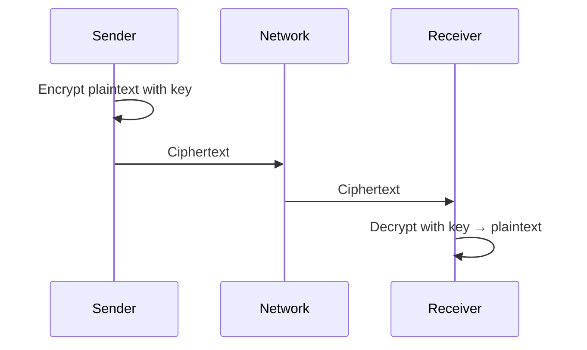

**Links**: [[TLS 1.3 Deep Dive]] | [[Web Security]] | [[OAuth and Authentication Protocols]] | [[Zero Trust Architecture]] | [[Vault and Secret Management]] | [[WireGuard and VPN Technologies]]


# Cryptography Basics

Cryptography provides confidentiality, integrity, authentication, and non-repudiation for data in transit and at rest.

## Core Goals

| Goal | Meaning | Provides |
|------|---------|----------|
| Confidentiality | Only authorized parties can read | Encryption |
| Integrity | Data hasn't been tampered with | Hashing, MACs |
| Authentication | Verify the sender's identity | Digital signatures |
| Non-repudiation | Sender cannot deny sending | Signatures, audit logs |

## Symmetric vs Asymmetric Encryption

| Property | Symmetric | Asymmetric |
|----------|-----------|------------|
| Keys | Single shared key | Public/private key pair |
| Speed | Very fast | Slow (math-intensive) |
| Key Size | 128-256 bits | 2048-4096 bits |
| Algorithms | AES, ChaCha20 | RSA, ECDSA, Ed25519 |
| Use Case | Bulk data encryption | Key exchange, signatures |

## Symmetric Encryption

| Algorithm | Key Size | Type | Notes |
|-----------|----------|------|-------|
| AES | 128, 192, 256 | Block (128-bit) | Current standard |
| ChaCha20 | 256 | Stream | Fast in software, mobile-friendly |
| DES (deprecated) | 56 | Block | Broken by brute force |

**Modes**: ECB (avoid — leaks patterns), CBC (needs padding), GCM (authenticated encryption, recommended), CTR (parallelizable)

## Asymmetric Encryption

| Algorithm | Key Size | Use Case |
|-----------|----------|----------|
| RSA | 2048, 4096 | Key exchange, signatures |
| ECDSA | 256, 384 | Signatures (smaller keys same security) |
| Ed25519 | 256 | Modern signature (fast, secure) |
| X25519 | 256 | Key exchange (ECDH) |

## Encryption / Decryption Flow



## Cryptographic Hashing

One-way function: input → fixed-size output (cannot reverse).

| Algorithm | Output | Security | Use |
|-----------|--------|----------|-----|
| SHA-256 | 256 bits | Secure | File integrity, signatures |
| SHA-3 | Variable | Future standard | Long-term systems |
| MD5 | 128 bits | Collision found | Never use |
| SHA-1 | 160 bits | Collision demonstrated | Never use |

## Hashing for Passwords

| Algorithm | Salted? | Memory-Hard | Recommended |
|-----------|---------|-------------|-------------|
| SHA-256 | Manual only | No | No — fast to brute-force |
| bcrypt | Built-in | No | Yes — work factor adjustable |
| Argon2id | Built-in | Yes | Yes — preferred, side-channel resistant |
| scrypt | Built-in | Yes | Yes — good for HW constraints |

## Digital Signatures

```
Sign: message → hash → encrypt hash with private key → signature
Verify: message → hash → decrypt signature with public key → compare hashes
```

## TLS Handshake (Simplified)

```
Client → Server: Hello, supported ciphers
Server → Client: Certificate (public key), chosen cipher
Client → Server: Key exchange (encrypted with server's public key)
Both: Derive session key → Finished (encrypted)
```

## Common Pitfalls

- **ECB mode**: Identical plaintext blocks → identical ciphertext (leaks patterns in images)
- **Weak keys**: DES, RSA <2048 bit, predictable RNG seeds — trivially brute-forced
- **Padding oracle**: CBC mode with attacker-accessible padding errors leaks plaintext byte by byte
- **Rolling your own crypto**: Almost always has fatal flaws; use audited libraries
- **Hardcoded keys**: Keys in source code exposed to every developer with access
- **Unsalted passwords**: Same password → same hash, enabling rainbow table attacks

**Links**: [[Web Security]] | [[API Security]] | [[JSON Web Tokens]] | [[OAuth and Authentication Protocols]] | [[Environment Variables]]
