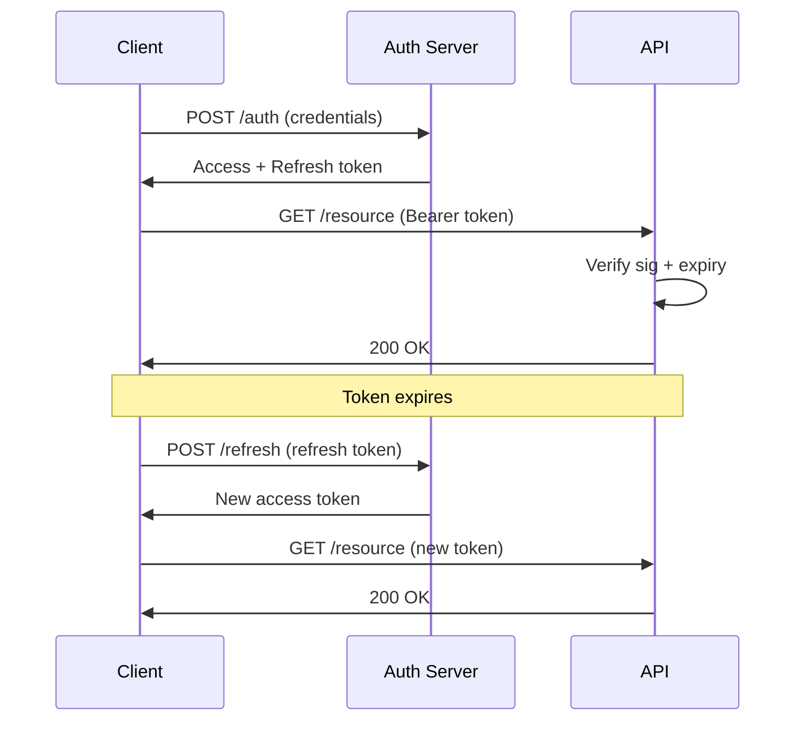

# JSON Web Tokens

**Links**: [[OAuth and Authentication Protocols]] | [[OAuth 2.0 in Practice]] | [[Web Security]] | [[REST API Design]] | [[API Versioning]] | [[HTTP Protocol]] | [[API Security]] | [[PostgreSQL Features]]

**See also**: [[Secure Coding Practices]], [[TLS 1.3 Deep Dive]], [[SAML and Enterprise SSO]]

## What is JWT?

JWT is a compact, URL-safe token format for securely transmitting claims between parties. Commonly used for API authentication.
## JWT Structure

Three Base64URL-encoded segments separated by dots: `header.payload.signature`

### Header
```json
{"alg": "HS256", "typ": "JWT"}
```

### Payload (Claims)
Three types: **Registered** (standardized claims), **Public** (IANA-registered), **Private** (custom via agreement).

```json
{"sub": "user_123", "role": "admin", "iat": 1516239022, "exp": 1516242622}
```

| Claim | Description |
|-------|-------------|
| `iss` | Issuer of the token |
| `sub` | Subject (user ID) |
| `aud` | Audience (intended recipient) |
| `exp` | Expiration timestamp |
| `iat` | Issued at timestamp |
| `jti` | Unique token ID (replay prevention) |

### Signature
```
HMACSHA256(base64url(header) + "." + base64url(payload), secret_key)
```

## Signing Algorithms

| Algorithm | Type | Key Size | Use Case |
|-----------|------|----------|----------|
| HS256 | Symmetric (HMAC + SHA-256) | 256+ bits | Single-service apps |
| RS256 | Asymmetric (RSA + SHA-256) | 2048+ bits | Multi-service, third-party |
| ES256 | Asymmetric (ECDSA + P-256) | 256 bits | Mobile, constrained devices |

Prefer RS256 or ES256 for distributed systems so services verify without sharing a secret.

## Token Flow


## Token Lifecycle
| Phase | Description |
|-------|-------------|
| **Issue** | Client authenticates → server generates access + refresh tokens |
| **Verify** | API validates signature, expiry, audience, issuer on every request |
| **Refresh** | Client sends refresh token → server issues new access token |
| **Revoke** | Server invalidates refresh token (blocklist or delete from DB) |

## Python Implementation
```python
import jwt
from datetime import datetime, timedelta

SECRET = "your-secret-key"

def create_token(user_id: str) -> str:
    payload = {
        "sub": user_id,
        "iat": datetime.utcnow(),
        "exp": datetime.utcnow() + timedelta(hours=24),
    }
    return jwt.encode(payload, SECRET, algorithm="HS256")

def verify_token(token: str) -> dict:
    try:
        return jwt.decode(token, SECRET, algorithms=["HS256"])
    except jwt.ExpiredSignatureError:
        raise Exception("Token expired")
    except jwt.InvalidTokenError:
        raise Exception("Invalid token")
```

## Security Best Practices

- Short expiration (15-60 min) for access tokens; use refresh tokens for longer sessions
- Store in HttpOnly cookies, never localStorage
- Validate `aud` (audience) and `iss` (issuer) claims on every request
- Rotate signing keys regularly
- Use RS256/ES256 (asymmetric) for multi-service systems
- Never include secrets in payload (Base64-encoded, not encrypted)

**Next**: [[HTTP Caching]] — Cache control
