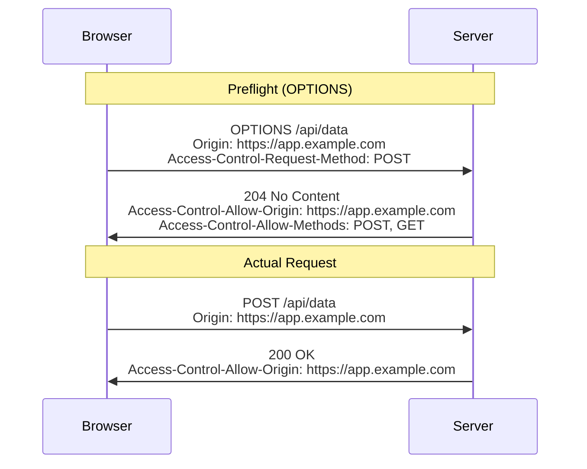
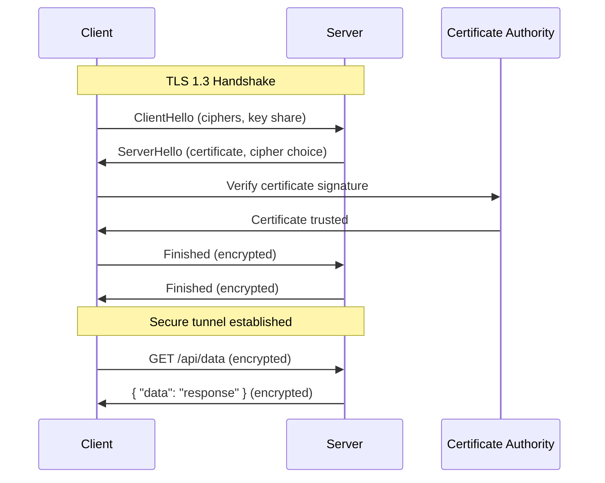

**Links**: [[OWASP Top 10]] | [[API Security]] | [[Secure Coding Practices]] | [[Threat Modeling]] | [[Cryptography Basics]] | [[OAuth and Authentication Protocols]] | [[Zero Trust Architecture]]


# Web Security

Web security protects applications from attacks, data breaches, and unauthorized access. It encompasses secure coding, encryption, authentication, and defensive infrastructure.

## Common Web Attacks

| Attack | Description | Example | Mitigation |
|--------|-------------|---------|------------|
| **XSS** (Cross-Site Scripting) | Attacker injects malicious scripts into pages viewed by others | `<script>fetch('/steal?cookie='+document.cookie)</script>` in comment field | Output encoding, CSP, input sanitization |
| **CSRF** (Cross-Site Request Forgery) | Attacker tricks authenticated user into unintended actions | Hidden form auto-submits POST to `/transfer?amount=1000&to=attacker` | Anti-CSRF tokens, SameSite cookies, re-authentication |
| **SQL Injection** | Attacker injects SQL via input fields | `' OR 1=1 --` bypasses login auth | Parameterized queries, ORM, input validation |
| **SSRF** (Server-Side Request Forgery) | Server coerced into making requests to internal resources | `http://169.254.169.254/latest/meta-data/` (AWS metadata) | URL allowlist, deny private IPs, disable redirect follow |
| **IDOR** (Insecure Direct Object Reference) | User accesses unauthorized objects by tampering with IDs | Change `/invoice/123` to `/invoice/124` | Authorization check on every access, use UUIDs |

## OWASP Top 10 (Common Threats)

| Rank | Threat | Mitigation |
|------|--------|------------|
| 1 | Broken Access Control | Role-based permissions, validate every request |
| 2 | Cryptographic Failures | Use HTTPS, hash passwords (bcrypt/argon2) |
| 3 | Injection (SQL, XSS) | Parameterized queries, input sanitization |
| 4 | Insecure Design | Threat modeling, security review |
| 5 | Security Misconfiguration | Minimal surface, disable debug in prod |
| 6 | Vulnerable Components | Regular dependency updates, SCA tools |
| 7 | Auth Failures | MFA, rate limiting, secure sessions |
| 8 | Data Integrity Flaws | Signatures, checksums |
| 9 | Logging Failures | Centralized logging, alert on anomalies |
| 10 | SSRF | Validate URLs, deny private networks |

## CORS (Cross-Origin Resource Sharing)

CORS is a browser security mechanism that controls cross-origin HTTP requests. For non-simple requests (e.g., custom headers, non-standard methods), the browser sends a **preflight** `OPTIONS` request.



| Header | Purpose |
|--------|---------|
| `Access-Control-Allow-Origin` | Permitted origins (`*` disallows credentials) |
| `Access-Control-Allow-Methods` | Allowed HTTP verbs |
| `Access-Control-Allow-Headers` | Allowed custom headers |
| `Access-Control-Allow-Credentials` | Whether cookies/auth headers are sent |
| `Access-Control-Max-Age` | Preflight cache duration (seconds) |

## HTTPS & TLS

HTTPS encrypts data in transit using TLS, preventing eavesdropping, tampering, and man-in-the-middle attacks.



- **TLS 1.3**: Reduces handshake to 1-RTT; supports 0-RTT for resumed sessions
- **Certificate Authorities**: Trusted third parties that issue signed certificates (Let's Encrypt, DigiCert)
- **HSTS**: `Strict-Transport-Security` header forces all future requests over HTTPS

## Content-Security-Policy (CSP)

CSP restricts resource loading (scripts, styles, images, fonts) to mitigate XSS and data injection.

```http
Content-Security-Policy: default-src 'self'; script-src 'self' https://analytics.example.com 'nonce-abc123'; style-src 'self' 'unsafe-inline'; img-src 'self' data:; object-src 'none'; frame-ancestors 'none'; report-uri /csp-violations
```

| Directive | Purpose |
|-----------|---------|
| `default-src` | Fallback for all resource types |
| `script-src` | Allowed script sources (`'unsafe-inline'` weakens CSP) |
| `style-src` | Allowed stylesheet sources |
| `img-src` | Allowed image sources |
| `object-src` | Controls `<object>`, `<embed>`, `<applet>` |
| `frame-ancestors` | Controls framing (clickjacking prevention) |
| `report-uri` / `report-to` | Sends violation reports to a URL |
| `nonce-{value}` | Allows inline scripts with matching nonce attribute |

## Security Headers

| Header | Purpose | Recommended Value |
|--------|---------|-------------------|
| `Strict-Transport-Security` | Enforces HTTPS only | `max-age=31536000; includeSubDomains; preload` |
| `X-Content-Type-Options` | Prevents MIME sniffing | `nosniff` |
| `X-Frame-Options` | Clickjacking protection | `DENY` or `SAMEORIGIN` |
| `X-XSS-Protection` | Legacy XSS filter (obsolete) | `0` (use CSP instead) |
| `Referrer-Policy` | Controls Referer header | `strict-origin-when-cross-origin` |
| `Permissions-Policy` | Controls browser features | `camera=(), microphone=(), geolocation=()` |
| `Content-Security-Policy` | Resource loading restrictions | See CSP section above |

## Authentication & Authorization

- **JWT**: Stateless tokens with signed claims, commonly used for API auth
- **OAuth 2.0**: Delegated authorization flow (authorization code, PKCE for SPAs)
- **API Keys**: Simple secret-based auth, best paired with rate limiting
- **Session Cookies**: Server-side sessions with httpOnly, Secure, SameSite flags

## Best Practices

```sql
-- ALWAYS use parameterized queries (prevents SQL injection)
SELECT * FROM users WHERE email = %s
```

```python
import bcrypt

password = b"user_password"
salt = bcrypt.gensalt()
hashed = bcrypt.hashpw(password, salt)
assert bcrypt.checkpw(password, hashed)
```

- Hash passwords with bcrypt (or argon2), never store plaintext
- Set Content-Security-Policy headers
- Restrict CORS origins to specific domains, never `*` with credentials
- Rate limit API endpoints (e.g., 100 req/min per IP)
- Validate and sanitize all user input server-side
- Enforce HTTPS everywhere with HSTS preload
- Keep dependencies updated via Dependabot, Snyk, or Renovate
- Log security events centrally with alerts for anomalies

**See also**: [[HTTP Protocol]], [[REST API Design]], [[REST API Design]], [[Dev Environment Setup]]
