# 🔒 Security — Map of Content

Security spans authentication protocols, network encryption, application hardening, and infrastructure defense. This folder covers OAuth 2.0, TLS 1.3, OWASP Top 10, zero trust architecture, cryptography fundamentals, and secure coding practices — providing both theoretical foundations and practical implementation guidance.

```mermaid
graph TD
  SEC["Security"] --> WEB["Web Security"]
  SEC --> AUTH["Authentication & Authorization"]
  SEC --> NET["Network Security"]
  SEC --> APP["Application Security"]
  SEC --> CRYPTO["Cryptography"]
  SEC --> INFRA["Infrastructure Security"]

  WEB --> OWASP["OWASP Top 10"]
  WEB --> API_SEC["API Security"]
  WEB --> WS["Web Security"]

  AUTH --> OAUTH["OAuth & Auth Protocols"]
  AUTH --> OIDC["OAuth 2.0 in Practice"]
  AUTH --> JWT["JSON Web Tokens"]
  AUTH --> SAML["SAML & Enterprise SSO"]

  NET --> TLS["TLS 1.3 Deep Dive"]
  NET --> ZTA["Zero Trust Architecture"]
  NET --> WIRE["WireGuard & VPN Technologies"]

  APP --> SCP["Secure Coding Practices"]
  APP --> TM["Threat Modeling"]

  CRYPTO --> CRYPTO_B["Cryptography Basics"]

  INFRA --> K8S_SEC["Kubernetes Security"]
  INFRA --> VAULT["Vault & Secret Management"]
```

## Topics

| Category | Notes |
|----------|-------|
| **Web Security** | [[OWASP Top 10]], [[API Security]], [[Web Security]] |
| **Authentication** | [[OAuth and Authentication Protocols]], [[OAuth 2.0 in Practice]], [[JSON Web Tokens]], [[SAML and Enterprise SSO]] |
| **Network** | [[TLS 1.3 Deep Dive]], [[Zero Trust Architecture]], [[WireGuard and VPN Technologies]] |
| **Application** | [[Secure Coding Practices]], [[Threat Modeling]] |
| **Cryptography** | [[Cryptography Basics]] |
| **Infrastructure** | [[Kubernetes Security]], [[Vault and Secret Management]] |

## Cross-Domain Links

- [[Security/OWASP Top 10]] → [[Web-Dev/Web Development Fundamentals]], [[Security/Secure Coding Practices]]
- [[Security/OAuth and Authentication Protocols]] → [[Web-Dev/Web Development Fundamentals]], [[DevOps/REST API Design]]
- [[Security/TLS 1.3 Deep Dive]] → [[Web-Dev/HTTP Protocol]], [[Web-Dev/HTTP-3 and QUIC]]
- [[Security/Kubernetes Security]] → [[DevOps/Containers/Kubernetes Basics]], [[DevOps/Containers/Kubernetes Deployments]]
- [[Security/API Security]] → [[Web-Dev/API Gateway Patterns]], [[DevOps/REST API Design]], [[Web-Dev/gRPC]]
- [[Security/JSON Web Tokens]] → [[System-Design/Architecture/Microservices Architecture]], [[Web-Dev/State Management Patterns]]
