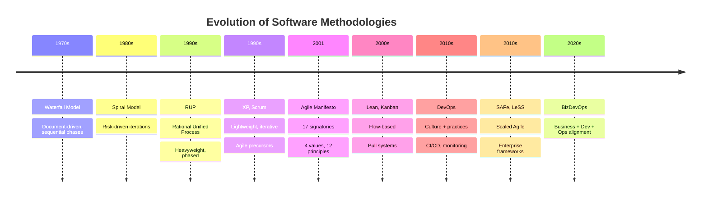
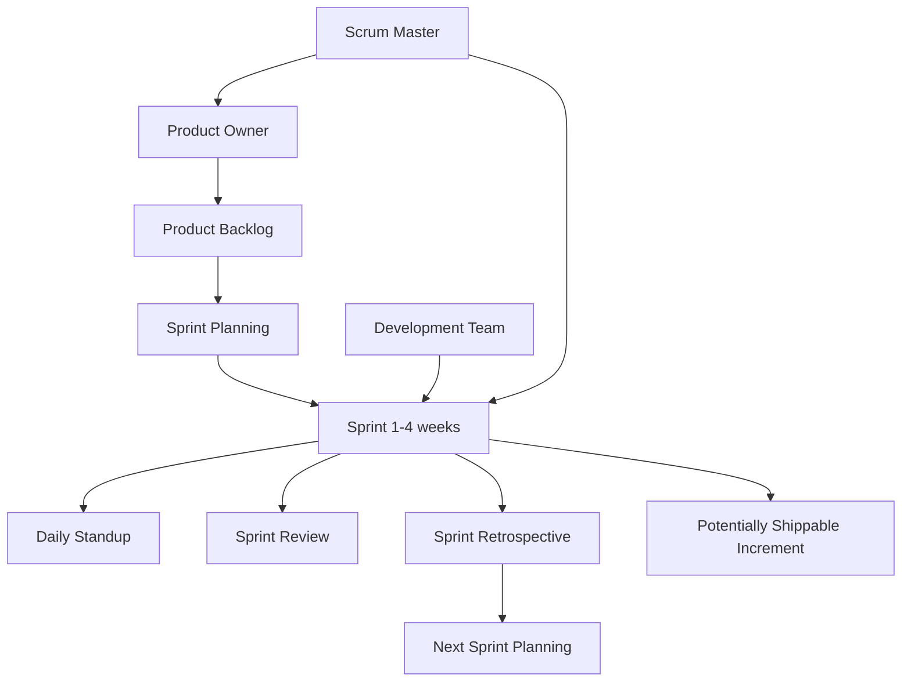
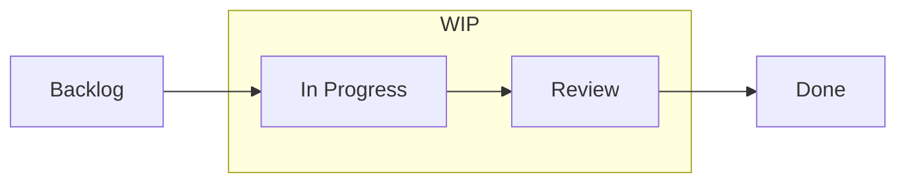
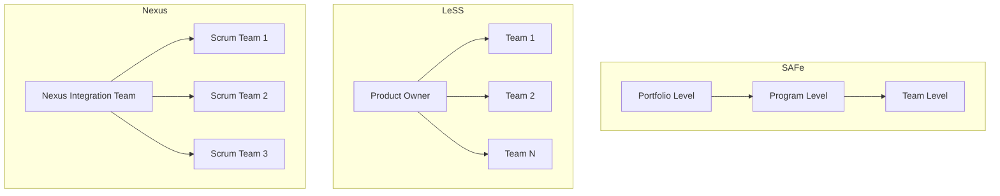

# Agile Development

**Links**: [[CI CD Pipelines]] | [[Code Review Best Practices]] | [[Unit Testing Guide]] | [[Git/Workflows]] | [[Microservices Architecture]] | [[Scrum Framework]] | [[Estimation and Planning]] | [[Incident Response]] | [[Feature Flags and Toggles]]

## What is Agile?

Agile is an iterative approach to software development emphasizing flexibility, collaboration, and customer feedback over rigid planning.

## History of Software Development Methodologies



## The Agile Manifesto

### History

In February 2001, 17 software developers met at the Snowbird ski resort in Utah. The group included Kent Beck, Martin Fowler, Robert C. Martin, Jeff Sutherland, Ken Schwaber, Ward Cunningham, and others. They sought a lightweight alternative to the heavyweight, document-driven methodologies of the 1990s. The result was the **Agile Manifesto** — four value statements and twelve principles.

### The Four Values

| Value | Over |
|-------|------|
| **Individuals and interactions** | Processes and tools |
| **Working software** | Comprehensive documentation |
| **Customer collaboration** | Contract negotiation |
| **Responding to change** | Following a plan |

**Each value explained:**

1. **Individuals and interactions over processes and tools** — The best tools and processes are worthless without skilled, motivated people. Teams should adapt processes to people, not the reverse. Communication face-to-face beats any project management tool.

2. **Working software over comprehensive documentation** — Documentation has diminishing returns. A working prototype communicates more than a 100-page spec. Write just enough documentation to support the work, but prioritize shipped code.

3. **Customer collaboration over contract negotiation** — Contracts create adversarial relationships. True partnership means the customer is embedded in the team, providing continuous feedback. Trust replaces rigid scope negotiations.

4. **Responding to change over following a plan** — Plans are hypotheses. When reality diverges (and it always does), the team must pivot. Agile embraces change even late in development as a competitive advantage.

### The Twelve Principles

1. Our highest priority is to satisfy the customer through early and continuous delivery of valuable software.
2. Welcome changing requirements, even late in development.
3. Deliver working software frequently, from a couple of weeks to a couple of months, with a preference to the shorter timescale.
4. Business people and developers must work together daily throughout the project.
5. Build projects around motivated individuals. Give them the environment and support they need, and trust them to get the job done.
6. The most efficient and effective method of conveying information to and within a development team is face-to-face conversation.
7. Working software is the primary measure of progress.
8. Agile processes promote sustainable development. The sponsors, developers, and users should be able to maintain a constant pace indefinitely.
9. Continuous attention to technical excellence and good design enhances agility.
10. Simplicity — the art of maximizing the amount of work not done — is essential.
11. The best architectures, requirements, and designs emerge from self-organizing teams.
12. At regular intervals, the team reflects on how to become more effective, then tunes and adjusts its behavior accordingly.

## Scrum Framework

Scrum is the most widely adopted Agile framework. It prescribes a lightweight set of roles, events, and artifacts.



### Roles

| Role | Responsibility | Key Skill |
|------|---------------|-----------|
| **Product Owner** | Defines features, manages backlog, prioritizes by value | Decision-making, stakeholder communication |
| **Scrum Master** | Facilitates ceremonies, removes blockers, coaches the team | Servant leadership, conflict resolution |
| **Development Team** | Self-organizing cross-functional group that builds the increment | Technical expertise, collaboration |

**Note**: There is no "project manager" role in Scrum. The Scrum Master is not a manager — they are a facilitator and coach.

### Events (Ceremonies)

| Event | Duration | Purpose |
|-------|----------|---------|
| **Sprint Planning** | 2-4 hours (2-week sprint) | Select backlog items for the sprint, define the sprint goal |
| **Daily Standup** | 15 minutes | Synchronize, identify blockers, plan next 24 hours |
| **Sprint Review** | 1-2 hours | Demo completed work to stakeholders, gather feedback |
| **Sprint Retrospective** | 1-1.5 hours | Inspect team process, identify improvements |
| **Backlog Refinement** | 1-2 hours/week | Break down and estimate upcoming items |

### Artifacts

- **Product Backlog**: Ordered list of everything that might be needed in the product. Never complete, continuously refined.
- **Sprint Backlog**: Set of Product Backlog items selected for the sprint, plus a plan for delivering them.
- **Increment**: The sum of all completed Product Backlog items during a sprint, plus increments of all previous sprints. Must be "Done" per the team's definition.

## Kanban

Kanban is a flow-based method for visualizing and managing work. Unlike Scrum, it has no fixed iterations.

### Principles

1. **Visualize the workflow** — Use a board with columns representing stages.
2. **Limit Work In Progress (WIP)** — Stop starting, start finishing.
3. **Manage flow** — Monitor cycle time and throughput.
4. **Make process policies explicit** — Define what "done" means at each stage.
5. **Implement feedback loops** — Regular reviews of the board and flow.
6. **Improve collaboratively** — Use metrics to identify bottlenecks.

### Kanban Board

```
Backlog | Analysis (WIP:2) | Dev (WIP:3) | Review (WIP:2) | Done
  T8         T3               T1            T2               T4
  T9                           T6            T5               T7
```

### Key Metrics

| Metric | Definition | Why It Matters |
|--------|------------|----------------|
| **Cycle Time** | Time from start of work to delivery | Predictability, process improvement |
| **Lead Time** | Time from request to delivery | Customer-facing SLA |
| **Throughput** | Items delivered per unit time | Capacity planning |
| **WIP** | Items currently in progress | Constraint for limiting batch size |

### Cumulative Flow Diagram (CFD)



A CFD plots the count of items in each state over time. Widening bands in `In Progress` indicate bottlenecks. The horizontal distance between top and bottom lines at any point shows average lead time.

## Extreme Programming (XP)

XP takes Agile practices to their logical extreme with technical excellence at the core.

| Practice | Description |
|----------|-------------|
| **Pair Programming** | Two developers, one keyboard. Driver writes code, navigator reviews in real time. Switches frequently. |
| **Test-Driven Development (TDD)** | Write failing test first, then minimum code to pass, then refactor. Red-Green-Refactor cycle. |
| **Continuous Integration (CI)** | Merge all developer branches to main multiple times daily. Every commit triggers automated build and tests. |
| **Collective Ownership** | Anyone can change any code. No silos. Everyone is responsible for quality. |
| **Simple Design** | The simplest solution that works. No YAGNI (You Ain't Gonna Need It) — don't build for hypothetical future requirements. |
| **Refactoring** | Improve design of existing code without changing behavior. Continuous investment in code health. |
| **Whole Team** | All contributors (devs, testers, PO, customers) work together in the same physical space. |
| **Coding Standards** | Everyone writes code that looks like it was written by one person. Consistent formatting and conventions. |
| **Sustainable Pace** | 40-hour work week. Overtime is a sign of systemic failure. |
| **Metaphor** | A shared story or analogy for how the system works (e.g., "the system is a spreadsheet"). |

## Lean Software Development

Adapted from Toyota's manufacturing system by Mary and Tom Poppendieck.

| Principle | Translation to Software |
|-----------|------------------------|
| **Eliminate Waste** | Unnecessary features, waiting, handoffs, defects, task switching |
| **Amplify Learning** | Iterations, prototypes, feedback loops |
| **Decide as Late as Possible** | Defer irreversible decisions, keep options open ([[Feature Flags and Toggles]]) |
| **Deliver as Fast as Possible** | Short iterations, small batch sizes, CI/CD |
| **Empower the Team** | Self-organizing teams, no micromanagement |
| **Build Integrity In** | Quality is not inspected in — it's designed in from the start |
| **See the Whole** | Optimize the entire value stream, not individual silos |

## Scaled Agile Frameworks Comparison

When one team is not enough, organizations turn to scaling frameworks.



| Aspect | SAFe | LeSS | Nexus |
|--------|------|------|-------|
| **Philosophy** | Prescriptive, structured framework | Minimalist, one-product focus | Scrum scaling with integration focus |
| **Team count** | 50-100+ teams | 2-8 teams | 3-9 teams |
| **Roles added** | Release Train Engineer, Solution Architect, Epic Owners | Area Product Owner | Nexus Integration Team |
| **Ceremonies** | PI Planning, Inspect & Adapt | Overall Sprint Planning, Overall Retrospective | Nexus Sprint Planning, Nexus Daily Scrum |
| **Artifacts** | Program Backlog, Solution Backlog, Portfolio Backlog | Single Product Backlog, Requirement Areas | Nexus Sprint Backlog |
| **Complexity** | High — many roles, ceremonies, artifacts | Low — extends Scrum minimally | Medium — adds integration-focused layer |
| **Best for** | Large enterprises, multiple value streams | Multi-team product development | When cross-team integration is the main challenge |

## When Agile Works and When It Doesn't

### Works Well
- **Uncertain requirements** — Agile thrives when the problem is not fully understood upfront
- **Product development** — New features, evolving products
- **Cross-functional teams** — When the team has all necessary skills
- **Collaborative culture** — Organizations that trust their people
- **Stakeholder availability** — Customers/PO can provide ongoing feedback

### Doesn't Work Well
- **Fixed-price contracts** — Scope is locked, Agile's embrace of change conflicts
- **Regulatory compliance** — Medical devices, aviation (require documentation/evidence)
- **Distributed teams** — Heavy timezone overlap needed for real-time collaboration
- **Large-scale without investment** — Scaling Agile requires training, coaching, culture change
- **Command-and-control culture** — Management unwilling to relinquish control
- **Part-time team members** — Agile requires dedication and focus

## Hybrid Approaches

### Water-Scrum-Fall
Waterfall at the boundaries (requirements gathering, deployment), Scrum in the middle. Common in enterprise environments where procurement and compliance require upfront specs but development teams want iteration.

```
[Requirements] → [Sprint 1] → [Sprint 2] → [Sprint 3] → [Deployment]
 Waterfall          Scrum             Scrum          Waterfall
```

### Scrumban
Teams use Scrum's roles and events but Kanban's flow management and WIP limits. Useful when:
- Teams need the structure of Scrum but work is event-driven (support, maintenance)
- Scrum's fixed iterations don't match unpredictable workload
- Transitioning from Scrum to continuous flow

## Agile Estimation

| Technique | Description | When to Use |
|-----------|-------------|-------------|
| **Planning Poker** | Team votes anonymously with story point cards (Fibonacci: 1, 2, 3, 5, 8, 13, 21). Discuss outliers, re-vote until consensus. | Sprint Planning, Backlog Refinement |
| **Affinity Estimation** | Group items into buckets (XS, S, M, L, XL) by relative size, then assign point values. Fast for large backlogs. | Initial product backlog sizing |
| **T-shirt Sizing** | S, M, L, XL categories. Quick relative sizing without commitment to exact numbers. | Epics, high-level roadmap |
| **Dot Voting** | Team places dots on items to indicate size. Fast, visual. | Large backlogs, early-stage estimation |
| **Three-Point Estimation** | Best case + worst case + most likely case. (O + 4M + P) / 6. | When precision is needed, regulatory contexts |

### Common Pitfalls in Estimation

- **Velocity as KPI** — Velocity is a planning tool, not a performance metric. Using it for performance eval leads to inflated estimates.
- **Comparing velocities across teams** — One team's 20 points != another team's 20 points. Story points are relative within one team.
- **Estimation as commitment** — Estimates are forecasts, not promises. Treat them as ranges, not deadlines.
- **Too much precision** — If a task is estimated at 7.5 hours, you're over-thinking it. Use buckets.

## Common Anti-Patterns

| Anti-Pattern | Symptom | Fix |
|-------------|---------|-----|
| **Velocity as KPI** | Management tracks velocity, compares teams, rewards speed | Use throughput and cycle time instead. Velocity for planning only. |
| **No PO / Part-time PO** | Team makes product decisions, priorities are unclear | Dedicated, empowered Product Owner who can make decisions |
| **Endless Grooming** | Backlog refinement takes 50%+ of sprint | Timebox refinement. Stop grooming items more than 2-3 sprints out. |
| **Zombie Scrum** | Teams do the motions but no improvement | Retrospectives should produce action items. Hold teams accountable. |
| **Scrummerfall** | Scrum ceremonies bolted onto waterfall planning | Real iteration on priorities. Sprints, not phases. |
| **The PO is a Clerk** | PO just writes tickets, doesn't make priority decisions | Empower PO. Educate stakeholders on the role. |
| **Multi-tasking** | Devs split across 3 projects simultaneously | One team, one product, one backlog. Dedicated team members. |
| **Sprint Boundary Heroics** | Crunch the last 2 days of every sprint | Sustainable pace. Swarm on bottlenecks early. |

## Key Metrics in Agile

| Metric | What It Measures | Agile Framework |
|--------|-----------------|-----------------|
| **Velocity** | Story points completed per sprint | Scrum |
| **Cycle Time** | Time from start to delivery | Kanban |
| **Lead Time** | Time from request to delivery | Kanban |
| **Throughput** | Items delivered per unit time | Kanban |
| **Escaped Defects** | Bugs found in production | All |
| **Sprint Goal Success Rate** | % of sprints achieving their goal | Scrum |
| **Team Morale** | Survey-based sentiment score | All |

## Agile and DevOps

Agile and DevOps are complementary. Agile focuses on development workflow; DevOps extends the same principles to operations.

| Agile | DevOps |
|-------|--------|
| Iterate on features | Iterate on infrastructure and operations |
| Shorter feedback from stakeholders | Shorter feedback from production |
| CI/CD supports frequent releases | CI/CD is the core practice |
| Cross-functional dev team | Dev + Ops collaboration |
| Retrospectives for process improvement | Incident post-mortems + SRE practices |

See [[CI CD Pipelines]], [[Incident Response]], and [[Feature Flags and Toggles]] for deeper dives.

## Further Reading

- [[Scrum Framework]]
- [[Estimation and Planning]]
- [[Code Review Process]]
- [[CI CD Pipelines]]
- [[Git/Workflows]]
- [[Incident Response]]
- [[Feature Flags and Toggles]]
