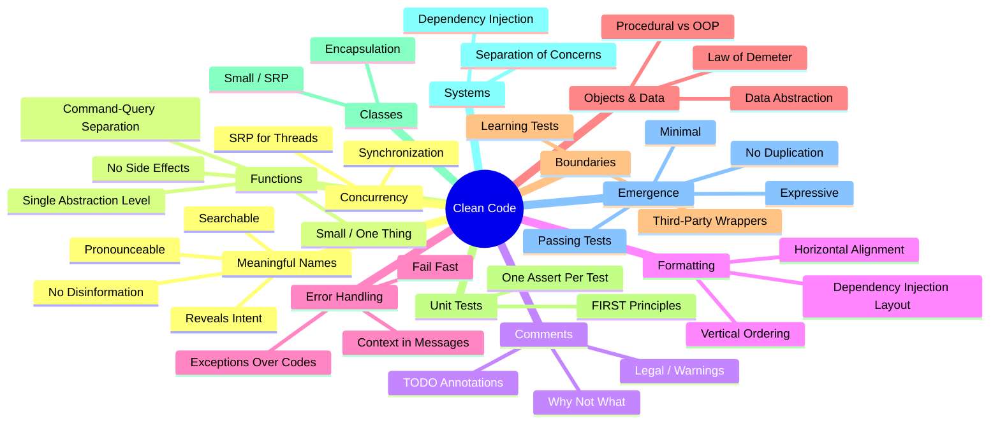

# Clean Code Principles

Clean code is readable, maintainable, and does what it says. It follows conventions, minimizes surprise, and is easy to change.



## Naming

Names are 90% of code readability. Choosing the right name eliminates the need for comments.

### Reveal Intent

A name should answer the big questions: why it exists, what it does, and how it's used.

```python
# Bad: does not reveal intent
def d(a, b):
    return a * b  # what is this multiplication?

# Good: reveals domain intent
def calculate_area(width, height):
    return width * height
```

| Principle | Bad Examples | Good Examples |
|-----------|-------------|---------------|
| Reveals intent | `x`, `data`, `tmp`, `val` | `userCount`, `invoiceTotal`, `maxRetries` |
| Pronounceable | `crDt`, `usrNm`, `genIdx` | `createdAt`, `userName`, `generationIndex` |
| Searchable | `5`, `true`, `"admin"` | `MAX_RETRY_COUNT`, `isAdmin`, `ADMIN_ROLE` |
| No disinformation | `accountList` (a dict) | `accountMap`, `accounts` |
| One word per concept | `fetch/get/retrieve` mixed | Pick one and stick with it |
| Use domain names | `processItem` (vague) | `fulfillOrder` (domain-specific) |

### Real-World Refactoring: Python `requests` library

```python
# Before (hypothetical early version)
def req(m, u, h, d):
    ...

# After
def request(method, url, headers=None, data=None):
    ...
```

### Naming Conventions by Language

| Language | Classes | Constants | Functions/Variables | Private |
|----------|---------|-----------|-------------------|---------|
| Python | `PascalCase` | `UPPER_SNAKE` | `snake_case` | `_prefix` |
| Java | `PascalCase` | `UPPER_SNAKE` | `camelCase` | `private` |
| JavaScript | `PascalCase` | `UPPER_SNAKE` | `camelCase` | `#private` |
| Go | `PascalCase` | `camelCase` | `camelCase` | lowercase |
| Rust | `PascalCase` | `UPPER_SNAKE` | `snake_case` | no `pub` |

## Functions

Functions are the first line of organization in code. Every function should do one thing well.

### Small and Focused

A function should fit on one screen (20-30 lines max). If you can't describe it in one sentence, it's doing too much.

```python
# Bad: does multiple things
def process_order(order):
    validate_stock(order)
    charge_payment(order)       # side effect!
    send_confirmation_email(order)  # side effect!
    update_inventory(order)
    return True

# Good: commands and queries separated
def place_order(order):
    validate_order(order)
    return order_repository.save(order)

def confirm_order(order_id):
    order = order_repository.find(order_id)
    payment = payment_service.charge(order.total)
    if payment.success:
        notification_service.send_confirmation(order)
        return OrderStatus.CONFIRMED
    return OrderStatus.PAYMENT_FAILED
```

### Command-Query Separation

- **Commands** change state but return void (or success/failure)
- **Queries** return a result but don't change state

```python
class Account:
    # Query
    def get_balance(self) -> Decimal:
        return self._balance

    # Command
    def deposit(self, amount: Decimal) -> None:
        if amount <= 0:
            raise ValueError("Amount must be positive")
        self._balance += amount

    # BAD: command AND query
    def withdraw_and_get_balance(self, amount):
        self._balance -= amount
        return self._balance
```

### Parameter Count

Zero params is ideal. One is fine. Two is acceptable. Three or more suggests the function should be a method on a struct/class.

```python
# Bad: 4 parameters, ordering matters, easy to mix up
def create_user(name, email, role, is_active):
    ...

# Good: parameter object
class CreateUserRequest:
    def __init__(self, name, email, role, is_active=True):
        self.name = name
        self.email = email
        self.role = role
        self.is_active = is_active

def create_user(request: CreateUserRequest):
    ...
```

### Single Level of Abstraction (SLA)

Mix high-level logic with low-level details in one function makes code unreadable.

```python
# Bad: mixed abstraction
def render_page():
    html = ""
    html += "<html><body>"
    for user in get_users():
        html += f"<div class='user'>{user.name}</div>"
    html += "</body></html>"
    response = requests.post("https://cdn.example.com/upload", data=html)
    return response.status_code

# Good: separated abstraction levels
def render_page():
    html = build_user_page_html()
    return upload_to_cdn(html)

def build_user_page_html():
    return f"<html><body>{build_user_list()}</body></html>"

def build_user_list():
    return "".join(f"<div class='user'>{u.name}</div>" for u in get_users())
```

### Exception Paths

Functions should have a clear "happy path" and handle exceptional paths separately.

```python
def get_user_profile(user_id: int) -> UserProfile:
    user = user_repository.find_by_id(user_id)
    if user is None:
        raise UserNotFoundError(f"User {user_id} not found")

    profile = profile_service.build_profile(user)
    if profile.is_private and not current_user.is_admin:
        raise PermissionDeniedError("Profile is private")

    return profile
```

## Comments

The best comment is the one you don't need because the code is self-explanatory. But some comments are necessary.

### When Comments ARE Necessary

| Situation | Example |
|-----------|---------|
| Legal notices | Copyright, license headers |
| Complex algorithm | Explaining a non-obvious approach from a paper |
| API docs | Public library interfaces |
| Warnings | "This method is O(n²) — do not call in a loop" |
| TODOs | `// TODO: replace with OAuth when available` |

```python
# NECESSARY: Complex algorithm explanation
def locate_median(arr):
    """Quickselect: O(n) average, O(n²) worst-case.
    
    Uses Hoare's partition scheme to find the kth smallest element
    without fully sorting. This is the Blum-Floyd-Pratt-Rivest-Tarjan
    median-of-medians variant for guaranteed O(n).
    """
    ...

# UNNECESSARY: Obvious code
def get_name(self):
    # Returns the name  <-- DELETE THIS
    return self.name
```

### Comment Smells

- **Redundant comments**: `i += 1  # increment i by 1`
- **Misleading comments**: out of date, no longer accurate
- **Commented-out code**: delete it; git has the history
- **Journal comments**: `// 2024-01-15: Fixed bug #1234` — use git log
- **Noise**: `// default constructor` — obvious

## Formatting

Formatting is about communication. Consistent formatting reduces cognitive load.

### Vertical Ordering

```python
# File structure top-to-bottom:
# 1. Imports (stdlib, third-party, local)
# 2. Constants
# 3. Types/Classes
# 4. Public functions
# 5. Private helpers

import os
import sys
from typing import Optional

MAX_RETRIES = 3
DEFAULT_TIMEOUT = 30

class ConnectionPool:
    ...

def connect(url: str) -> Connection:
    ...

def _handshake(conn: Connection) -> bool:
    ...
```

### Dependency Injection Layout

```python
# Constructor injection — dependencies explicitly listed
class OrderService:
    def __init__(self, payment_gateway: PaymentGateway,
                 inventory_repo: InventoryRepository,
                 notifier: NotificationService):
        self._payment = payment_gateway
        self._inventory = inventory_repo
        self._notifier = notifier
```

### Horizontal Alignment

```python
# Bad: alignment tries to be clever
def create_user(name  : str,
                email : str,
                role  : Role) -> User:
    ...
```

Don't align variable names to the same column — it creates diffs with unnecessary whitespace changes.

## Objects vs Data Structures

This is a deep tradeoff between procedural code and object-oriented code.

| Aspect | Procedural (Data Structures) | OOP (Objects) |
|--------|------------------------------|---------------|
| Data | Exposed, no behavior | Hidden behind methods |
| Functions | Operate on data | Belong to objects |
| Adding new functions | Easy (no existing code changes) | Hard (new methods everywhere) |
| Adding new types | Hard (switch statements everywhere) | Easy (new classes) |

```python
# Procedural — easy to add new functions, hard to add new types
class Rectangle:
    def __init__(self, width, height):
        self.width = width
        self.height = height

class Circle:
    def __init__(self, radius):
        self.radius = radius

def area(shape):
    if isinstance(shape, Rectangle):
        return shape.width * shape.height
    elif isinstance(shape, Circle):
        return math.pi * shape.radius ** 2

# OOP — easy to add new types, hard to add new functions
class Shape:
    def area(self): ...

class Rectangle(Shape):
    def __init__(self, width, height):
        self._width = width
        self._height = height

    def area(self):
        return self._width * self._height
```

### Law of Demeter

"Only talk to your immediate friends." Don't chain deeply:

```python
# Bad: violates Law of Demeter
order.customer().address().city()

# Better: tell, don't ask
order.ship_to_customer_address()
```

## Error Handling

### Return Codes vs Exceptions

```python
# Return codes (C-style) — caller must check every result
def save_user(database, user):
    if database is None:
        return -1  # error
    if not user.is_valid():
        return -2  # validation error
    database.insert(user)
    return 0  # success

# Exceptions — caller handles what matters
def save_user(database: Database, user: User) -> None:
    if not database.is_connected:
        raise DatabaseConnectionError("Database not available")
    if not user.is_valid():
        raise ValidationError(f"User {user.id} is invalid")
    database.insert(user)
```

### Exception Best Practices

```python
# Provide context
raise PaymentError(
    f"Payment declined for order {order_id}: "
    f"card ending in {last_four} was rejected"
) from original_error

# Don't return null
def find_user(user_id: int) -> Optional[User]:
    ...  # returns None if not found

# Better: use result type
from typing import Union

class Result:
    def __init__(self, value=None, error=None):
        self.value = value
        self.error = error

def find_user(user_id: int) -> Result:
    user = database.find(user_id)
    if user is None:
        return Result(error=f"User {user_id} not found")
    return Result(value=user)
```

### Fail Fast

Validate at boundaries. Don't let bad data propagate.

```python
def process_payment(amount: Decimal, currency: str) -> None:
    if amount <= 0:
        raise ValueError("Amount must be positive")
    if currency not in SUPPORTED_CURRENCIES:
        raise ValueError(f"Unsupported currency: {currency}")
    if amount > MAX_PAYMENT_LIMIT:
        raise PaymentLimitError(f"Amount {amount} exceeds limit {MAX_PAYMENT_LIMIT}")

    gateway.charge(amount, currency)
```

## Boundaries

Managing third-party code is critical. Third-party libraries change, have quirks, and leak abstractions.

### Wrap Third-Party Code

```python
# BAD: direct dependency scattered everywhere
import requests  # what if we switch to httpx?

response = requests.get("https://api.example.com/users")
data = response.json()
for user in data["results"]:
    ...

# GOOD: own your abstractions
class UserApiClient:
    def __init__(self, http_client, base_url):
        self._http = http_client
        self._base_url = base_url

    def get_users(self) -> list[User]:
        response = self._http.get(f"{self._base_url}/users")
        return [User.from_dict(u) for u in response.json()]

# Usage — third-party details hidden
client = UserApiClient(httpx.Client(), "https://api.example.com")
users = client.get_users()
```

### Learning Tests

Write tests that exercise the third-party API to validate your understanding:

```python
def test_s3_client_upload_returns_etag():
    # Learning test: confirm S3 returns ETag on upload
    response = s3_client.put_object(Bucket="test", Key="x", Body=b"hello")
    assert response["ETag"] is not None
```

These tests become regression detectors when the library upgrades.

## Unit Tests

Clean tests are as important as production code.

### The FIRST Principles

| Letter | Principle | Meaning |
|--------|-----------|---------|
| F | Fast | Tests run quickly |
| I | Independent | No test depends on another |
| R | Repeatable | Same result every environment |
| S | Self-validating | Boolean pass/fail output |
| T | Timely | Written before production code |

### One Assert Per Test

```python
# Bad: tests multiple things
def test_order_total():
    order = Order(items=[...])
    assert order.subtotal == 100.0
    assert order.tax == 8.0
    assert order.total == 108.0

# Good: one concept per test
def test_order_subtotal_is_sum_of_items():
    order = Order(items=[
        Item(price=40.0),
        Item(price=60.0),
    ])
    assert order.subtotal == 100.0

def test_order_tax_is_8_percent_of_subtotal():
    order = Order(items=[Item(price=100.0)], tax_rate=0.08)
    assert order.tax == 8.0

def test_order_total_includes_subtotal_and_tax():
    order = Order(items=[Item(price=100.0)], tax_rate=0.08)
    assert order.total == 108.0
```

### Test Structure (Arrange-Act-Assert)

```python
def test_withdraw_reduces_balance():
    # Arrange
    account = Account(balance=100.0)

    # Act
    account.withdraw(30.0)

    # Assert
    assert account.balance == 70.0
```

### Test Naming

Name tests like sentences describing what they verify:

```
test_[method]_[scenario]_[expected_result]
test_withdraw_insufficient_funds_raises_error
test_get_user_existing_id_returns_user
test_get_user_missing_id_returns_none
```

## Classes

Classes should be small and have a single responsibility.

### Class Organization

```python
class PaymentProcessor:
    # 1. Constants
    MAX_RETRIES = 3

    # 2. Static factory / constructors
    @classmethod
    def with_defaults(cls) -> "PaymentProcessor":
        return cls(gateway=StripeGateway())

    # 3. Public methods
    def process(self, payment: Payment) -> PaymentResult:
        ...

    # 4. Private methods
    def _retry(self, payment: Payment) -> PaymentResult:
        ...

    # 5. Properties / accessors
    @property
    def is_available(self) -> bool:
        return self._gateway.is_healthy()
```

### Encapsulation

Hide internal details. Expose only what's needed.

```python
class Account:
    def __init__(self):
        self._balance = Decimal("0.00")
        self._transaction_log = []

    @property
    def balance(self) -> Decimal:
        return self._balance

    def deposit(self, amount: Decimal) -> None:
        if amount <= 0:
            raise ValueError("Deposit amount must be positive")
        self._balance += amount
        self._transaction_log.append(
            Transaction(TransactionType.DEPOSIT, amount)
        )

    def get_statement(self, since: datetime) -> list[Transaction]:
        """Query, no side effects — can be called safely."""
        return [
            t for t in self._transaction_log
            if t.timestamp >= since
        ]
```

## Systems

Separate construction from use. Don't spread wiring logic throughout your application.

```python
# Bad: construction mixed with business logic
class OrderController:
    def __init__(self):
        self._service = OrderService(  # hardcoded dependency
            payment=StripeGateway(),   # can't swap for tests
            inventory=InventoryDB(),
            email=SendGridClient()
        )
```

```python
# Good: dependency injection separates construction from use
class OrderController:
    def __init__(self, order_service: OrderService):
        self._service = order_service

# Construction in one place (composition root)
def create_app():
    config = load_config()
    return OrderController(
        OrderService(
            payment=StripeGateway(config.stripe_key),
            inventory=InventoryDB(config.db_url),
            email=SendGridClient(config.sendgrid_key)
        )
    )
```

### Dependency Injection Patterns

| Pattern | Description | When to Use |
|---------|-------------|-------------|
| Constructor injection | Dependencies passed in __init__ | Most common, makes dependencies explicit |
| Setter injection | Dependencies set after construction | Optional dependencies |
| Parameter injection | Passed to specific method | One-off dependencies |
| Service locator | Global registry of services | Framework-managed (use sparingly) |

## Emergence

Kent Beck's four rules of simple design:

```
1. Runs all the tests      →  validates correctness
2. No duplication          →  every concept expressed once
3. Expresses intent        →  reader understands the code
4. Minimizes classes/methods →  don't over-engineer
```

### Priority Order

These rules are in priority order. A system that passes tests but has duplication is better than a clean system that doesn't work.

## Concurrency

Concurrency is hard. Clean code principles make it manageable.

### Single Responsibility for Thread Management

```python
# Separate thread management from business logic
class UserProcessor:
    def process(self, user_id: int) -> None:
        # Business logic only — knows nothing about threads
        user = self._repo.find(user_id)
        user.increment_login_count()
        self._repo.save(user)

class ConcurrentUserProcessor:
    def __init__(self, processor: UserProcessor, pool_size: int = 4):
        self._processor = processor
        self._executor = ThreadPoolExecutor(max_workers=pool_size)

    def process_many(self, user_ids: list[int]) -> None:
        futures = [
            self._executor.submit(self._processor.process, uid)
            for uid in user_ids
        ]
        for future in as_completed(futures):
            future.result()  # propagate exceptions
```

### Clean Concurrency Rules

- Use immutable data where possible
- Keep synchronized sections small
- Prefer `Lock` over `synchronized` methods (too much locking)
- Document concurrent access policies in comments
- Test under load to find race conditions

## Code Smells

Code smells are surface indicators that usually correspond to deeper problems.

### Comprehensive Smell Catalog

| Smell | Detection Strategy | Likely Fix |
|-------|-------------------|------------|
| Long Method | > 20 lines | Extract method(s) |
| Large Class | > 300 lines / > 20 methods | Extract class/module |
| Primitive Obsession | Passing strings/ints where a type belongs | Create value object |
| Long Parameter List | > 3 parameters | Introduce parameter object |
| Data Clumps | Same 3 fields appear together | Extract class |
| Switch Statements | Type-checking with isinstance/switch | Polymorphism |
| Speculative Generality | Unused interfaces, abstract classes | YAGNI — delete them |
| Message Chains | `a.b().c().d()` | Hide delegate, Law of Demeter |
| Middle Man | Class that only delegates | Inline class |
| Feature Envy | Method uses another class' data more than its own | Move method |
| Inappropriate Intimacy | One class accessing private data of another | Change bidirectional to unidirectional |
| Comments | Code requires explanation | Extract method, rename |
| Lazy Class | Class that does nothing | Inline, delete |
| Refused Bequest | Subclass doesn't use parent methods | Replace inheritance with delegation |
| Shotgun Surgery | One change requires many small edits | Move methods, consolidate |
| Parallel Inheritance | Every subclass of A needs a subclass of B | Use delegation |

### Detection Tools

| Language | Linter | Complexity Analyzer |
|----------|--------|-------------------|
| Python | Ruff, Pylint | radon, mccabe |
| JavaScript | ESLint | eslint-plugin-complexity |
| Java | Checkstyle, PMD | jQAssistant |
| Go | golangci-lint | gocyclo |
| Rust | clippy | cargo-lint |

## DRY, YAGNI, KISS

| Acronym | Meaning | Application |
|---------|---------|-------------|
| DRY | Don't Repeat Yourself | Extract duplication into functions/classes. But distinguish accidental vs. essential duplication. |
| YAGNI | You Ain't Gonna Need It | Don't build generic frameworks for hypothetical future needs. Build what you need now. |
| KISS | Keep It Simple, Stupid | The simplest solution that works is usually the best. Avoid cleverness that obscures intent. |

### DRY Pitfall

Duplication is sometimes fine if the two pieces of code serve different purposes and will evolve independently. Premature abstraction is worse than duplication:

```python
# This duplication is acceptable — same pattern, different concerns
def validate_email(email):
    return re.match(r"^[^@]+@[^@]+\.[^@]+$", email) is not None

def validate_phone(phone):
    return re.match(r"^\+?1?\d{10}$", phone) is not None

# Trying to DRY these would force a generic "validator" with parameters
# that makes the code harder to understand — don't do it.
```

**Links**: [[Object-Oriented Programming]] | [[Functional Programming]] | [[Refactoring Techniques]] | [[Software Design Principles]] | [[Code Review Best Practices]] | [[Error Handling Patterns]] | [[Unit Testing Guide]] | [[SOLID Principles Deep Dive]]
