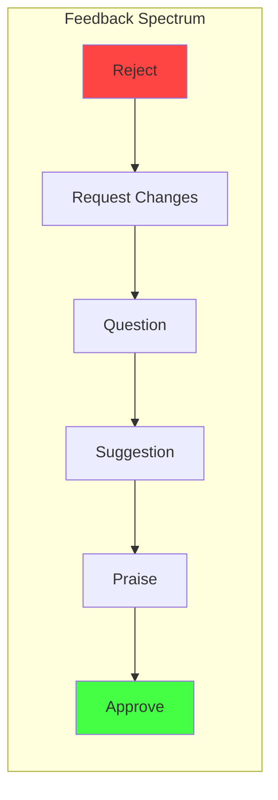

# Code Review Best Practices

**Links**: [[Code Review Process]] | [[Clean Code Principles]] | [[Onboarding and Mentoring]] | [[Developer Experience]] | [[Psychological Safety]] | [[Git/Pull Requests]] | [[Git/Workflows]]

Code review is the systematic examination of code changes by peers to catch bugs, improve quality, and share knowledge.

## What to Look For

| Category | Questions |
|----------|-----------|
| Correctness | Does the code do what it's supposed to? |
| Edge Cases | What happens with empty/null/malformed input? |
| Security | Are there injection risks, exposed secrets? |
| Performance | Are there N+1 queries, unnecessary allocations? |
| Readability | Is the intent clear? Are names descriptive? |
| Test Coverage | Are there tests for the new logic? |

## Review Etiquette

- **Author**: Keep PRs small (< 400 lines). Write a clear description.
- **Reviewer**: Be specific and kind. Ask questions, don't dictate.
- **Both**: Respond within 24 hours. Assume good intent.

## Checklist

- [ ] Code follows project conventions
- [ ] No commented-out code or debug logs
- [ ] Error handling is appropriate
- [ ] Documentation is updated
- [ ] Tests pass and cover new code
- [ ] No security vulnerabilities introduced

---

## The Psychology of Code Review



### Ego Depletion

Code review is cognitively demanding. Each review decision drains mental energy. **Review earlier in the day** for thoroughness. Avoid reviewing complex PRs at the end of a long day.

### Cognitive Biases in Review

| Bias | Effect | Mitigation |
|------|--------|------------|
| **Confirmation bias** | Reviewer looks for evidence supporting their initial impression | Read the diff description first, then code, then form opinion |
| **Anchoring** | First comment sets the tone for the whole review | Read entire PR before leaving any comments |
| **Fundamental attribution error** | Assuming bad intent ("they were lazy") instead of situational factors ("maybe they were under deadline") | Assume good intent. Ask "why" before "what". |
| **Hindsight bias** | "I knew that would be a bug" - feeling obvious after seeing | Note the cleverness of finding it, not the obviousness of the mistake |
| **Recency bias** | Focus on the last thing you read, missing earlier issues | Use a checklist. Review systematically section by section. |

### The Reviewer's Brain

When you review code, your brain performs three overlapping passes:

1. **Diff scan** (seconds) - Pattern matching. "Does this look roughly right?" If alarm bells ring, a deeper pass is needed.
2. **Logic trace** (minutes) - Follow the execution path. Trace variables, branches, error paths. This is where most bugs are found.
3. **System impact** (longer) - How does this change interact with the rest of the system? Touchpoints, data flow, API contracts, performance.

**Rule of thumb**: Complex logic changes need all three passes. Refactors/doc changes may only need pass 1.

## The Art of Writing Review Comments

### The Comment Spectrum

| Style | Example |
|-------|---------|
| **Dictation** | "Change this to use the builder pattern." |
| **Suggestion** | "What do you think about using the builder pattern here?" |
| **Question** | "What was the reasoning for not using the builder pattern?" |
| **Teaching moment** | "One approach I've seen work well here is the builder pattern - it separates configuration from construction." |
| **Praise** | "This error handling is really clean. Especially the fallback to the cache." |

### Rules for Great Review Comments

1. **Be specific** - Say *where* and *what*, not just "this is wrong."
2. **Be actionable** - The author should know exactly what to do next.
3. **Be kind** - You're on the same team. Avoid words like "obviously," "just," "simply."
4. **Explain the "why"** - Don't just say "use `const`", say "using `const` here prevents accidental reassignment and makes the intent clearer to the next reader."
5. **Offer alternatives, not ultimatums** - "What do you think about..." instead of "Change this to..."
6. **Separate blockers from nits** - Use prefixes like **Blocking**: and **Nit**: so the author knows what must change vs. what's optional.

### Example Transformations

| Instead of... | Try... |
|---------------|--------|
| "This is wrong." | "I think there's an off-by-one here - when `index` equals `length`, this will throw." |
| "Use a constant." | "Nit: can we extract `300` into a named constant like `TIMEOUT_MS`? Makes it clearer when reading." |
| "This code is confusing." | "I had to trace this a few times to follow the logic. Could we add a comment explaining the fallback chain?" |
| "Why did you do it this way?" | "I'm curious about this approach - what were the tradeoffs you considered?" |

## Async vs Synchronous Reviews

| Aspect | Async (Comment on PR) | Sync (Pair Review / Screen Share) |
|--------|-----------------------|-----------------------------------|
| **When** | Most reviews | Complex logic, architectural decisions, sensitive feedback |
| **Depth** | Can be thorough | Limited by time in the session |
| **Record** | Written, searchable | Not preserved (unless recorded) |
| **Context** | Reviewer reads at their pace | Both see the same thing at the same time |
| **Best for** | Routine changes, small PRs | Major features, design decisions, mentoring |
| **Social safety** | Lower pressure | Higher pressure, better for building trust |

**Pro tip**: For async reviews, the author can walk through the PR in a Loom video (2-3 min) to give context. This reduces back-and-forth significantly.

## Reviewing as a Junior

Reviewing senior engineers' code can be intimidating. Here's how to make it valuable.

- **Focus on readability and naming** - You don't need to understand the full system. If you find something confusing, others will too. That's a legitimate review finding.
- **Learn by reading** - Every review is a free tutorial. Read the PR description and linked issue first. Understand why the change exists.
- **Ask genuine questions** - "I've never seen this pattern before - can you explain why you chose it?" This is learning, not challenging.
- **Check tests** - Do the tests actually test what they claim? Are edge cases covered? Tests are often easier to review than implementation.
- **Start small** - Review documentation, tests, and simple bug fixes. Build confidence before tackling complex logic.

## Reviewing as a Senior

Senior engineers shape the team's quality culture through reviews.

- **Mentor, don't dictate** - When you see a suboptimal approach, explain the tradeoffs. "I've seen this approach cause issues because X. An alternative is Y. What do you think?"
- **Teach design patterns, not syntax** - Focus on architecture, separation of concerns, testability. Let linters catch formatting.
- **Delegate authority** - Let juniors be the primary reviewer on smaller changes. Review the review. This builds confidence.
- **Protect the team from heroics** - If you see rushed, messy code, ask about timeline pressure. The process may need fixing, not the developer.
- **Model vulnerability** - Admit when you're wrong. "Actually, I was wrong about that - your approach handles the edge case better. Thanks for pushing back."

## Responding to Reviews

A review reply reveals more about the author than the code.

### Growth Mindset Responses

| Review Comment | Fixed Mindset Reply | Growth Mindset Reply |
|----------------|--------------------|----------------------|
| "This could be simpler." | "That's how I always do it." | "Interesting, can you suggest what you have in mind?" |
| "Edge case not handled." | "That would never happen." | "Good catch - let me add that. Can you think of other edge cases?" |
| "Consider extracting this." | "It's fine as is." | "Fair point. I was trying to keep it inline. Let me refactor." |
| "Tests are missing." | "The code is simple enough." | "You're right. Let me add tests for the critical paths." |

### Not Taking Feedback Personally

- **Code is not identity** - A bug in your code does not mean you are a bad developer.
- **Assume good intent** - The reviewer spent time to help you improve the codebase.
- **Thank every reviewer** - Even when feedback stings. Gratitude defuses defensiveness.
- **Sleep on it** - If a comment makes you angry, step away. Respond tomorrow.
- **Ask clarifying questions** - "I don't fully understand the concern - can you elaborate?" is always acceptable.

## Building a Review Culture

### Blameless Review

The goal is not to assign blame but to improve the codebase and share knowledge. A blameless review culture:

- Asks "what can we learn?" instead of "who wrote this?"
- Treats bugs as process failures, not personal failures
- Celebrates finding issues, not the absence of them
- Reviews the code, not the developer

### Psychological Safety

Teams with high psychological safety (see [[Psychological Safety]]):

- Have more productive reviews because people voice concerns freely
- Accept feedback without defensiveness
- Admit mistakes openly
- Challenge technical decisions without fear

**How to build it**:
- Lead by example - admit your mistakes in reviews
- Thank people for finding issues
- Never shame or mock in comments
- Use emojis and positive framing
- Separate learning reviews from approval reviews

### Team Review Norms Document

Every team should write down their review expectations:

```markdown
## Our Review Norms
- All PRs get reviewed within 1 business day
- PRs under 200 lines are reviewed within 4 hours
- Blocking comments use the BLOCKING: prefix
- Nits use the NIT: prefix
- The author merges their own PR after approval
- Anyone can request a sync review for complex changes
```

## Review Velocity

How to make reviews fast without sacrificing quality.

| Strategy | Impact |
|----------|--------|
| **Small PRs** (< 200 lines) | Faster review, fewer bugs missed |
| **Design docs first** | Align on approach before code is written |
| **Assign reviewers by expertise** | Right reviewer = less back-and-forth |
| **Timebox reviews** | 30 min max per session, then break |
| **Batch feedback** | Leave all comments at once, not one at a time |
| **Review the diff, not the file** | Focus on changed lines, not the entire file |
| **CI passes before review** | Don't waste time on style/lint issues |

### The Cost of Slow Reviews

```
Slow review (3+ days) -> Context switch cost for author
                      -> Developer moves to other work
                      -> PR grows stale, merge conflicts
                      -> Urgency pressure reduces review quality
                      -> Workaround code merges without review
```

**Target**: First review feedback within **4 business hours** for standard PRs, **24 hours** max.

## Cross-Team Reviews

Reviewing code in areas you don't know.

- **Focus on tests** - You can assess test quality without deep domain knowledge
- **Check error handling** - What happens when things go wrong?
- **Look at observability** - Logging, metrics, tracing
- **Review the PR description** - Does it explain the problem and approach clearly?
- **Ask naive questions** - Your fresh perspective often catches assumptions domain experts miss
- **Configuration and API surface** - Public interfaces should be clean and intuitive

## Code Review for Security

Develop a security mindset during review.

### Common Vulnerabilities to Spot

| Vulnerability | What to Look For |
|---------------|------------------|
| **SQL Injection** | String concatenation in queries. Unsanitized input in raw SQL. |
| **XSS (Cross-Site Scripting)** | User input rendered without escaping in HTML/JS |
| **CSRF** | State-changing endpoints without tokens |
| **Sensitive data exposure** | Secrets, API keys, PII in logs, responses, or commits |
| **Insecure deserialization** | Unvalidated input to `pickle`, `eval`, `JSON.parse` |
| **Path traversal** | User input used in file paths without validation |
| **Mass assignment** | Unfiltered parameters bound to model attributes |
| **IDOR** | Missing authorization checks on user-owned resources |

### Security Review Checklist

- [ ] Input is validated and sanitized
- [ ] Output is properly escaped
- [ ] Authentication checks exist on protected endpoints
- [ ] Authorization checks verify ownership/role
- [ ] Secrets are not hardcoded or logged
- [ ] HTTPS is enforced
- [ ] Rate limiting is in place for sensitive endpoints
- [ ] Dependencies are up to date (no known CVEs)

## Code Review for Accessibility

Reviewing with an a11y mindset (see [[Web Accessibility]]).

### a11y Checklist for Reviews

- [ ] Semantic HTML is used (not just `<div>` everywhere)
- [ ] All images have `alt` text
- [ ] Forms have proper `<label>` elements
- [ ] Color is not the only way information is conveyed
- [ ] Keyboard navigation works (tab order, focus indicators)
- [ ] ARIA attributes are used correctly (and only when needed)
- [ ] Text has sufficient color contrast (WCAG AA: 4.5:1)
- [ ] Screen reader announcements are meaningful
- [ ] Dynamic content updates are announced (aria-live)
- [ ] Touch targets are at least 44x44px

## Code Review for Performance

### Anti-Patterns to Flag

| Issue | Example | Impact |
|-------|---------|--------|
| **N+1 queries** | Loop with DB query per iteration | Major - turns 1 query into N |
| **Unbounded collection loading** | Loading entire table into memory | Memory exhaustion |
| **Missing indexes** | Queries on non-indexed columns | Slow reads at scale |
| **Inefficient data structures** | `Array.includes()` in a hot loop | O(n) instead of O(1) |
| **Memory leaks** | Event listeners never removed, closures holding references | Degradation over time |
| **Cache misses** | Cache key granularity wrong, TTL too short | Repeated expensive operations |
| **Large bundle imports** | Importing entire library for one function | Bloated client bundles |
| **Blocking the event loop** | CPU-heavy work on main thread (Node/JS) | Frozen UI |

**Performance review tip**: If you can't reason about the performance of a change, ask the author to add a benchmark or trace. Data beats intuition.

## Code Review for DevOps

Reviewing infrastructure and CI/CD configurations.

### IaC Review Checklist

- [ ] Infrastructure changes are reviewed like application code
- [ ] State locking is enabled (prevent concurrent applies)
- [ ] Secrets are not in plaintext (use Vault, Secrets Manager)
- [ ] Resource naming follows conventions
- [ ] Tags/labels are applied for cost tracking
- [ ] IAM permissions follow least-privilege principle
- [ ] Network security groups are as restrictive as possible
- [ ] Auto-scaling policies include cooldown periods

### CI/CD Pipeline Review

- [ ] Tests run in CI (unit, integration, lint)
- [ ] Build artifacts are immutable (versioned, checksummed)
- [ ] Deployments are idempotent
- [ ] Rollback strategy exists
- [ ] Secrets are injected, not baked into images
- [ ] Stages are gated (dev -> staging -> prod)
- [ ] Notifications on failure

## Further Reading

- [[Code Review Process]]
- [[Clean Code Principles]]
- [[Onboarding and Mentoring]]
- [[Developer Experience]]
- [[Psychological Safety]]
- [[Git/Pull Requests]]
