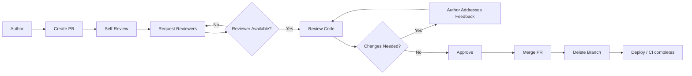

# Code Review Process

Code review is a systematic examination of code changes by peers. It catches bugs, improves design, shares knowledge, and enforces standards.



## Why Code Review?

| Benefit | Impact | Mechanism |
|---------|--------|-----------|
| Bug detection | Finds 35-70% of defects before merge | Fresh eyes spot edge cases the author missed |
| Knowledge sharing | Team learns from each other's code | Reading others' code → learn patterns, APIs |
| Code quality | Enforces standards, best practices | Consistency across team |
| Team ownership | Shared responsibility, no bus factor | Multiple people understand each module |
| Mentoring | Junior devs learn from senior feedback | Inline explanations of why approaches differ |
| Design improvement | Early feedback on architecture | Catch design smells before they're entrenched |
| Onboarding | New team members learn codebase | Reviewing PRs teaches architecture faster than docs |

### Cognitive Bias in Review

Being aware of biases helps you review more objectively:

| Bias | Effect | Mitigation |
|------|--------|------------|
| Confirmation bias | Look for evidence supporting author's approach | Actively search for other approaches |
| Anchoring | First comment influences the rest of review | Read the whole PR before commenting |
| Authority bias | Junior code gets more scrutiny than senior | Use a standardized checklist |
| Recency bias | Recent PRs judged differently | Let PRs sit for an hour before reviewing |
| Ownership bias | Defensiveness about code you wrote | "I wrote this" → "This code lives here" |

## Review Size

| Size | Lines Changed | Time to Review | Recommended? | Ideal Scenario |
|------|--------------|----------------|-------------|----------------|
| Tiny | < 50 | 5-10 min | ✓ Best | Bug fixes, one-line refactors |
| Small | 50-200 | 15-30 min | ✓ Good | Single feature, small refactor |
| Medium | 200-400 | 30-60 min | ⚠ Split if possible | Multi-file changes, new endpoints |
| Large | 400-1000 | 60+ min | ✗ Too large | Major features — should be broken up |
| Massive | 1000+ | Hours | ✗ Split into multiple PRs | Rewrites, migrations — plan incremental PRs |

### Why Size Matters

- Review effectiveness drops sharply after 400 lines (Google study: 200-400 lines is optimal)
- Review density (comments per LOC) is highest in small PRs
- Large PRs get fewer comments per line → more bugs slip through
- Time to first review increases with PR size

## PR Description Writing

A good PR description answers two questions: WHAT changed and WHY.

### Template

```markdown
## Summary
[1-3 sentences describing the change]

## Motivation
[Why is this change needed? What problem does it solve?]

## Changes
- [List of specific changes, file by file or module by module]
- [e.g., Added UserRepository.find_by_email() for login flow]

## Testing
- [ ] Unit tests added/updated
- [ ] Integration tests pass
- [ ] Manual testing performed
- [ ] Tested in staging

## Risks
- [e.g., This changes the payment schema — requires DB migration]
- [e.g., High risk: touches auth middleware]

## Related Issues
Closes #123
Relates to #456

## Changelog Entry
### Added
- User lookup by email endpoint

### Changed
- Refactored authentication middleware to use JWT

### Fixed
- Connection leak on payment timeout
```

### Bad vs Good PR Descriptions

| Bad | Good |
|-----|------|
| "Fixed a bug" | "Fixed O(n²) query in user search caused by missing index on email column (Closes #123)" |
| "Refactored the thing" | "Extracted payment validation into PaymentValidator class to reuse in webhook handler" |
| "Updated dependencies" | "Upgraded requests from 2.28 to 2.31 to fix CVE-2023-32681 (redirect header injection)" |
| (empty) | Includes summary, motivation, testing, and changelog entry |

## What to Look For

### Priority Order

| Priority | Area | Questions |
|----------|------|-----------|
| 1 | Functionality | Does the code work? Are there bugs? Edge cases? |
| 2 | Design | Is this the right approach? Does it fit the architecture? |
| 3 | Readability | Is the code easy to understand? Names clear? |
| 4 | Standards | Follows team conventions? Linting passes? |
| 5 | Testing | Are there adequate tests? Meaningful coverage? |
| 6 | Performance | Any obvious performance issues? N+1 queries? |
| 7 | Security | Input validation, auth checks, injection prevention? |
| 8 | Maintainability | Will this be easy to change in 6 months? |

## Code Review Example: Before and After

### Before the Review (submitted by author)

```python
def process(data):
    r = requests.post("https://api.stripe.com/v1/charges",
        json={"amount": data["price"] * 100, "currency": "usd",
              "source": data["token"], "description": data["desc"]},
        headers={"Authorization": "Bearer " + settings.STRIPE_KEY})
    if r.status_code == 200:
        return {"ok": True, "id": r.json()["id"]}
    else:
        return {"ok": False, "error": r.text}
```

### Review Annotations

```python
def process(data):
    # [ISSUE 1] What is `data`? No type hints. Is this a dict? A Pydantic model?
    r = requests.post("https://api.stripe.com/v1/charges",
        # [ISSUE 2] Hardcoded URL! What about test/staging?
        json={"amount": data["price"] * 100,
              # [ISSUE 3] Magic number 100. What if we add fractional currency?
              "currency": "usd",  # [ISSUE 4] Hardcoded currency
              "source": data["token"], "description": data["desc"]},
        headers={"Authorization": "Bearer " + settings.STRIPE_KEY})
        # [ISSUE 5] Logging the key if exception is thrown? Risk of key leak
    if r.status_code == 200:
        # [ISSUE 6] What about 201? What about 3xx?
        return {"ok": True, "id": r.json()["id"]}
        # [ISSUE 7] What if "id" key is missing?
    else:
        # [ISSUE 8] Returns different types (dict with ok=True vs ok=False)
        return {"ok": False, "error": r.text}
        # [ISSUE 9] r.text can contain HTML, sensitive data, or be huge
```

### After the Review

```python
from dataclasses import dataclass
from enum import Enum
from typing import Optional

import stripe
from stripe.error import StripeError

class Currency(Enum):
    USD = "usd"
    EUR = "eur"
    GBP = "gbp"

@dataclass
class ChargeRequest:
    amount: Decimal  # In dollars, e.g., 9.99
    currency: Currency
    source_token: str
    description: Optional[str] = None

@dataclass
class ChargeResult:
    success: bool
    charge_id: Optional[str] = None
    error_message: Optional[str] = None

class PaymentProcessor:
    def __init__(self, stripe_client: stripe.Stripe):
        self._stripe = stripe_client

    def charge(self, request: ChargeRequest) -> ChargeResult:
        try:
            charge = self._stripe.Charge.create(
                amount=int(request.amount * 100),  # cents
                currency=request.currency.value,
                source=request.source_token,
                description=request.description,
            )
            return ChargeResult(success=True, charge_id=charge.id)
        except StripeError as e:
            return ChargeResult(success=False, error_message=str(e))
```

## Reviewing Different Types of Changes

### Frontend

| Area | Check |
|------|-------|
| Accessibility | Semantic HTML, ARIA labels, keyboard navigation |
| Responsiveness | Mobile, tablet, desktop breakpoints |
| State handling | Loading, empty, error, edge case states |
| Bundle size | New dependencies, code splitting, tree shaking |
| API integration | Error handling, retries, optimistic updates |
| CSS | Specificity, unused styles, design tokens |

### Backend

| Area | Check |
|------|-------|
| API design | RESTful conventions, versioning, backwards compatibility |
| Database queries | N+1 detection, indexing, EXPLAIN plans |
| Auth | Proper authentication, authorization checks for each endpoint |
| Rate limiting | Throttling on public endpoints |
| Input validation | Schema validation, sanitization |
| Error handling | Consistent error responses, proper HTTP status codes |

### Database Migrations

```sql
-- BEFORE review
ALTER TABLE users ADD COLUMN api_key VARCHAR(64);
-- Issues: locks table, no default, no unique constraint, no NOT NULL

-- AFTER review
-- 1. Add column as nullable first
ALTER TABLE users ADD COLUMN api_key VARCHAR(64);
CREATE UNIQUE INDEX idx_users_api_key ON users(api_key);
-- 2. Backfill in a separate transaction
UPDATE users SET api_key = gen_random_uuid()::text WHERE api_key IS NULL;
-- 3. Make it NOT NULL in a second migration version
ALTER TABLE users ALTER COLUMN api_key SET NOT NULL;
```

### Configuration

| Check | Why |
|-------|-----|
| No secrets committed | Use env vars, Vault, or secret manager |
| Defaults are safe | Don't default to production values |
| Config validation | Crash early on invalid config |
| Feature flags | Can changes be toggled? |
| Environment parity | Config works in dev, staging, prod |

### Tests

| Check | Why |
|-------|-----|
| Test names are descriptive | Failures should explain what broke |
| Tests are isolated | No shared state between tests |
| Not just happy paths | Edge cases, error paths, flakes |
| Assertions are specific | `assert result == expected`, not `assert result` |
| Test infrastructure | Mocks vs fakes, fixtures, factories |
| Coverage is meaningful | Not just line coverage — branch coverage |

### Documentation

- API docs updated (OpenAPI, internal docs)
- README updated if behavior changed
- Architecture Decision Records (ADRs) for significant decisions
- Changelog entry added

## Security Review

### OWASP Top 10 Checklist

| Risk | What to Look For |
|------|-----------------|
| Broken access control | Missing auth checks, IDOR (Insecure Direct Object Reference) |
| Cryptographic failures | Storing plaintext passwords, weak hashing (MD5, SHA1) |
| Injection | Raw SQL concatenation, unsanitized user input |
| Insecure design | Missing rate limiting, no input validation at API boundary |
| Security misconfiguration | Debug endpoints exposed, CORS too permissive |
| Vulnerable components | Outdated libraries with known CVEs |
| Auth failures | Weak session management, missing MFA, JWT not validated |
| Data integrity | No CSRF protection, unsigned serialization (pickle) |
| Logging failures | Not logging auth failures, logging sensitive data |
| SSRF | User-provided URLs fetched by server |

```python
# SECURITY BUG: SQL injection
query = f"SELECT * FROM users WHERE email = '{user_input}'"

# FIX: parameterized query
query = "SELECT * FROM users WHERE email = %s"
cursor.execute(query, (user_input,))
```

## Performance Review

| Pattern | Impact | Detection |
|---------|--------|-----------|
| N+1 queries | Accidental O(n) DB calls | Check ORM logs, look for loops with queries |
| Missing indexes | Full table scans | Check EXPLAIN plans in review |
| No pagination | O(n) memory | Review list endpoints for limit/offset |
| Wrong data structure | O(n) where O(1) exists | Look for `in` checks on lists vs sets |
| Expensive loops | O(n²) from nested loops | Check for loops inside loops over DB results |
| No caching | Repeated computation | Look for repeated identical calls |
| Synchronous I/O in async path | Blocks event loop | Check for blocking calls in async functions |

## Urgency Levels

Not every PR needs the same review depth.

| Level | Description | Example | Review Standard | Merge Window |
|-------|-------------|---------|-----------------|-------------|
| P0 | Production outage | Critical bug fix | Fastest possible, can post-review | Minutes |
| P1 | Blocked workflow | Broken feature | Thorough but expedited | Hours |
| P2 | Feature work | New endpoint | Normal review | 1-2 days |
| P3 | Improvement | Refactor, perf | Normal review | 3-5 days |
| P4 | Cleanup | Linting, docs | Lightweight | 1 week |
| P5 | Experiment | Spike, prototype | Minimal or skip | N/A |

### P0 Hotfix Protocol

```
1. Author flags PR as [HOTFIX] in title
2. At least one reviewer must approve
3. Merge even with minor style nits (open follow-up issues)
4. Post-merge: schedule a full review within 24 hours
5. Create a regression test after fix
```

## Tools Deep Dive

| Feature | GitHub PRs | GitLab MRs | Gerrit | Phabricator |
|---------|-----------|------------|--------|-------------|
| Workflow | Fork/pull | Branch/MR | Push/Review | Diff/Revision |
| Review UI | Side-by-side, unified | Side-by-side | File-based inline | Side-by-side |
| Approvals | Required reviewers | Approval rules | Code-Review+2 | "Accept Revision" |
| CI integration | Checks API, Actions | Pipelines, status | Jenkins, Zuul | Build integration |
| Inline suggestions | Code suggestions | Multiple comment types | Patch sets | "Plan changes" |
| Stacked changes | Rebase workflow | Merge trains | Patch set dependencies | Stacked diffs |
| Self-hosted | GHES | Self-managed | Open source | Open source |
| Best for | Open source, small teams | Enterprise | Large C++ projects | Large monorepos |

## Code Review Metrics

| Metric | Definition | Formula | Good Target | Bad Signal |
|--------|------------|---------|-------------|------------|
| Review depth | Substantive comments per PR | Comments / PR | 3-10 substantive | 0 = rubber stamp, 20+ = unclear spec |
| Time to first review | From PR open to first comment | t_first_comment - t_pr_open | < 4 hours | > 24 hours |
| Time to merge | PR lifecycle duration | t_merge - t_pr_open | < 2 days | > 5 days (stale PR) |
| Rework rate | Revisions before approval | Revisions / PR | 1-3 revisions | 0 = no review, 5+ = spec unclear |
| Satisfaction | Developer survey score | Survey avg | > 4/5 | < 3/5 indicates toxic review culture |
| Review distribution | Reviews per person per week | Reviews / reviewer | Balanced | One person does all reviews |
| Pickup time | Time from review request to first reviewer | t_first_reviewer - t_request | < 1 hour | > 1 day |

## Automated Code Review

### Integration in CI Pipeline

```yaml
# Example GitHub Actions workflow
name: Code Review Checks
on: [pull_request]

jobs:
  lint:
    runs-on: ubuntu-latest
    steps:
      - uses: actions/checkout@v4
      - run: ruff check .
      - run: ruff format --check .

  type-check:
    runs-on: ubuntu-latest
    steps:
      - uses: actions/checkout@v4
      - run: mypy src/

  security:
    runs-on: ubuntu-latest
    steps:
      - uses: actions/checkout@v4
      - name: Semgrep SAST
        uses: semgrep/semgrep-action@v1

  complexity:
    runs-on: ubuntu-latest
    steps:
      - uses: actions/checkout@v4
      - run: radon cc src/ --min C
```

### SAST (Static Application Security Testing)

| Tool | Language | Covers |
|------|----------|--------|
| Semgrep | Multi-language | Custom rules, OWASP Top 10 |
| CodeQL | Multi-language | GitHub-native, deep analysis |
| SonarQube | Multi-language | Bugs, vulnerabilities, code smells |
| Bandit | Python | Security issues in Python |
| Brakeman | Ruby | Rails security scanner |
| Gosec | Go | Security scanning for Go |
| ESLint security plugin | JavaScript | XSS, injection patterns |

## Review of Infrastructure as Code

### Terraform

```hcl
# BEFORE review
resource "aws_s3_bucket" "data" {
  bucket = "my-company-data"
}

# AFTER review — bucket is private, versioned, encrypted
resource "aws_s3_bucket" "data" {
  bucket = "my-company-data"
  versioning {
    enabled = true
  }
  server_side_encryption_configuration {
    rule {
      apply_server_side_encryption_by_default {
        sse_algorithm = "AES256"
      }
    }
  }
}

resource "aws_s3_bucket_public_access_block" "data" {
  bucket = aws_s3_bucket.data.id
  block_public_acls       = true
  block_public_policy     = true
  ignore_public_acls      = true
  restrict_public_buckets = true
}
```

### Kubernetes Manifests

| Check | Why |
|-------|-----|
| Resource limits/requests | No resource limits = noisy neighbor |
| Readiness + liveness probes | Without them, K8s can't manage traffic |
| PodSecurityContext | Run as non-root, read-only root filesystem |
| Network policies | Default deny traffic between namespaces |
| Secret references | Secrets mounted as files, not env vars |
| Image tags | `:latest` is unreliable — pin to SHA or semver |
| Replicas | More than 1 for production services |

## Review of CI/CD

| Concern | What to Check | Checklist |
|---------|---------------|-----------|
| Pipeline safety | Can this pipeline deploy without review? | Require PR approval for production stages |
| Approval gates | Are production deployments gated? | Manual approval step before prod deploy |
| Secret handling | Are secrets exposed in logs? | Redact secrets in pipeline output |
| Test stages | Do tests run before build? | Test → Build → Deploy ordering |
| Rollback plan | Can this deployment be rolled back? | Keep previous artifacts, DB rollback scripts |
| Versioning | Is every build versioned? | Git SHA tags, semantic versions |
| Artifact storage | Are build artifacts stored immutably? | S3, ECR, Artifactory |

## Handling Disagreements

```
Author: "I think approach X is better because performance"
Reviewer: "I prefer Y because readability"

Resolution: Discuss tradeoffs → Escalate to team lead if needed
             → Document decision in ADR → Move forward
```

### Escalation Hierarchy

1. Author and reviewer discuss inline (comments on PR)
2. Sync up in voice/video call — 80% resolved here
3. Involve a third team member for tie-breaker
4. Tech lead makes final call
5. Document in ADR regardless of outcome

## The Review Mindset

```
╔══════════════════════════════════════════════╗
║  Review the code, not the person.            ║
║  Suggest improvements, don't demand them.    ║
║  Approve when "good enough," not "perfect."  ║
║  Assume good intent from both sides.         ║
║  Ask "What if?" not "You should."            ║
║  Praise good solutions, not just find flaws.  ║
╚══════════════════════════════════════════════╝
```

## Review Checklist

- [ ] Does the code satisfy acceptance criteria?
- [ ] Are there edge cases not handled?
- [ ] Is error handling appropriate?
- [ ] Are there tests for new functionality?
- [ ] Do existing tests still pass?
- [ ] Is the code following team conventions?
- [ ] Are there any security concerns?
- [ ] Is documentation updated?
- [ ] Are there TODO/FIXME comments that need action?
- [ ] Does the PR include unnecessary changes?
- [ ] Is the PR description clear and complete?
- [ ] Are migration scripts reversible?
- [ ] Is there a changelog entry?
- [ ] Are there no secrets committed?
- [ ] Are logs not leaking PII?

## Automated Review

| Category | Tool |
|----------|------|
| Linting | ESLint, Ruff, Rubocop |
| Formatting | Prettier, gofmt, rustfmt |
| Security | Semgrep, SonarQube, CodeQL |
| Tests | CI must pass |
| Coverage | Codecov, Coveralls |
| Complexity | SonarQube (cognitive complexity) |

## Metrics to Track

| Metric | What It Measures | Good Target |
|--------|-----------------|-------------|
| Review depth | Comments per PR | 3-10 substantive comments |
| Time to review | First response | < 4 hours |
| Time to merge | PR open duration | < 2 days |
| Rework rate | Revisions per PR | 1-3 revisions |
| Satisfaction | Developer survey | > 4/5 |

**Links**: [[Code Review Best Practices]] | [[Clean Code Principles]] | [[Git Pull Requests]] | [[Developer Workflow Automation]] | [[CI CD Pipelines]] | [[Security Best Practices]] | [[Clean Code Principles]]
